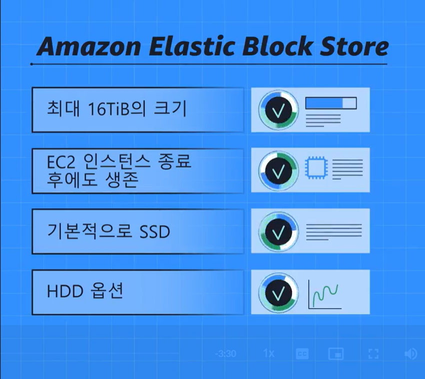
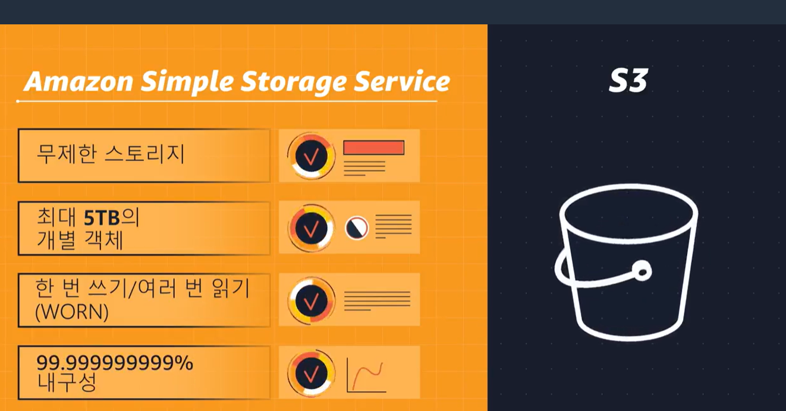
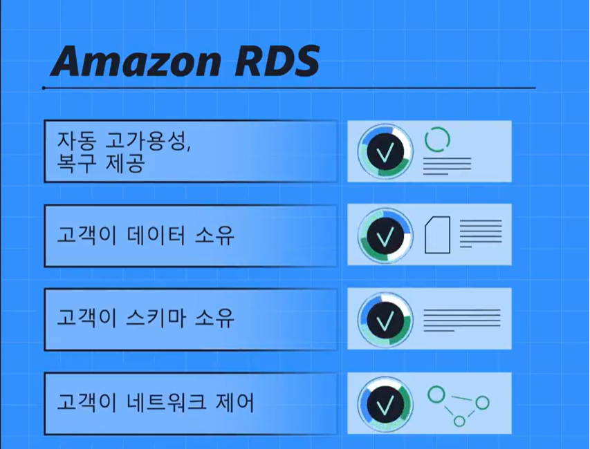
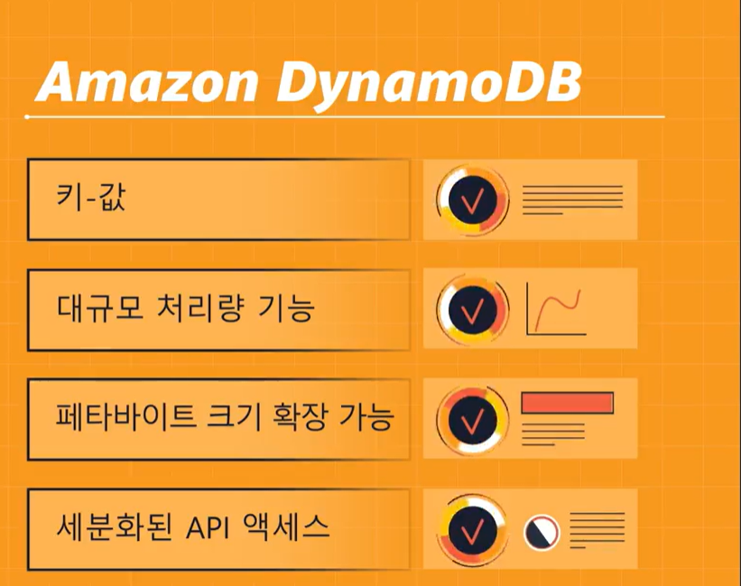

Amazon EBS(Amazon Elastic Block Store)

EC2 인스턴스 유형에 따라 인스턴스 스토리지 볼륨이 존재(휘발성)
호스트에 물리적으로 연결됨
Amazon EBS에 저장하면, EBS volume이라는 가상 HD에 인스턴스들이 지속적으로 유지됨
볼륨이 자동적으로 확장되지는 않음

데이터는 또한 백업을 해놓는 것이 중요
EBS 스냅샷은 **증분 백업**으로, 처음 볼륨을 백업하면 모든 데이터가 복사되고 이후의 백업에서는 변경된 데이터 블록만 저장됨

Amazon S3
무한대의 데이터 저장 및 검색
데이터를 객체로 버킷에 저장(하드 드라이브는 객체, 파일디렉토리는 버킷)
최대 5TB크기의 객체 업로드 가능
여러 버킷 생성 가능

Amazon S3 Standard
내구성99.999999% -> 1년 후에도 객체가 온전히 구성될 확률이 높음
정적 웹 사이트 호스팅에 사용

Amazon S3 Standard-IA
자주 access하지 않지만, 장기 보관 및 빠른 access를 위함

Amazon S3 Glacier Flexible
장기 보관 및 저장소 잠그기 가능
WORM(한번쓰고 많이 읽음)제어 항목으로 정책을 잠글 수 있음
수명 주기 정책으로, 데이터 계층간 이동에 좋음(90일간 Standard -> 30일간 Standard IA 사용)

Amazon S3 Intelligent-Tiering
객체의 액세스 패턴을 모니터링하여 자동으로 Amazon S3 Standard 스토리지 등급과 Amazon S3 Standard-IA 스토리지 등급 간에 객체를 이동합니다.

EBS와 S3 비교

완성 객체 or 변경 횟수가 작으면 S3
복잡한 읽기 및 쓰기 작업을 실행한다면 EBS

객체 스토리지 - 모든 파일을 완성된 개별 객체로 취급
일부 파일이 수정되면 전체 파일을 업로드 해야 함(증분백업X)

블록 스토리지 - 수정할 때, 해당 블록만 수정하는 것이 가능

Amazon EFS(Elastic File System)
관리형 파일 시스템
파일 스토리지는 많은 서비스가 동일한 데이터에 액세스해야하는 사용 사례에 이상적
파일 추가 및 제거하면 자동으로 확장 및 축소가 진행됨

DB를 Cloud로 옮기는 방법 : 리프트 앤 시프트 마이그레이션

Amazon RDS
데이터를 다른 데이터와 관계짓는 방식(관계형 DB)으로 저장
자동 패치, 백업, 이중화, 장애 조치, 재해복구를 자동으로 해줌

Amazon Aurora
상용 DB 비용의 1/10
데이터 복제본이 항상 존재
읽기 전용 복제본이 최대 15개 가능
S3로의 지속적인 백업
특정 시점 복구도 가능

Amazon DynamoDB
비관계형(NoSQL)으로, 키-값 페어로 구성
서버리스 구조로, 프로비저닝, 패치 적용 또는 관리할 필요가 없음
소프트웨어 설치, 유지 관리, 운영할 필요도 없음
자동으로 용량 변화에 맞춰 크기 조정

RDS와 Dynamo DB 비교

관계형은 비지니스 분석에 좋음
단순한 look up table은 Dynamo DB가 좋음

Amazon Redshift
빅데이터 분석에 사용하는 데이터 웨어하우징 서비스
여러 원본에서 데이터를 수집하여 데이터 간의 관계 및 추세 파악에 도움

AWS Database Migration Service
관계형 DB, 비관계형 DB 및 기타 유형의 데이터 저장소를 마이그레이션할 수 있는 서비스

추가 DB 서비스
