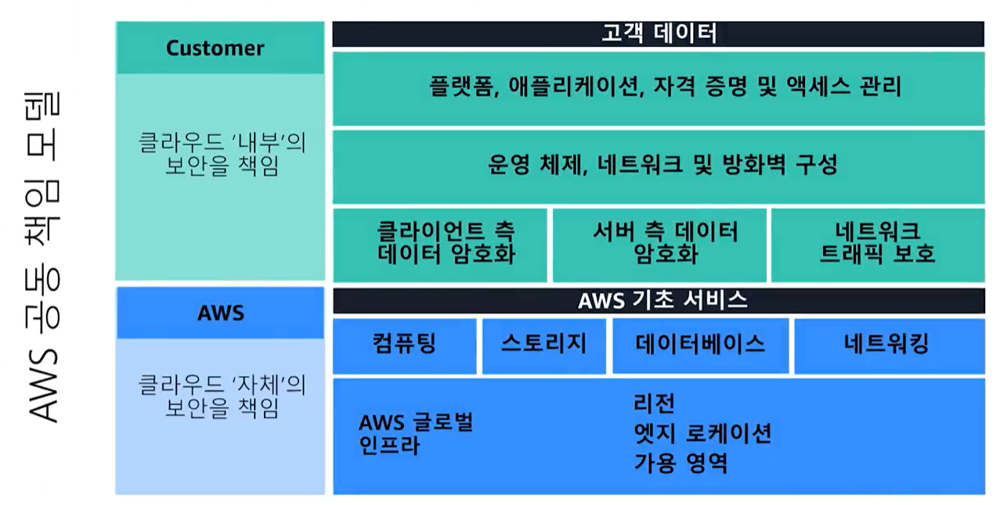
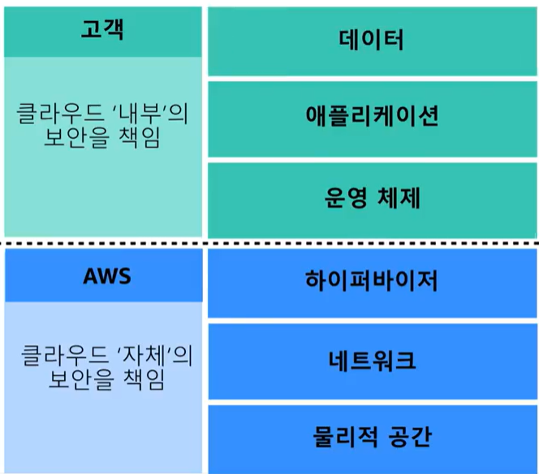
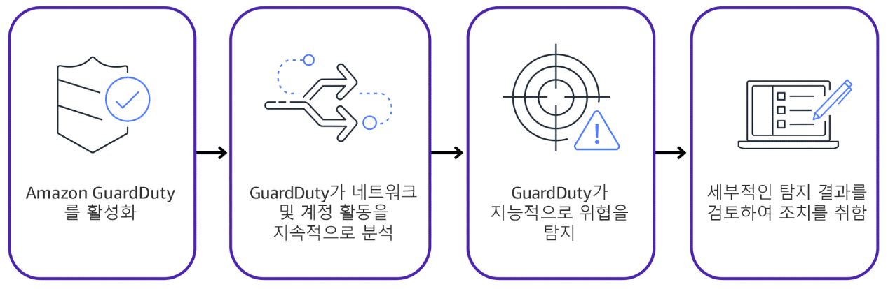

# 공동책임모델
AWS - 클라우드 자체의 보안을 책임
Customer - 클라우드 내부의 보안을 책임

# 사용자 권한 및 액세스
루트 계정 사용자
AWS 서버 및 리소스에 대한 모든 권한을 가짐

AWS Identity and Access Management(IAM)
회사의 운영 및 보안 요구 사항에 따라 액세스 권한을 구성할 수 있는 유연성
IAM 사용자는 사용자가 AWS에서 생성하는 자격 증명으로, 특정 작업을 수행할 수 있도록 허용하려면 사용자에게 필요한 권한을 부여해줘야 함

MFA(다중인증) - 추가인증

AWS Organization
계정을 조직단위로 그룹화하여 중앙 집중식으로 관리하는 방법
통합 결제
AWS 서비스 및 API 작업 액세스 제어

# 규정준수
회사가 속한 업종에 따라 특정 표준을 준수해야하는데, 이를 표준을 충족했는지 확인하는 절차
AWS에 직접 구축한 아키텍처의 보안만 준수하면 됨

AWS Artifact
온디맨드로 AWS 규정 준수 보고서에 액세스
AWS와의 계약을 검토, 수락 및 관리 가능

# 서비스 거부 공격
Dos
공격이 단일 소스로 부터 발생하며, 사용자들이 웹 사이트 or 앱을 이용할 수 없게 함

DDOS
공격이 여러 소스로부터 발생

AWS Shield
DDos 공격으로부터 앱을 보호하는 서비스
Standard - 무료 서비스로, 가장 자주 발생하는 일반적인 DDos 공격으로부터 보호
Advanced - 유료 서비스로, 복잡한 DDos 공격 완화를 위한 커스텀 가능하며, 다른 서비스와도 통합 가능

# 추가 보안 서비스
보안의 주요 포인트는 암호화
저장 중 암호화, 전송 중 암호화로 나눔

AWS Key Management Service(AWS KMS)
암호화 키 관리

AWS WAF
웹 앱으로 들어오는 네트워크 요청을 모니터링할 수 있는 웹 애플리케이션 방화벽
Amazon CloudFront 및 Load balancer와 함께 작동
ACL를 사용하여 트래픽 차단 및 허용

Amazon Inspector
자동화된 보안 평가를 실행하여 보안 및 규정 준수를 개선할 수 있는 서비스스

Amazon GuardDuty
AWS 인프라 및 리소스에 대한 지능형 위협 탐지 기능을 제공하는 서비스

