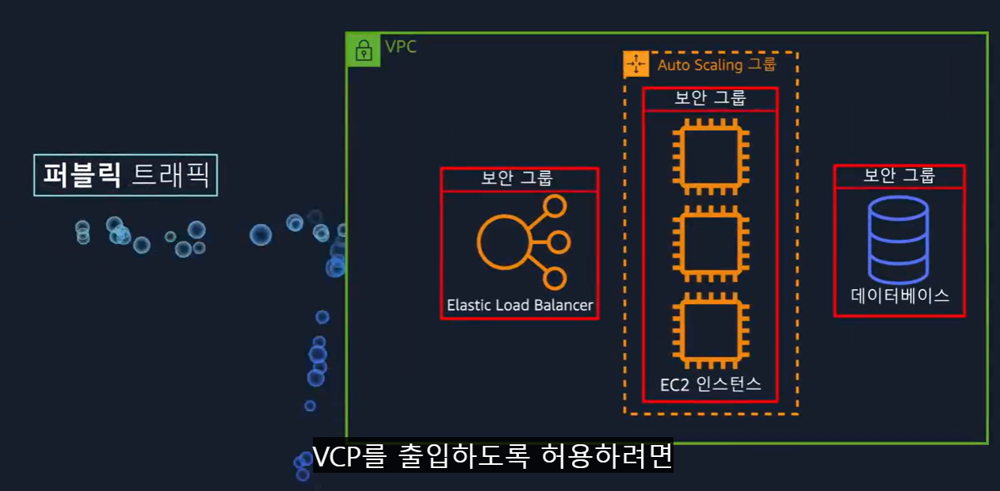
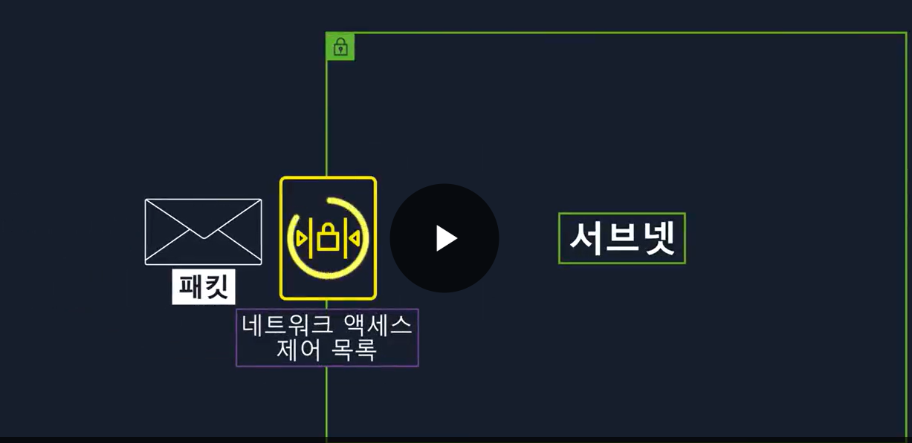

Amazon Virtual Private Cloud
- 사용자가 정의한 가상 네트워크에서 AWS 리소스를 실행시킬 수 있는 클라우드 섹션 프로비저닝 가능
- 퍼블릭 과 프라이빗한 네트워크 둘 다 가능
- 퍼블릭 or 프라이빗 리소스 그룹을 서브넷이라고 함

VPC
- 가상의 격리된 프라이빗 네트워크
- EC2 나 ELB 같은 요소 배치 가능(서브넷에)

퍼블릭 트래픽이 VPC에 접근하려면 인터넷 게이트웨이(IGW)를 VPC에 연결해야 함

-> 프라이빗한 리소스가 있다면 인터넷 게이트웨이를 VPC에 연결하면 안됌
-> 인증된 사람들이 리소스에 접근하는 것은 가능하게 해야하는데, 이것이 **가상 프라이빗 게이트 웨이**

AWS Direct Connect
- 완전 비공개인 광섬유 회선을 구축할 수 있다.
- 네트워크와 AWS VPC를 연결하는 물리적인 회선

서브넷을 사용해야하는 이유는 게이트웨이의 access 관리 때문이다.
서브넷은 트래픽 권한 제어함.

네트워크 액세스 제어 목록을 통해 서브넷으로 들어오는 패킷 제어 (발신자와 수신자를 기준으로 권한 있는지 확인)

ACL(네트워크 액세스 제어 목록)은 서브넷의 패킷 권한만 확인
내부에서는 각 인스턴스는 다른 규칙이 적용됨.
인스턴스 수준의 액세스 문제를 해결하고자 보안 그룹 도입

# 보안 그룹과 네트워크 ACL의 차이점
보안 그룹은 상태 저장 방식(statefull)임
출입이 허용된 사람을 기억함

네트워크 ACL은 상태 비저장(stateless)이므로, 모든 패킷을 확인해야 함

보안 그룹은 반환할 때 체크리스트를 확인하지 않아도 됨.
네트워크 ACL은 상태를 기억하지 않기 때문에 체크리스트를 다시 확인해야 함.

# Global Networking
Amazon Route53 - AWS의 DNS로 가용성과 확장성이 좋음
Amazon Cloud Front(CDN) - 데이터를 짧은 시간에 보내기 위함
**CDN: 지리적 위치를 기반으로 사용자에게 엣지 콘텐츠를 제공하는 네트워크**

