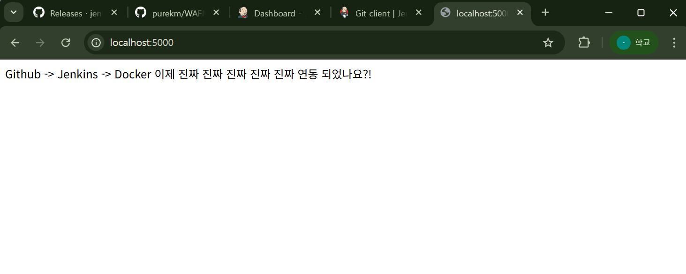
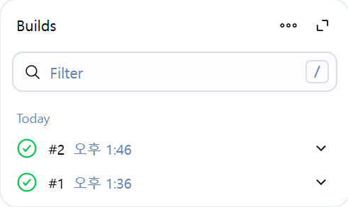
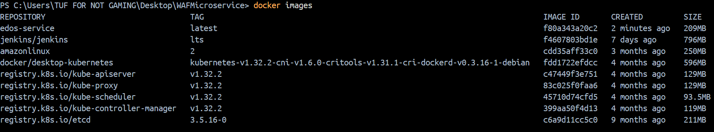
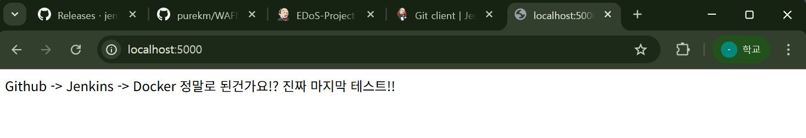

---

## 🛠 GitHub → Jenkins → Docker: CI/CD 자동화-1!

오늘은 `Flask` 웹 서버를 GitHub에 올리고, Jenkins와 Docker를 연동해 자동으로 빌드 및 배포되는 **CI/CD 파이프라인**을 구축했다.

---

### ✅ 1. Jenkins 설치 및 초기 설정

* Jenkins를 Docker 컨테이너에 설치
* 필수 플러그인 설치 (`Git`, `Pipeline`, `Docker Pipeline`, `GitHub Integration` 등)
* GitHub와 연동을 위한 Personal Access Token 등록
* `Docker CLI`를 Jenkins 컨테이너 안에 설치하고, Docker 소켓(`/var/run/docker.sock`)을 볼륨으로 연결
* Jenkins 사용자에 Docker 실행 권한 부여 (`usermod -aG docker jenkins`)

---

### ✅ 2. Jenkins 파이프라인 구성

Jenkins에 다음과 같은 파이프라인을 구성했다:

```groovy
pipeline {
    agent any

    environment {
        IMAGE_NAME = "edos-service"
        IMAGE_TAG = "latest"
    }

    stages {
        stage('Clone') {
            steps {
                checkout scm
            }
        }

        stage('Docker Build') {
            steps {
                sh "docker build -t $IMAGE_NAME:$IMAGE_TAG ."
            }
        }

        stage('Docker Run') {
            steps {
                sh '''
                    docker stop edos-test || true
                    docker rm edos-test || true
                    docker run -d -p 5000:5000 --name edos-test $IMAGE_NAME:$IMAGE_TAG
                '''
            }
        }

        stage('Check') {
            steps {
                sh "docker images | grep $IMAGE_NAME || true"
            }
        }
    }
}
```

---

### ✅ 3. Flask 서버 작성

아주 간단한 Flask 웹 서버를 작성하여 루트 경로(`/`)에서 메시지를 반환하도록 했다:

```python
from flask import Flask
app = Flask(__name__)

@app.route("/")
def home():
    return "Github -> Jenkins -> Docker 이제 진짜 진짜 진짜 진짜 진짜 연동 되었나요?!"

if __name__ == "__main__":
    app.run(host="0.0.0.0", port=5000)
```

---

### ✅ 4. GitHub → Jenkins 자동 트리거 확인

VSCode에서 Flask 서버의 메시지를 수정하고 GitHub에 푸시하자, Jenkins가 자동으로 감지하여 빌드를 실행했다.

시작화면


vscode에서 커밋을 하니까 Jenkins에서 build가 자동으로 실행됨
📸 빌드 성공 로그:


📸 새로운 도커 이미지가 빌드된 모습:



📸 브라우저에서 수정된 메시지가 반영된 결과:



---

### ✅ 오늘의 성과 요약

* GitHub → Jenkins → Docker까지 완전 자동화 파이프라인 구축
* Jenkins 파이프라인을 통해 `코드 변경 → 이미지 빌드 → 컨테이너 실행`까지 자동화
* `docker stop` 및 `run`을 포함한 배포 재시작 흐름 구성
* 직접 만든 Flask 애플리케이션의 변경이 실시간으로 반영되는 것을 브라우저에서 확인

---

### 🚀 다음 목표


* EKS 또는 Minikube로 Kubernetes 배포 확장
* CI 과정에 pytest 테스트 추가
* Discord 알림 연동

---

