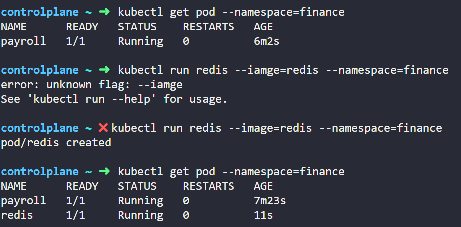
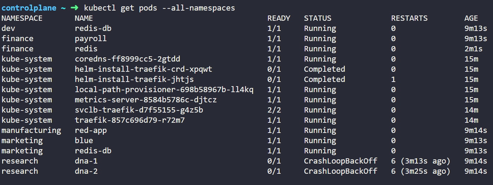
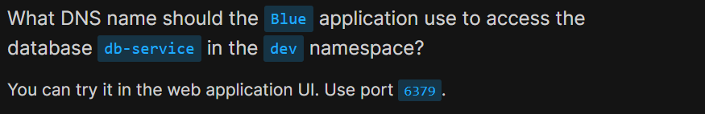

Create pod in finance namespace

Want to find blue pod in some namespaces
I just see all the pods in namespaces

If use grep, can find easily

Access to other namespace

db-service.dev.svc.cluster.local