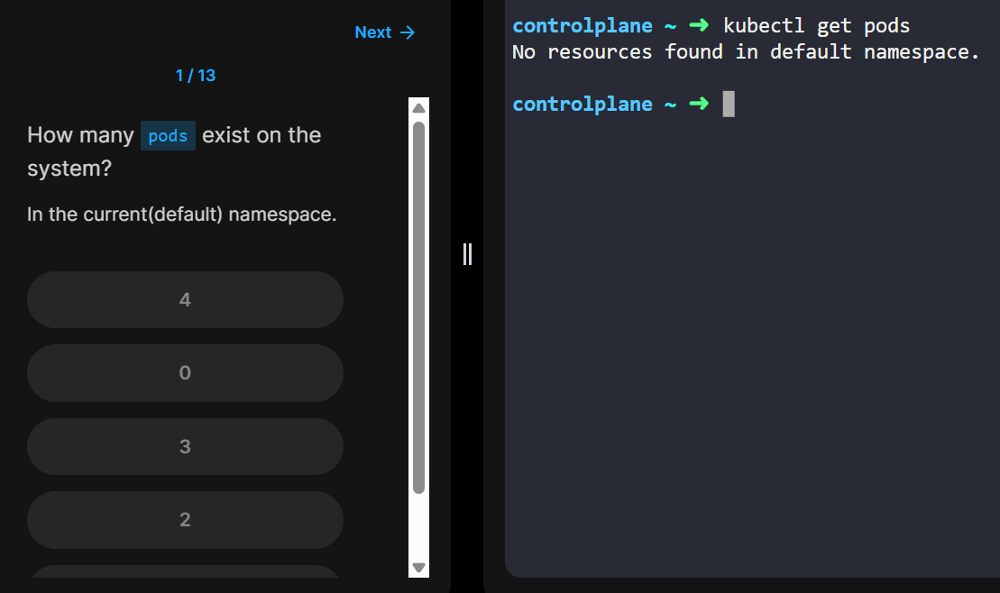
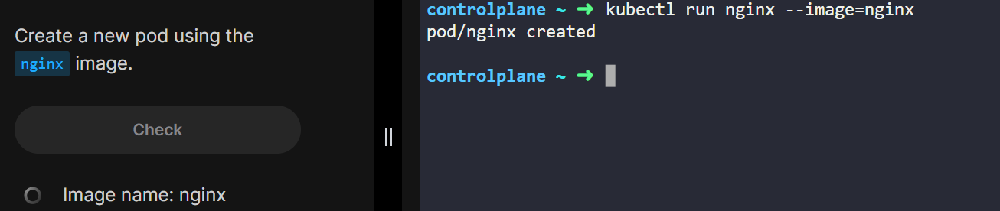
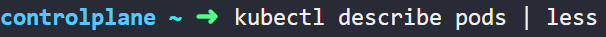
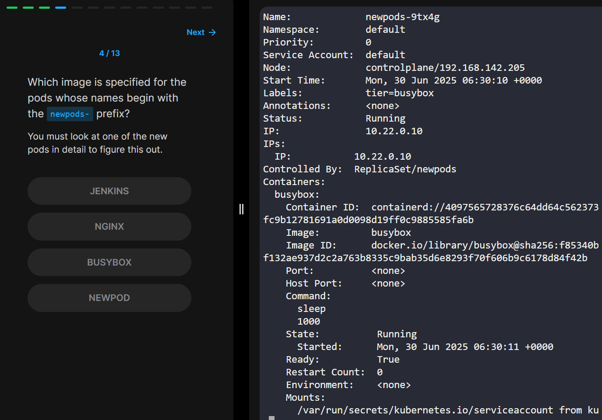
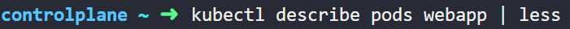
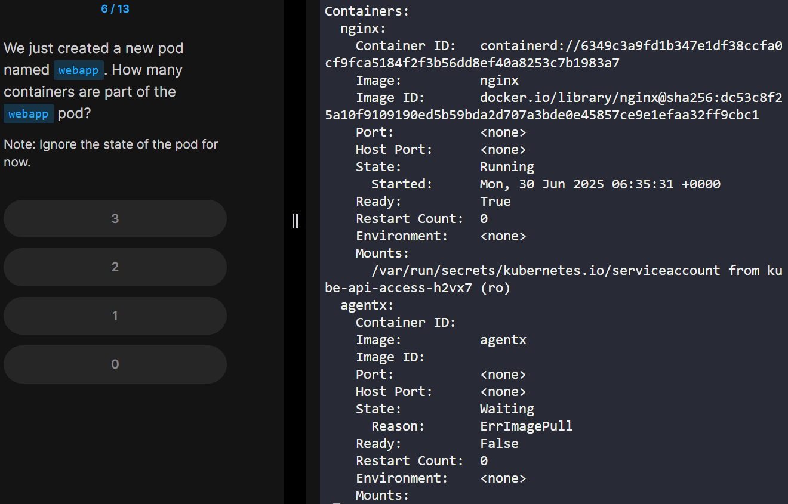
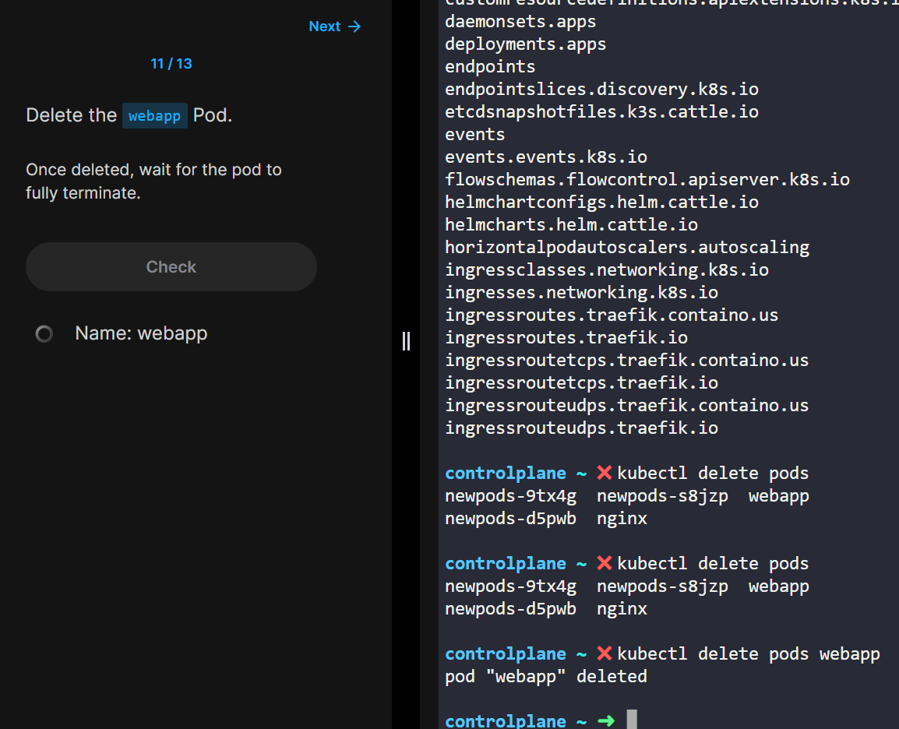
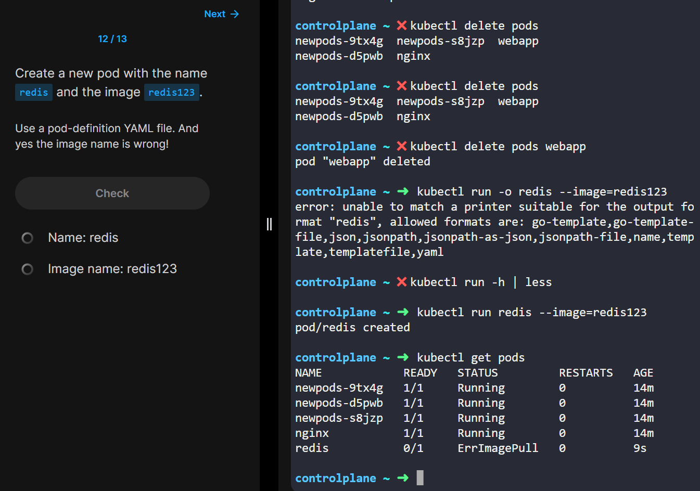
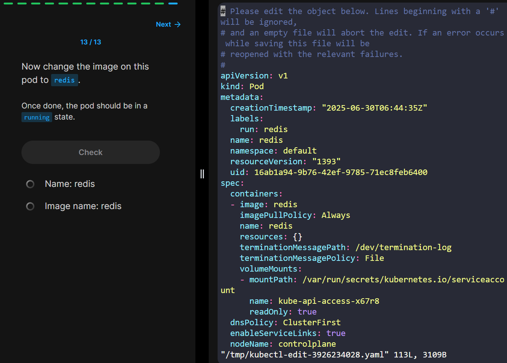

````markdown
# 📘 Kubernetes Pod 명령어 & 실습 예시 정리

---

## 📌 1. 모든 Pod 목록 확인

```bash
kubectl get pods
````



---

## 📥 2. 이미지로 Pod 생성

```bash
kubectl run <pod-name> --image=<image-name>
```

예시:

```bash
kubectl run nginx --image=nginx
```



---

## 🔎 3. 특정 이름/라벨/노드에 있는 Pod 찾기

* Label: `busybox`
* Node: `controlplane`

```bash
kubectl get pods -o wide
kubectl get pods --selector run=busybox -o wide
```




---

## 📦 4. 컨테이너 수 및 사용된 이미지 확인

* Container 수: 2개
* 사용된 이미지: `nginx`, `agentx`

```bash
kubectl get pods <pod-name> -o jsonpath="{.spec.containers[*].image}"
kubectl describe pod <pod-name>
```




---

## ❌ 5. Pod 삭제

```bash
kubectl delete pod <pod-name>
```



---

## ➕ 6. redis123 이미지를 사용한 redis Pod 생성

```bash
kubectl run redis --image=redis123
```



---

## 🛠 7. Pod 수정

```bash
kubectl edit pod <pod-name>
```



```
```
