````markdown
# 🔁 ReplicaSet 실습 정리 (명령어 + 동작 예시)

---

## 📑 1. 새로운 ReplicaSet의 spec 확인

```bash
kubectl get replicaset <replicaset-name> -o yaml
````

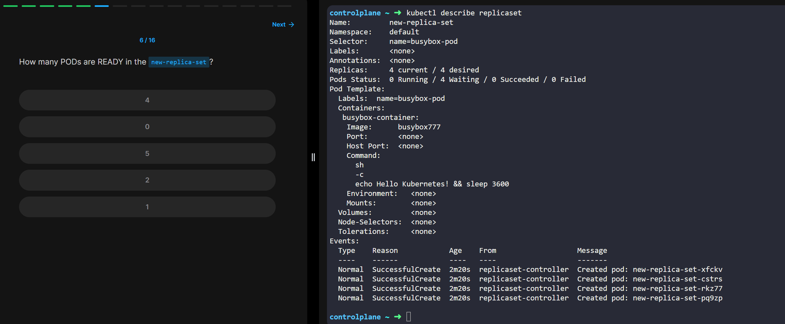

---

## 🔍 2. 관련된 Pod 정보 확인

```bash
kubectl describe pods
```

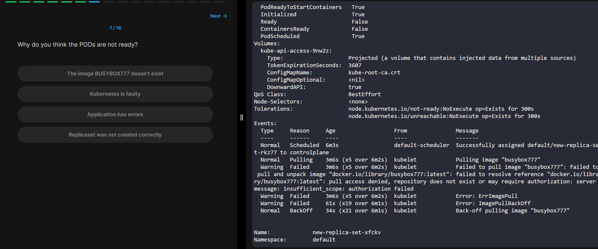

---

## 🔄 3. Pod 삭제 시 자동 복구 확인

ReplicaSet은 설정된 복제 수를 유지하려 하기 때문에, Pod를 삭제하면 새로 생성됨.

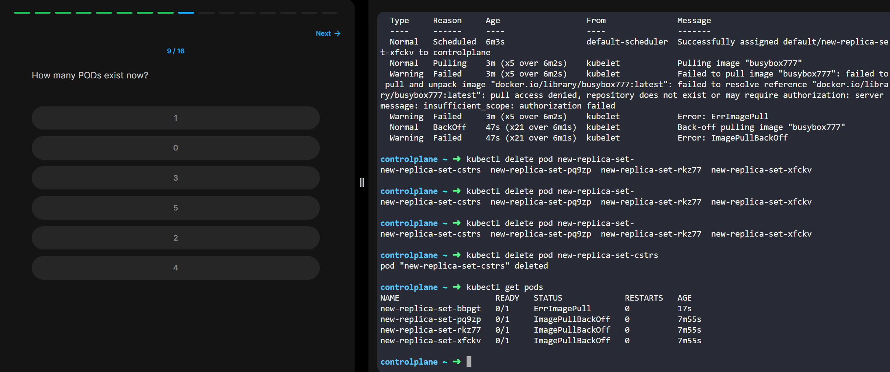

---

## 🛠 4. ReplicaSet 정의 파일 작성 & 생성

```bash
kubectl create -f replicaset-definition.yml
```

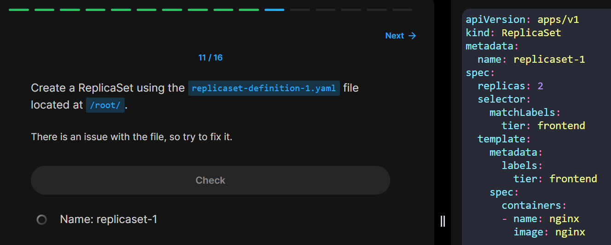
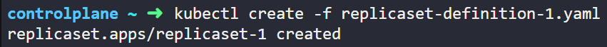

---

## 🏷️ 5. label과 matchLabels 일치시키기 & 생성

* `spec.selector.matchLabels` 와 `spec.template.metadata.labels` 가 일치해야 함
* 그래야 ReplicaSet이 해당 Pod를 추적 및 관리 가능

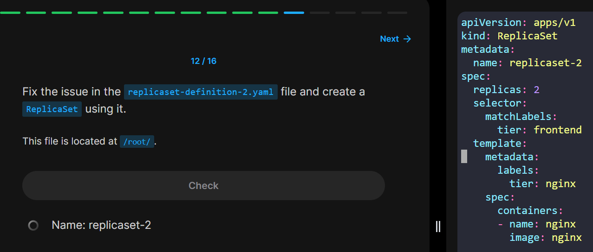
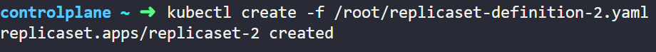

---

## ❌ 6. ReplicaSet 삭제

```bash
kubectl delete replicaset <replicaset-name>
```

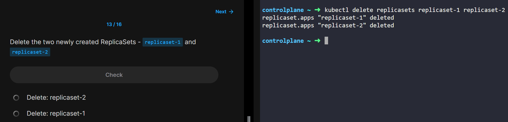

---

## 🔧 7. 이미지 수정

* 정의 파일 내 이미지 수정
* 기존 ReplicaSet 삭제 후 수정된 파일로 재생성

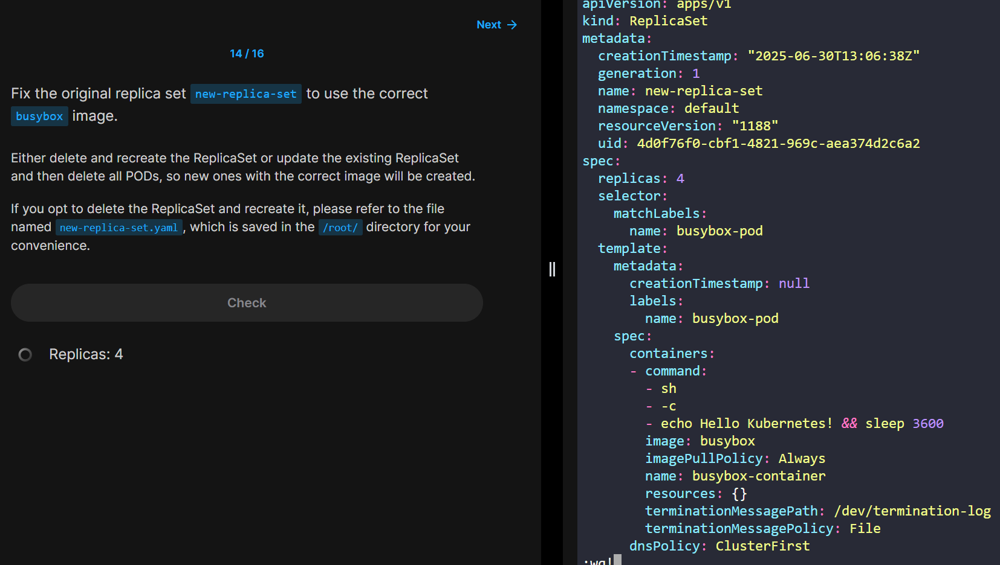
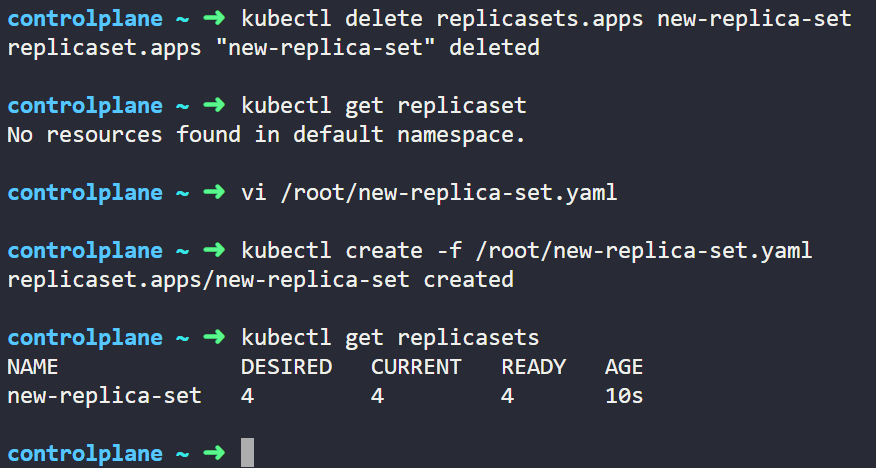

---

## 🔁 8. ReplicaSet 재정의 및 재생성

1. 기존 ReplicaSet 삭제:

   ```bash
   kubectl delete replicaset <replicaset-name>
   ```

2. 정의 파일 수정 후 다시 생성:

   ```bash
   kubectl apply -f replicaset-definition.yml
   ```

---

## 📈 9. ReplicaSet을 5개의 Pod로 스케일

```bash
kubectl scale replicaset <replicaset-name> --replicas=5
```

또는

```bash
kubectl scale -f replicaset-definition.yml --replicas=5
```

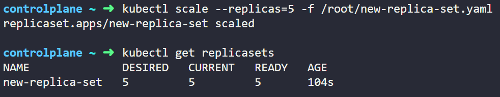
