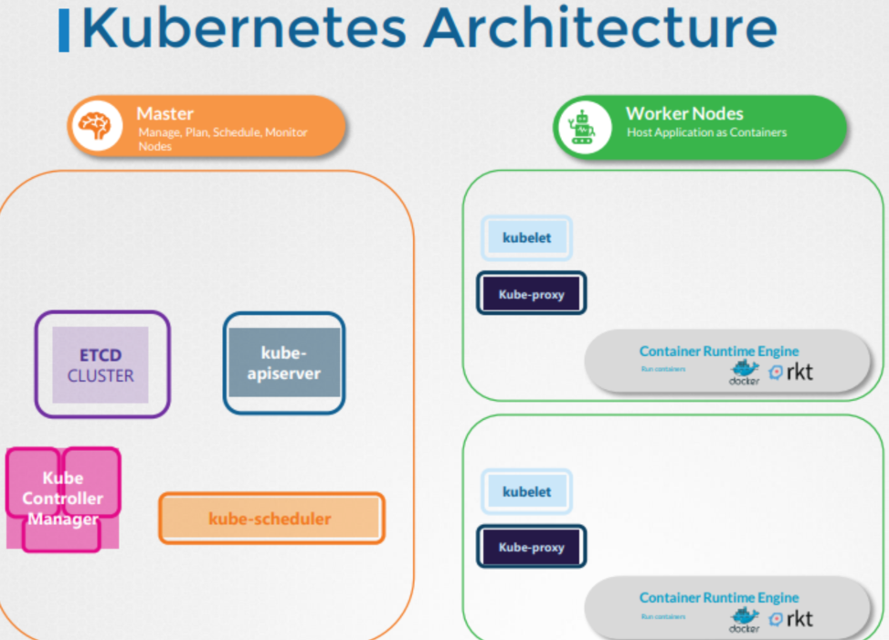

---

# 쿠버네티스(Kubernetes) 기본 개념 정리

## 1. 쿠버네티스란?

* 응용 프로그램을 **컨테이너 형식**으로 호스트하는 것을 **자동화된 방식**으로 처리하는 시스템
* 컨테이너의 배포, 스케일링, 운영 등을 자동화함

---

## 2. 쿠버네티스 클러스터 구조

쿠버네티스 클러스터는 \*\*여러 노드(Node)\*\*로 구성되며, 크게 두 종류로 나뉨:

### 🔹 마스터 노드(Master Node)

클러스터를 제어하고 관리하는 역할

* **Kube API Server**: 클러스터 내 모든 작업을 오케스트레이션
* **ETCD Cluster**: 클러스터 상태 정보를 저장하는 **Key-Value 저장소**
* **Controller Manager**

  * `Node Controller`: 노드 상태 관리
  * `Replication Controller`: 컨테이너가 항상 원하는 수만큼 실행되도록 보장
* **Kube Scheduler**: 각 컨테이너를 실행할 워커 노드를 선택 (용량, 정책, 제약 조건, 우선순위 고려)

### 🔹 워커 노드(Worker Node)

실제 컨테이너(응용 프로그램)를 실행하는 노드

* **Kubelet**: 노드 내에서 실행되는 에이전트, API Server의 지시를 받고 컨테이너 생성/제거
* **Kube Proxy**: 노드 간 통신을 지원
* **Container Runtime Engine**: 컨테이너 실행 소프트웨어 (예: Docker)

---

## 3. 쿠버네티스 아키텍처 다이어그램

### 구성 요약

| 구성 요소              | 마스터 노드 | 워커 노드 |
| ------------------ | ------ | ----- |
| ETCD Cluster       | ✅      |       |
| Kube API Server    | ✅      |       |
| Kube Scheduler     | ✅      |       |
| Controller Manager | ✅      |       |
| Kubelet            |        | ✅     |
| Kube Proxy         |        | ✅     |
| Container Runtime  |        | ✅     |

---