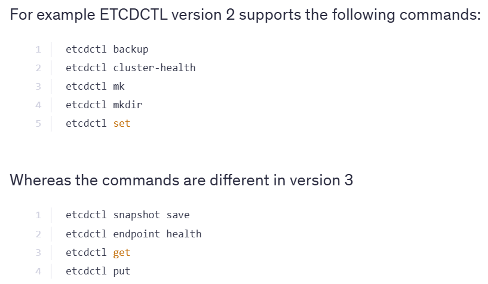

---

# 📦 ETCD Cluster

ETCD는 Kubernetes 클러스터의 **상태 정보를 저장하는 Key-Value 스토리지**입니다.
클러스터의 상태 변화는 ETCD에 실시간으로 반영되어 전체 시스템이 동기화됩니다.

---

## 📂 저장되는 정보

ETCD에는 다음과 같은 클러스터 리소스 정보가 저장됩니다:

* Nodes
* Pods
* Configs
* Secrets
* Service Accounts
* Roles
* Role Bindings

---

## 🔄 동기화

* 클러스터에 변화가 생기면, 복제된 데이터 세트가 다른 서버의 ETCD에도 업데이트됩니다.
* 고가용성을 위해 복제본들은 항상 일관된 상태를 유지하도록 설계되어 있습니다.

---

## ⚙️ 설치 방법

ETCD는 클러스터 설정에 따라 **두 가지 방식**으로 설치할 수 있습니다:

### 1. Scratch 방식 (바이너리 설치)

* ETCD 바이너리를 직접 설치하여 구성
* 내부 IP 설정이 반드시 필요
* 사용할 포트는 **Kube API 서버에서 구성**되어야 함

### 2. kubeadm Tool 사용

* ETCD를 **Pod 형태**로 배포 가능
* 상태 확인 명령어:

  ```bash
  kubectl get pods -n kube-system
  ```
* `initial-cluster` 및 `controller` 옵션을 통해 인스턴스 지정

---

## 🛠️ etcdctl 사용

ETCD를 관리할 때 사용하는 CLI 도구는 `etcdctl`입니다.

* **버전에 따라 명령어 형식에 차이**가 있으므로 주의 필요

* 예시:

  

* **API 버전을 변경하고 싶을 때**는 환경변수를 설정해줘야 합니다:

  

---

