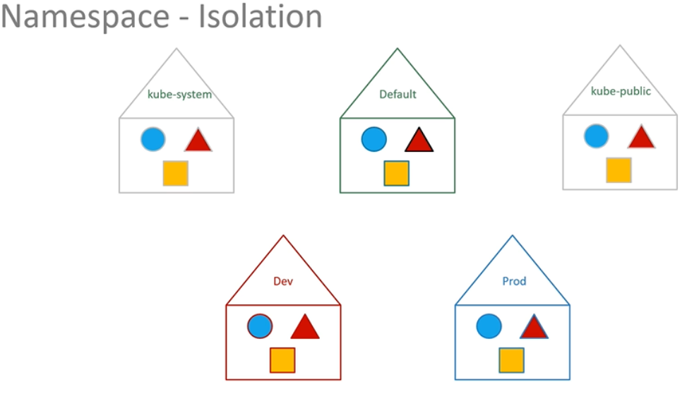

Namespace
리소스를 가상으로 분리하는 공간

k8s는 pod와 service들을 네트워킹 솔루션이나 DNS 서비스 등 내부 목적으로 생성하는데, 이를 실수로 삭제하거나 수정하는 것을 방지하기위해 다른 namespace에 생성함

각각의 namespace는 각각의 규칙이 있음

default namespace에서 리소스를 단순히 이름으로 참조할 수 있음
ex) mysql.connect("db-service") 로 db 연결

webapp pod는 다른 namespace의 pod에도 접근할 수 있음
ex) mysql.connect("db-service.dev.svc.cluster.local")
servicename, namespace, svc(Service), cluster.local(default 도메인 이름) 형식

kubectl get pods를 실행하면 default namespace의 pods들이 출력되었지만,
kubectl get pods --namespace=kube-system 을 실행하면 kube-system에 있는 pods들이 실행됨

create를 할때도 namespace를 명시하지 않으면 default namespace에 생성됨
--namespace=(namespace) 옵션을 추가하면 해당 namespace에 create됨
OR
definition file의 metadata 영역에 namespace: (namespace) 처럼 추가하면 됨

default namespace를 바꾸는 방법도 있음
kubectl config set-context $(kubectl config current-context) --namespace=dev
=> default namespace를 dev로 설정

