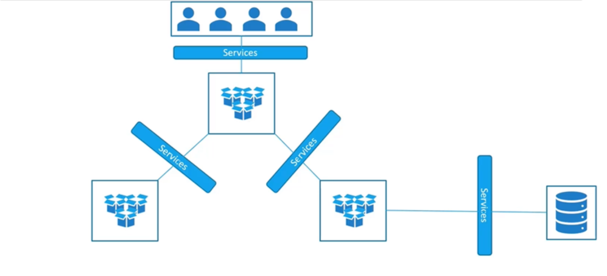
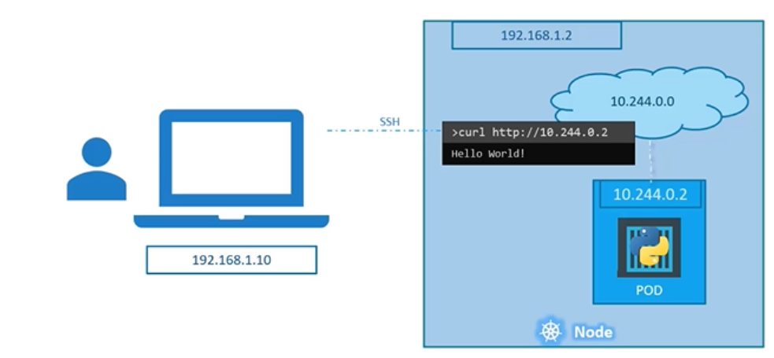
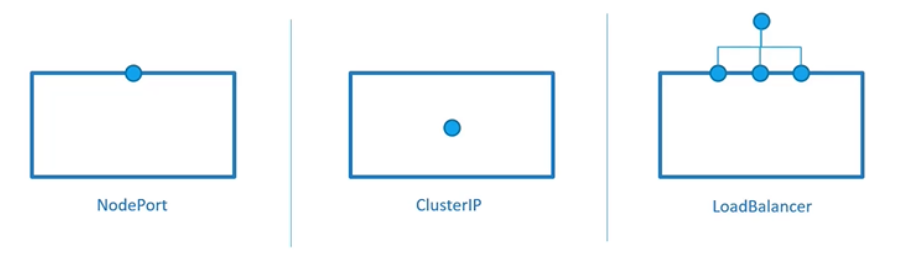
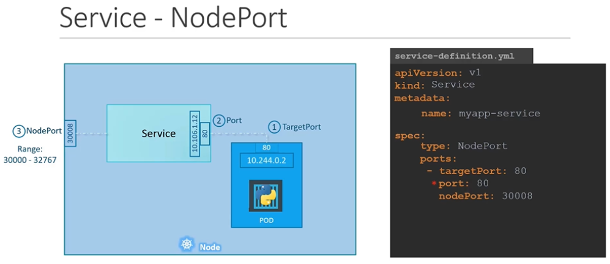

Service
Pod 그룹 간 연결을 가능하게 하는 것
=> Service는 애플리케이션의 마이크로서비스간 loose coupling이 가능하게 함

외부에서 pod에 ping을 보내기에는 서로 다른 네트워크에 있어서 불가능함
k8s 노드에 ssh로 연결하고, 이후에 curl을 통해 pod에 접속할 수 있긴 하지만, ssh를 사용해야 함

SSH없이 k8s 노드의 IP에 접근하고, 웹 서버에 접근하고 싶음
=> 노트북에서 node로, node에서 pod로 중간에 요청을 매핑해주는 k8s Service 사용

Service Type

# NodePort
노드와 노드 내 pod에서 내부 pod에 접근 가능하도록 만드는 서비스

1. 실제 웹 서버에 접속하는 포트는 80번 = target port
2. 서비스 자체의 port, 클러스터 내부에는 자체 IP가 있음 = Port, ClusterIP
3. Node에 있는 port로, 외부에서 웹 서버에 액세스할 때 사용ㅎ할 노드 30008 = NodePort(30000~32767)

definition file에 전처럼 apiVersion, kind, metadata, spec을 작성해야 함
spec의 중요한 부분으로 type과 ports가 있음
type은 서비스 유형(NodePort)
ports에는 targetPort, port, nodePort를 array로 작성해야 함
targetport를 적지 않으면 port와 동일하다고 간주되고, nodePort를 적지 않으면 범위내의 랜덤한 포트가 자동으로 배정됨

selector 에는 pod definition file에서 labels를 가져옴으로써 서비스와 pod를 연결하는 링크를 생성함

높은 가용성을 위해 노드에 pod가 여러 개인 경우가 있는데, pod들은 모두 같은 label을 가지고 있음
그 중에서 요청을 전달할 pod는 Loadbalancing이 되어 pod간 부하 분산을 해줌
=> Service는 기본적으로 Loadbalancer 역할도 함

여러 노드에 Pod들이 분산되어 있는 경우는 어떻게 될까?
서비스를 만들면 k8s는 자동으로 클러스터의 모든 노드에서 대상 포트를 매핑하도록 함
=> 클러스터의 모든 노드는 동일한 포트 번호를 사용

(Single Node, Single Pod)
(Single Node, Multiple Pod)
(Multiple Nod, Multiple Node)
어떤 경우에도 추가적인 설정을 해줄 필요가 없음

# Cluster IP
Cluster IP 서비스는 다른 계층들(프론트, 백엔드, redis)간에 소통을 하기 위한 단일 interface를 제공하는 가상의 IP
definition file의 spec type = ClusterIP 로 작성

