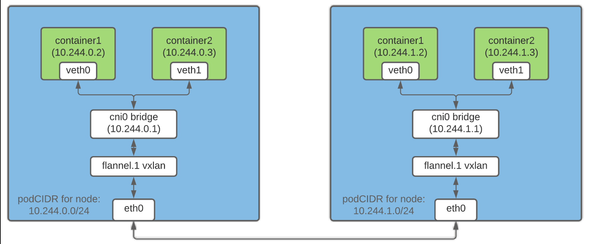

None network: Docker container가 외부로 연결될 수 없는 상태
Host network: container가 host 네트워크에 연결됨(격리X)
Bridge network: host에 가상 브릿지 인터페이스를 생성하고, container의 가상 인터페이스를 브릿지에 연결하여 통신 가능

기본적으로 호스트에 docker가 설치되면 bridge 네트워크가 생성됨.

CNI
여러 환경에서 네트워크 설정을 통일적으로 관리하기 위한 인터페이스
프로그램과 컨테이너 런타임이 이를 호출하는 방법을 정의하는 표준 

K8s에서는 네트워크 작업을 하지않음.
=> CNI 플러그인을 사용하여 네트워크 설정을 함.

CNI가 하는 일
- Pod가 생성될 때 네트워크 인터페이스 생성
- Pod에 IP 주소 할당
- Pod의 네트워크 인터페이스를 호스트의 브릿지에 연결
- Pod가 삭제될 때 네트워크 인터페이스 제거

/opt/cni/bin 디렉토리에 CNI 플러그인 바이너리가 위치해야함.
/etc/cni/net.d 디렉토리에 CNI 설정 파일이 위치해야함.

Cluster Network

Master Node
- API Server에 대해 6443 포트로 통신
- 스케줄러 10259번 포트
- 컨트롤러 매니저 10257번 포트
- etcd 2379,2380 포트
Worker Node
- 30000-32767 포트 범위: 외부 서비스에 사용
Master && Worrker Node는 Kubelet 10250 포트로 통신

실제로 netstat -nltp 로 확인해보면 etcd는 2379가 2380보다 더 많이 연결되어있음
=> 2379: 모든 컴포넌트들이 연결되는 포트
=> 2380: etcd 클러스터 노드들 간의 통신에 사용되는 포트

Commands for network config
- ip link: 모든 네트워크 인터페이스 확인
- ip addr: 모든 네트워크 인터페이스의 IP 주소 확인
- ip route: 라우팅 테이블 확인
- netstat -plnt: 리스닝 중인 포트 확인
- arp 
- route

Lab
We use Containerd as our container runtime. What is the interface/bridge created by Containerd on the controlplane node?
=> docker는 docker0 생성
=> containerd는 자동으로 네트워크를 생성하지 않음
=> CNI 플러그인을 사용하여 네트워크를 설정해야함.
=> cni

Weave cni 작동 방식
1. pod가 브릿지로 보냄
2. 브릿지는 weave agent로 보냄
3. weave agent는 패킷을 캡슐화해서 다른 weave agent로 보냄
=> 패킷화를 하는 이유: src와 dst를 pod 기준으로 작성했었는데, 캡슐화를하면 node 기준으로 작성됨
4. 다른 weave agent는 캡슐화된 패킷을 디캡슐화해서 dst pod로 보냄

Lab
사용중인 CNI 지우기
- Daemonset 지우기
- ConfigMap 지우기
- 설정파일인 /etc/cni/net.d/~ 지우기

yaml파일이 있으면 delete -f 로 한번에 지울 수 있음

Service Networking
Cluster IP: 클러스터 내의 pod에 접근할 때 사용
NodePort: 클러스터 외부에서 접근할 때 사용

서비스는 가상의 IP인데 어떻게 ip를 할당받고, 어떻게 pod로 라우팅을 해주나?
=> service가 생성되면 k8s는 미리 정의된 범위의 IP를 할당해주고, kube-proxy에서 포워딩 규칙을 생성해서 해당 IP로 오는 트래픽은 service IP -> pod IP 로 라우팅해줌

Nodeport를 사용할 땐 외부에서 접근할 땐 NodeIP:Nodeport 를 사용하고, 내부에서 사용하면 ClusterIP:ServiceIP가 따로 있음. 
Nodeport에는 port 3개를 정의해야 함
- port: ClusterIP 포트
- targetPort: 실제로 컨테이너가 듣는 포트
- nodePort: 외부용 port

NodeIP:NodePort를 사용할 때 매번 NodeIP와 NodePort를 사용하긴 힘들잖아
=> NodeIP는 DNS를 통해 도메인 네임으로 변경
=> NodePort는 DNS와 클러스터 사이에 proxy로 보냄으로써 일반적인 port를 사용하게 변경

LoadBalancer의 경우엔 요청을 proxy가 아닌 CSP의 Loadbalancer로 보냄
kubernetes에선 로드 밸런싱 역할을 ingress가 해줌
ingress도 물론 외부에서 액세스할 수 있도록 svc를 구성해야함

Ingress
- Ingress Controller: ingress resource를 보고 실제로 트래픽을 라우팅해주는 프로그램
Controller는 기본적으로 없기 때문에 deployment로 배포해줘야 함
이후 svc를 생성해서 controller에 붙여줘야 함
Deployment(ingressController)생성, Service 생성, ConfigMap 생성, ingressController를 위한 role과 rolebinding 이 필요함

- Ingress Resources: config
다양한 조건에 따라 트래픽을 라우팅하려는 경우 config를 사용함
yaml 파일로 정의하며, 여러 rule들과 여러 path들을 함께 작성

kubectl create ingress <ingress-이름> --rule="호스트/경로=서비스이름:포트" 
이런 식으로 1.20 버전 부터는 명령형으로 생성가능

kube-proxy 구성하는 법
1. userspace
2. iptables
3. ipvs

Lab
Cluster 내의 pod들 대역폭 알고싶음
=> describe node로 pod CIDR 찾기
=> controller-manager static pod yaml파일 확인

kube-proxy의 모드를 알고 싶음
=> configmap을 확인해야 함. 만약 mode가 비워져있다면 default(iptable)을 쓴다는 의미

DNS
pod에서 다른 네임스페이스의 pod에 접근하려면
=> servicename.namespacename.svc.cluster-local

Pod의 dns 이름을 IP 기반으로 작성하는 규칙이 있음
ex) 10.244.2.5 -> 10-244-2-5.namespacename.pod.clusterlocal

/etc/resolv.conf = DNS 서버 ip

core dns는 가용성을 위해 2개의 pod로 배포됨
coredns는 구성 파일이 필요함
=> /etc/coredns/Corefile
corefile은 configmap 오브젝트로 pod에 전달됨

Lab
다른 namespace에 있는 pod에 접근하려고 함.
=>이번 문제의 경우 환경변수들이 namespace에 맞는 건지 확인해보기

Lab
만약 Ingress resource에서 요구사항이 아무런 path와 맞지 않으면 default로 보냄
=> default-Backend 란을 확인했을 때, default 라고 적혀있으면 ingress controller yaml 파일로 꺼내서 확인

annotation에 rewrite를 작성해줘야 path를 백엔드에 안 넘김(백엔드와 요청 받는 방식이 다를 때 사용)

API Gateway
ingress의 한계점
- 만약 /wear과 /watch를 다른 팀에서 관리한다고 하면, 하나의 yaml 파일을 같이 사용해야 하는 불편함
- namespace 격리 없음
- No RBAC
- No resource isolation

3가지 객체가 있음
- GatewayClass: 어떤 종류의 게이트웨이를 사용할지
apiVersion: gateway.networking.k8s.io/v1
kind: GatewayClass
metadata:
  name: nginx
spec:
  controllerName: nginx.org/gateway-controller

- Gateway: 실제 입구 인스턴스
어떤 포트(80, 443 등)를 열지
어떤 프로토콜(HTTP, HTTPS, TCP 등)을 받을지
어떤 라우트들(HTTPRoute 등)을 받아줄지
apiVersion: gateway.networking.k8s.io/v1
kind: Gateway
metadata:
  name: nginx-gateway
  namespace: default
spec:
  gatewayClassName: nginx
  listeners:
  - name: http
    protocol: HTTP
    port: 80
    allowedRoutes:
      namespaces:
        from: All

- HTTPRoute: 어떤 요청을 어떤 svc로 보낼지 
kind: HTTPRoute
metadata:
  name: basic-route
  namespace: default
spec:
  parentRefs:
  - name: nginx-gateway
  rules:
  - matches:
    - path:
        type: PathPrefix
        value: /app
    backendRefs:
    - name: my-app
      port: 80

아래의 경우는 redirect http -> https
kind: HTTPRoute
metadata:
  name: https-redirect
spec:
  parentRefs:
  - name: nginx-gateway
  rules:
  - filters:
    - type: RequestRedirect
      requestRedirect:
        scheme: https

이와같이 HTTPRoute에서는 redirect, rewrite, 헤더 수정, 트래픽 분할, 요청 미러링, TLS 설정, TCP/UDP/gRPC등 지원

=> APIGateway는 Ingress보다 구조화된 라우팅 구성

gateway+httproute가 합쳐져서 ingress 역할을 함

ingress는 컨트롤러에 맞게 annotation 작성해야 하지만, apigateway는 표준으로 작성하면 다 호환됨

kustomize는 경로를 줬을 때 yaml파일만 생성해서 출력

Lab
Gateway Controller 사용하기 위한 단계

GatewayAPI리소스 다운로드(컨트롤러 공용: GatewayClass, Gateway, HTTPRoute 등) 
1. kubectl kustomize "https://github.com/nginx/nginx-gateway-fabric/config/crd/gateway-api/standard?ref=v1.5.1" | kubectl apply -f -

Nginx만의 확장기능 다운로드
2. kubectl apply -f https://raw.githubusercontent.com/nginx/nginx-gateway-fabric/v1.6.1/deploy/crds.yaml

배포
3. kubectl apply -f https://raw.githubusercontent.com/nginx/nginx-gateway-fabric/v1.6.1/deploy/nodeport/deploy.yaml

