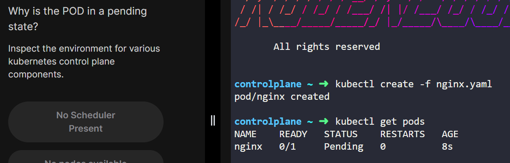

왜 pod가 pending 상태일까??
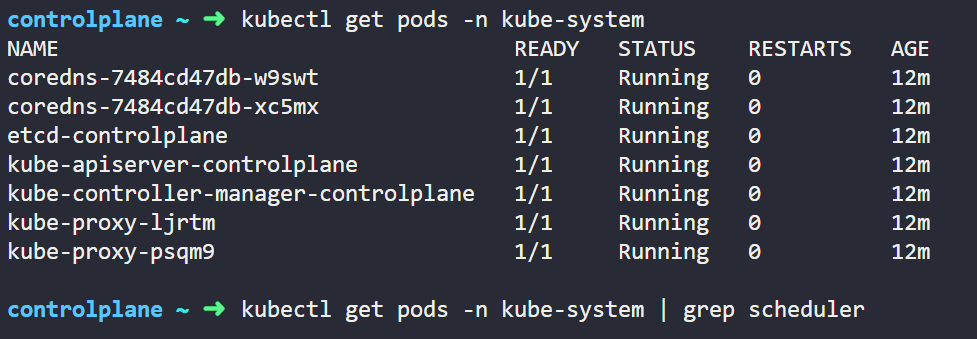

--- 

현재 스케줄러가 kube-system 상에 없음

| 명령어               | 동작 요약                      | 상세 설명                                                                               |
| ----------------- | -------------------------- | ----------------------------------------------------------------------------------- |
| `kubectl edit`    | **라이브 리소스 수정**             | 현재 클러스터에 존재하는 리소스를 편집기에서 수정하고, 저장 시 **즉시 반영** ※ 로컬의 YAML 파일은 **변경되지 않음**         |
| `kubectl replace` | **덮어쓰기 (delete + create)** | 지정한 YAML 파일로 기존 리소스를 **완전히 대체** ※ 리소스가 이미 있으면 삭제 후 재생성 (`immutable field` 변경 가능) |
| `kubectl create`  | **최초 생성**                  | 리소스가 **존재하지 않아야** 함. 이미 존재하면 실패 (`AlreadyExists` 에러 발생)                             |

--- 

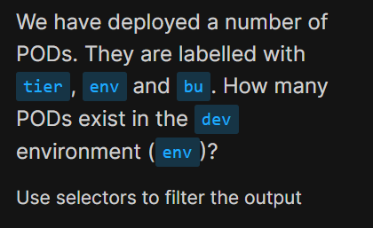

env = dev인 Pods는 몇개 존재하는가??
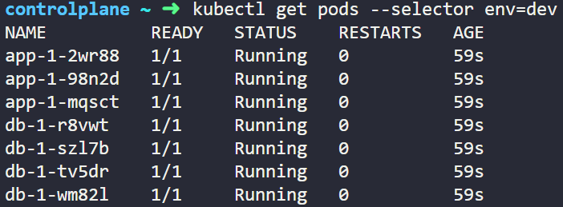

--- 

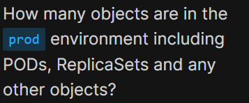

env = prod 인 리소스들은 몇개가 존재하는가??
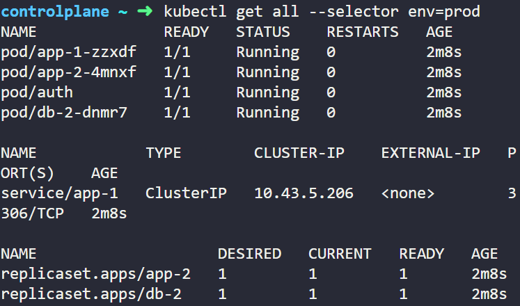

--- 

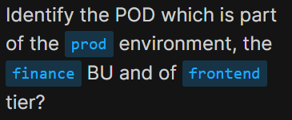

여러 filter가 존재하는 경우 filter를 ,로 연결시켜줌
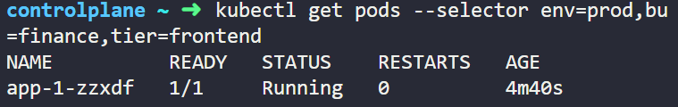

--- 
라벨 몇개인지 찾기
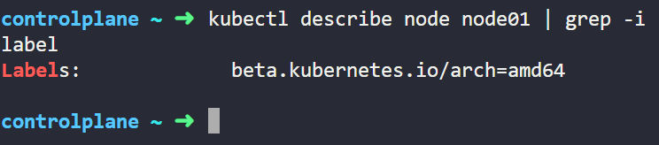

라벨이 한개인 줄 알았지만, 한줄만 출력이 된거였고 직접 describe로 확인했을 때 5개가 나온것을 확인할 수 있었음
직접 찾아보기 귀찮다면 아래의 명령어 사용해서 , 단위로 읽기
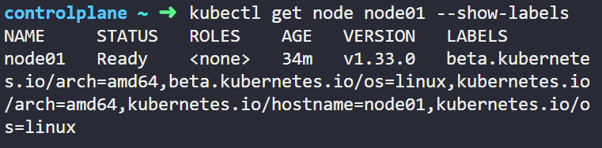

---
노드에 라벨 적용하기
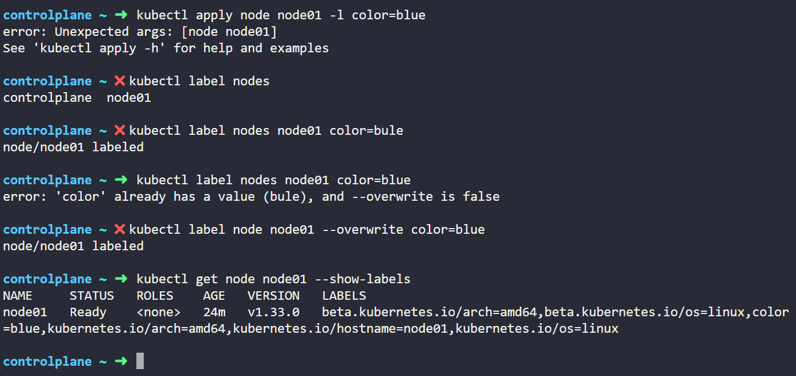

label 명령어를 통해 적용하는데, 처음에 오타로 인해 잘못 라벨을 생성했다.
수정할때는 --overwrite 명령어를 함께 사용

---

Node Affinity 설정

---

DaemonSet Deploy 하는법
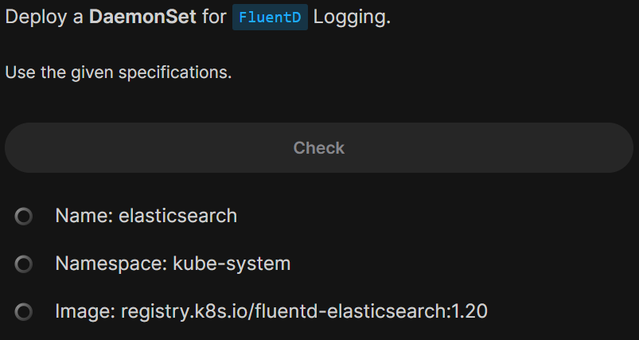

먼저 deployment를 생성한 후, yaml 파일에서 수정
kind 수정 및 DaemonSet에 필요없는 status나 replica 부분들 지워줘야 함

---

Static pod 개수 찾는 법
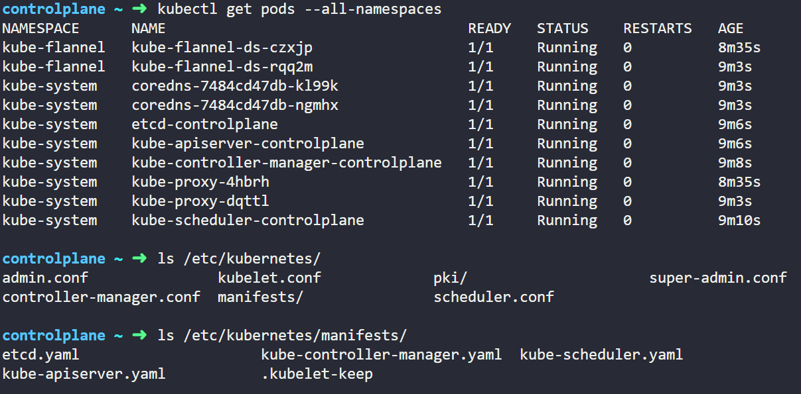

kubelet이 pod를 생성할 때 규칙이 (component)-(Nodename) 이라서 이름 패턴이 이와 같은지 확인
또는, /etc/kubernetes/manifest에 yaml 파일이 몇개있는지 확인
=> static pod는 kube-apiserver를 거치지않고, kubelet이 직접 manifest를 읽어서 생성하기 때문임

---

Static pod 생성하는 법
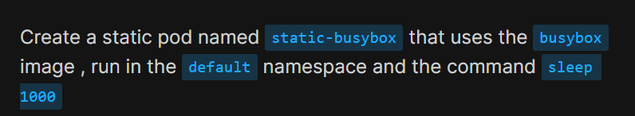

--restart=Never 옵션을 사용하면 단일 Pod가 생성되고, 옵션을 명시하지 않으면 default로 Always가 사용되어 Deployment가 생성된다.
--dry-run=client 옵션을 사용하면 yaml 파일만 생성되고 object를 생성하지 않음
static-pod는 /etc/kubernetes/manifest 디렉토리에 yaml파일만 생성하면 자동으로 kubelet이 생성해주는 것이기 때문에
--dry-run=client 옵션이 필요함
command를 입력해야 할 때는 --command를 사용하는데, 이후의 --는 옵션이 끝나고 command가 올 것 이라는 의미

kubectl run static-busybox --restart=Never --image=busybox --dry-run=client -o yaml --co
mmand -- sleep 1000 > /etc/kubernetes/manifests/static-busybox.yaml

---
Static pod 지우는 방법
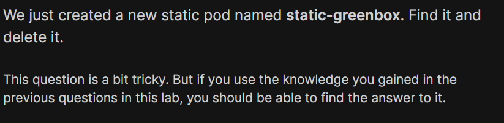

기본적으로 같은 노드에 있다면 해당 ymal 파일을 지우면 되지만, greenbox의 경우엔 controlplane이 아닌 node01 노드에 존재했다.
그래서 ssh를 통해 node01 노드로 이동하고, /var/lib/kubelet/config.yaml파일에서 해당 노드의 staticpodpath를 확인했고, 그 위치에 있는 yaml 파일을 삭제해주었다.

처음엔 config 파일은 찾아보았지만.. default에 있는 controlplane 노드의 staticpodpath를 찾아봤더니 정석적인 manifest 디렉토리에 greenbox.yaml이 없다는 것 까지만 알았었다..

---
Priority Class 생성
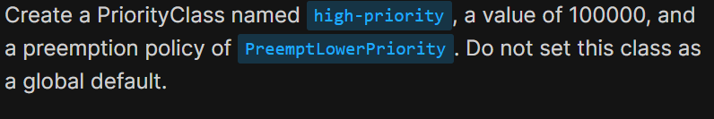

Priority Class 는 생성 이후에 value 필드를 수정할 수 없음
