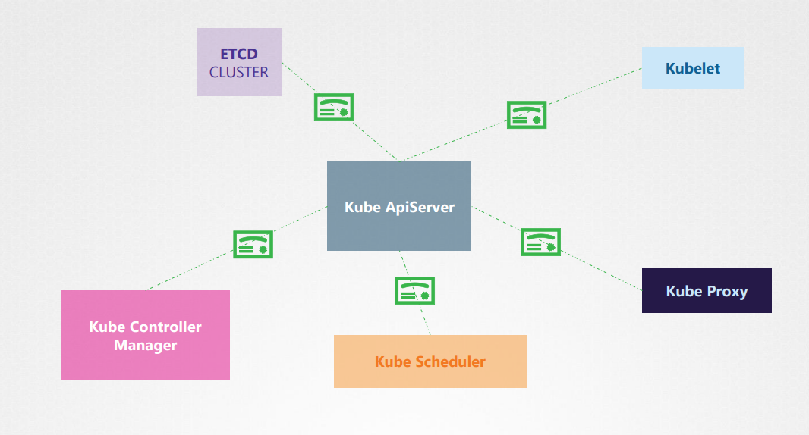
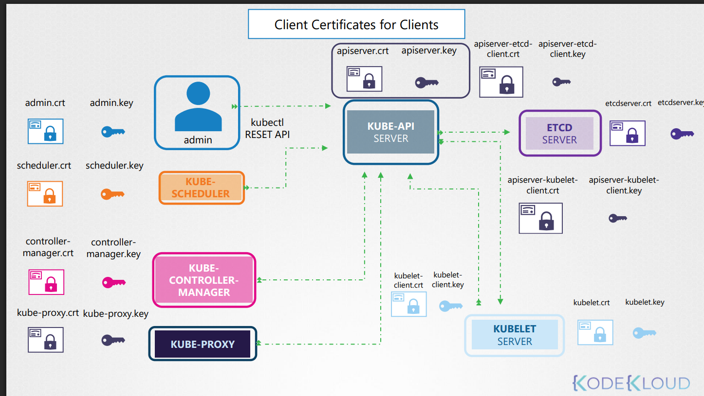
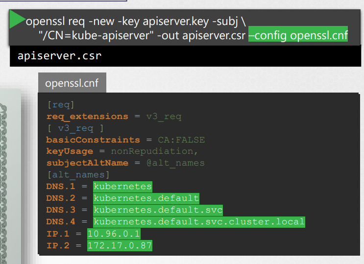

Kube-api server는 쿠버네티스의 모든 작업의 중심에 있음
=> API 서버에 대한 1차 방어선 이라고 할 수 있음

보안에서는 who, what에 따라 2가지 측면이 존재
who: Authentication, 인증으로 apiserver 인증서를 인증하는 여러 방법 존재
what: Authorization, 권한부여에 따라 수행할 수 있는 작업 정의

kube-apiserver와 etcd, control manager, kubelet, schedular, Proxy와 연락할 때는 TLS로 보안이 유지됨

Network Policy
기본적으로 Pod는 클러스터 내의 다른 pod에 액세스할 수 있음
=> Network Policy 제한 가능

Authentication
- 클러스터에 액세스 보호가 목적

2가지 액세스 유형이 있음
Admin, Developer : User
Bots : Service Account

Kubernetes는 사용자 계정은 관리(생성 및 보기)할 수 없지만, Service Account는 관리할 수 있음

Kube-Apiserver는 모든 요청을 처리하기 전에, 요청을 인증함
1. kube-apiserver
2. Authenticate User
3. Process Request

ApiServer가 인증하는 방법
- Static Token files: 사용자 이름과 토큰 저장
- - 고정(정적) 토큰을 파일에 미리 적어두고, API Server가 그 파일을 참고해 토큰 → 사용자/그룹을 매핑해 인증하는 방식.
- - 이 방식은 안전하지 않으므로 권장하지 않음

- Certificates: 인증서
- Ldap, Kerberos: 타사의 인증 프로토콜

APIserver를 항상 통하므로, 상황에 따라 클라이언트, 서버 역할이 될 수 있음

Admin, Schedular, Controll Manager, kube-proxy (client) -> kube apiserver (server)
kube apiserver (client) -> etcd, kubelet (server)

Generate Certification
여러 도구를 사용할 수 있지만 강의에서는 Openssl 사용

CA 인증서 생성
1. 키 생성
2. 인증서 서명 요청
3. 인증서 서명

Client 인증서 생성
과정은 동일하지만 3번에서 차이가 발생
인증서 서명할 때 ca인증서와 ca키를 지정해서 서명
=> 유효한 서명이 됨

다른 admin과 구분을 하고 싶다면, 2번 과정에서 OU 매개변수를 통해 그룹 정보 추가

Server 인증서 생성
과정은 동일

etcd의 경우 고가용성 환경에서 여러 서버에 걸쳐 클러스터에 배포 가능(peer)
peer 마다 인증서를 생성해줘야 함

kube-apiserver의 경우 부르는 이름이 다양함
=> 모든 이름을 지정해줘야하는데 어떻게?
=> 2번 과정에서 openssl config 파일을 생성 후 이름을 넣어줘야 함

모든 컴포넌트는 클라이언트를 확인하기 위해 CA인증서가 필요!

Kubelet의 경우 각 노드마다 인증서가 필요함

Lab
인증서 확인해보려면 openssl x509 -in filepath -text -noout 
apiserver/etcd가 이상해서 kubectl 이 안되면 로그확인 어떻게하지?
=> crictl ps -a / crictl logs containerID
로그 확인 후 뭐가 문제인지 알아야함

manifest file에 경로가 잘못되어있지 않은지 확인

KubeConfig
API server에 curl을 보낼 때 TLS를 해야하니까 키, 인증서, ca인증서가 필요함
=> 사용자를 인증하기 위해서 api server에 요청을 보냄

이러한 내용들을 매번 적기엔 귀찮고 힘듦
=> KubeConfig 파일 사용

Config파일에는 3가지 영역이 있음
- Cluster : 액세스할 수 있는 클러스터 
- Context : Cluster와 User를 연결시켜줌. 어떤 사용자가 어떤 클러스터에 액세스할지 정의
- User : 클러스터에 액세스할 수 있는 사용자들

그럼 Cluster에는 내 API Server와 ca인증서가 들어가고, Users에 키, 서버 인증서가 들어감
yaml파일에서 current-context를 통해 현재 어떤 context를 사용할지 지정 가능
kubectl config view 명령어로 현재 config 볼 수 있음

명령어로도 current-context 수정 가능
kubectl config use-context <context이름> 을 사용하면 해당 context가 current-context가 됨

kubectl config --kubeconfig= ~~ 에서 --kubeconfig를 사용하지않으면 기본파일을 사용함

namespace마다 다른 클러스터가 있을텐데 context를 그럼 계속 바꿔줘야하나요??
=> context에 namespace 영역을 추가할 수 있는데, 추가하면 해당 namespace로 가면 current-context가 자동으로 바뀜

Lab
환경설정하려는데 세션을 유지하지 않아도 영구적으로 유지되게하려면 .bashrc 파일 수정

API Groups
여러 api 그룹들이 있음
- /version : 클러스터 버전을 보기 위함
- /metrics, healthz : 클러스터 상태를 모니터링 하기위함
- /logs : 타사의 로깅 앱과 연동하기 위함
- /api, /apis : 클러스터 기능 담당

/api는 Core group, /apis는 Named group
/api/v1 아래에 pod,endpoint,PV,namespace 등등 핵심기능들이 존재
/apis 아래에는 앱, 확장프로그램, 네트워킹, 스토리지, 인증, 권한부여등을 위한 그룹들이 있고, 새로운 기능 들을 다 여기에 들어감
/apis/app 에는 deployments, replicasets, statefulsets 같은 resource들이 존재

Authorization
Node Authorization: 각 노드가 자기에게 필요한 리소스만 접근할 수 있게 제한하는 권한으로, 주로 kubelet이 kube-apiserver에 요청할 때 적용됨
ABAC(Attributes-Based Access Control): 속성 기반 접근제어로, policy를 위한 json 파일을 생성해줘야 함. 보안을 추가하거나 변경해야할 때마다 정책 파일을 수동으로 변경해야하고, kube apiserver를 재시작해야하는 단점이 있음
RBAC: AWS의 IAM 역할이라고 생각하면 편함. Developer 역할에 할 수 있는 권한을 제공해두고, 개발자들에게 developer 역할을 제공
Webhook: 인증을 외부에 맡기고 싶음
AlwaysAllow(default), AlwaysDeny 옵션들도 있음

/usr/local/bin/kube-apiserver에서 authorization-mode를 확인
여러 mode들을 사용하고 싶으면 ,로 이어서 작성해주면 되는데, 인증 순서는 작성한 순서대로 진행됨

RBAC
definition file 작성하는 법
apiVersion, kind, metadata, rules로 구성되는데 rules에는 3가지 섹션이 필요함. 배열로 이루어져있음
- apiGroups: Core Group의 경우에는 [""] 처럼 비워둬도 됨/ 아닐 경우 작성
- resources: ["pods"] 처럼 리소스 작성
- verbs: ["delete", "get", "list"] 등등 할 작업 작성
- resourceNames: 일부 리소스에 대한 액세스권한 부여도 가능

해당 RBAC를 만들고, User에게 해당 규칙을 적용하기 위해서 규칙 바인딩이라는 개체를 만들어야 함

subjects는 사용자 세부 정보를 지정하는 곳
roleRef는 생성한 규칙의 세부 정보를 제공하는 곳

Role과 RoleBinding은 namespace 범위에 속함

사용자가 클러스터의 특정 리소스에 대한 액세스 권한이 있는지 확인하려면 어떻게 해야할까?
kubectl auth can-i create deployments 처럼 확인

ClusterRole
Role과 같지만 Cluster 영역을 다룸(not namespace)
방식은 Role과 똑같으며, 명령어의 차이만 존재함

ServiceAccount
2가지 유형의 계정이 존재
User Account: 사용자가 사용
Service Account: 기계가 사용

Service Account에는 인증을 위한 토큰을 가지고 있음
또한 Service Account는 Pod내의 볼륨에 저장되어있으며, 확인하고 싶으면 /var/run/secrets/kubernetes.io/serviceaccount 를 확인

ServiceAccount를 생성하면 pod의 definition file에 spec.serviceAccountName에 추가해줘야 함.
이후 Pod를 describe해보면 serviceaccount가 mount된 위치같은 정보를 알 수 있음
만약 ServiceAccount가 자동으로 pod에 mount되는게 싫다면 
automountServiceAccountToken: false를 추가해주면 됨

Token은 생성할 수 있는데, 저장소에 저장되지 않음
default로는 1시간이 유지되는데, 연장 및 시간을 정할 수 있음

Image Security
Docker Hub를 사용하지 않고, 다른 registry를 사용한 image라며 풀 경로를 적어줘야 함

private registry를 사용할 때 secret을 사용해야 하는데,
secret 생성할 때는 옵션으로
- docker-server: registry
- docker-username: username
- docker-password, docke-email
총 4가지 옵션이 필요함
이후 definition file의 imagepullSecrets에 secret이름 작성해주면 됨

Docker 기본 지식
프로세스들은 서로 다른 namespace에서 서로 다른 ID를 가짐
=> 프로세스 격리

Docker에서 원하는 사용자 아이디를 지정해서 default로 컨테이너를 실행시키고 싶으며 UESR 옵션 사용

Lab
컨테이너의 sleep 명령어 실행하는 사람이 누구냐?
solution -> kubectl exec ubuntu-sleeper -- whoami
내 답 -> command 찾고, ps -a 로 누가 실행하는지 확인하기

securityContext를 통해 container level과 pod level에서 실행할 사용자를 설정할 수 있음
root user로 실행시켜야 함
solution -> runAsUser을 쓰지 않으면 기본적으로 root user로 실행됨
나 -> root가 실행 중인 프로세스 ID 아무거나 넣었다가 실패..

pod level에서는 capabilites가 설정할 수 없으므로, container level에서 설정

Network Policy
Ingress: 외부에서 내부로 인바운드하는 트래픽
Egress: 내부에서 외부로 아웃바운드하는 트래픽

pod들은 service를 통해 해당 클러스터내의 리소스들에 접근할 수 있어야 함.
만약 web pod, api pod, db pod가 있으면 web이 db 에 바로 접근할 수 있게 되니까, 이를 방지해야함
Network policy도 pod, replicaset 과 같은 오브젝트로, 네트워크 정책을 하나이상의 포드에 연결
ex) db에서는 api pod의로부터 오는 ingress 트래픽만 허용

pod의 labels.role과 NetworkPolicy의 matchLabels.role이 동일해야 함

NetworkPolicy 작성법
podSelector로 자신에 대한 matchLabel 작성
policyTypes로 ingress/Egress 타입 선택
이후 해당 트래픽 타입에 대한 설정 
ex) 
ingress:
- from:
  - podSelector: 
      matchLabels:
        name: ~~
    namespaceSelector:
      matchLabels:
        name: ~~
  - ipBlock:
        cidr: ~ /32 를 통해 외부 DB에 접근가능

-를 통해서 조건을 붙이면 And, 각각 - 를 사용한다면 or로 여러 조건 나열하는 형식

  ports:
  - protocol:
    port:

CustomResourceDefinition
내가 원하는 리소스 생성하는 것으로,
CRD를 생성하고 난 뒤에 해당 리소스를 사용할 수 있음

name에 plural(복수형)과 singular(단일형)가 있는데, plural은 metadata의 name 앞부분과 일치해야 함
internals.datasets.kodekloud.com 에서 각각의 속성이 의미하는 것은 무엇일까?
=> describe로 봐야 암...

