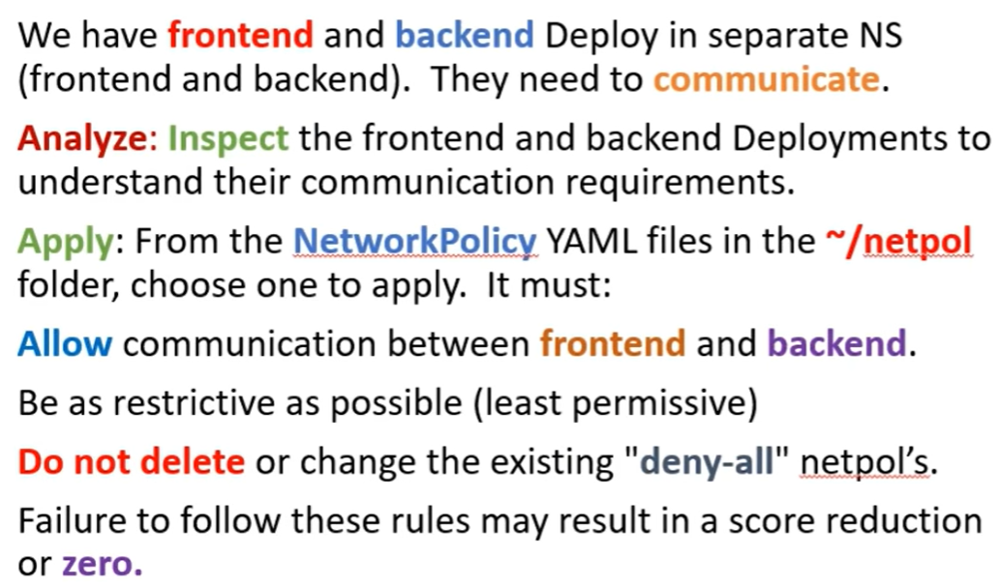
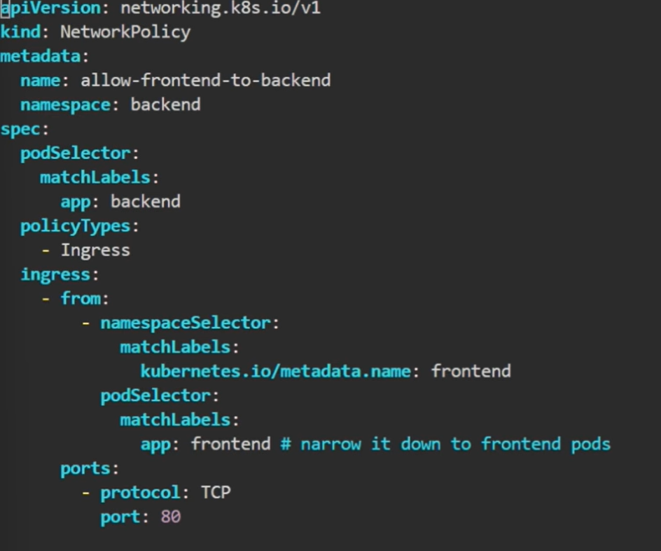
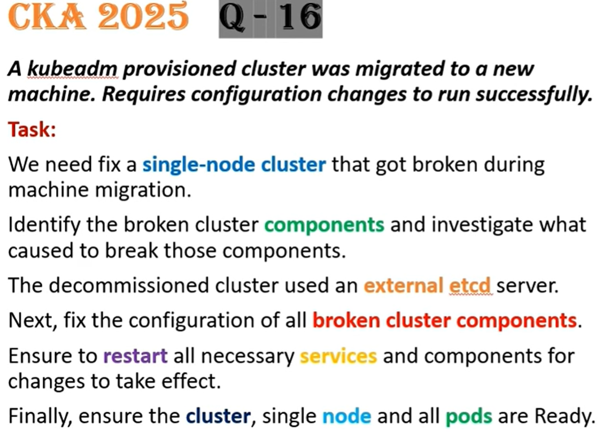

예상 질문
configmap 수정

1. configmap ! 
An Nginx Deploy named nginx-static is Running in the nginx-static NS. 
It is configured using a ConfigMap named nginx-config. Update the nginx-config ConfigMap to allow only TLSv1.3 connections. re-create, restart, or scale resources as necessary. By using command to test the changes.

nginx-config 자체를 TLSv1.3을 허용하도록 수정해야함. 
- k edit configmap -n ~ ~ 
- TLSv1.3만 사용하도록 수정
이후에는 deployment를 새로 시작해주기.
- 재시작은 k rollout restart deploy ~ -n ~ 
환경변수로 사용중인 configmap은 재시작 해줘야 함

2. ingress to Gateway Migration !
Migrate an existing web application from Ingress to Gateway API. We must maintain HTTP Success. 
A GatewayClass name nginx is installed in the cluster.

First, create a Gateway named web-gateway with hostname gateway.web.k8s.local that maintains the existing TLS and listener configuration from the existing ingress resource named web.
Next, create an HTTPRoute named web-route with hostname gateway.web.k8s.local that maintains the existing routing rules from the current Ingress resource named web.
Finally, delete the existing Ingress resource named web.

gateway 만들어서 ingress에 있던 TLS 설정들을 가져와야 함. 이때 document는 api resources에 들어가서 귀찮지만 보거나 explain recursive로 확인하기. 
tls.certificateRefs의 kind는 default로 secret이고, 주로 secret을 사용하기 때문에 kind를 웬만하면 안 해도 될듯 함
httproute에서도 gateway 참조하고, routing 하는 설정들 가져와야 함
기존의 ingress 지우기

3. hpa

4. install cni(flannel) !
Install and configure a Container Network Interface (CNI) of your choice that meets the specified requirements. Choose one of the following CNI options:

Flannel (v0.26.1)
using the manifest:
© [kube-flannel.yml]
(https://github.com/flannel-io/flannel/releases/download/v0.26.1/kube-flannel.yml)

Calico (v3.28.2)
using the manifest:
[tigera-operator.yamll]
(https://raw.githubusercontent.com/projectcalico/calico/v3.28.2/manifests/tigera-operator.yaml)

flannel은 가벼운 cni, Calico는 고급이면서 pod to pod 연결할 때 사용
다운로드 했을 때, 에러가 날 수 있음.
에러가 났을 땐 에러난 pod 로그 확인해보고, 주로 kubeadm configmap에 pod cidr을 확인

5. install cni(calico) !
Let pod communication => calico
처음에 operator을 apply 하고 나서, custom-resources 를 다운 받아야 함.
이때 wget으로 yaml 파일을 가져와서, pod cidr 대조 하고 이때 수정 할 필요가 있으면 하고 apply

6. argocd 다운로드 !
Install Argo CD in cluster:
Add the official Argo CD Helm repository with the name argo.
The Argo CD CRDs have already been pre-installed in the cluster.
Generate a helm template of the Argo CD Helm chart version 7.7.3 for the argocd NS and save to /argo-helm.yaml
Configure the chart to not install CRDs.
Install Argo CD using Helm with release name argocd using the same version as above
and configuration as used in the template 7.7.3.
Install it in the argocd ns and configure it to not install CRDs.
You do not need to configure access to the Argo CD server Ul.

argo라는 repo 추가
tempate 만들 때 버전 7.7.3으로 argo namespace에 CRDs not install 한 상태로 /argo-helm.yaml에 저장
- helm template argocd argo/argo-cd -n argo --version=7.7.3 crds.install=false > /argo-helm.yaml
여기서 argo-cd라는 차트 이름은 helm search repo argo 로 찾았고, crds.intall은 helm show values argo/argo-cd | less 로 찾음

7. priorityclass

8. Service(expose Nodeport)
Reconfigure the existing Deployment front-end in namespace sp-culator to expose port 80/TCP of the existing container nginx.
Create a new Service named front-end-svc exposing the container port 80/TCP.
Configure the new Service to also expose the individual pods via & NodePort.

front-end-svc를 만드는데, 이걸로 container port 80/TCP도 개방하고, Nodeport로 외부에도 개방해라.

9. storageclass
Create a new StorageClass named low-latency that uses the existing provisioner rancher.io/local-path.
Set the VolumeBindingMode to WaitForFirstConsumer. (Mandatory or the score will be reduced)
Make the newly created StorageClass (low-latency) the default StorageClass in the cluster.

10. sidecar
Update the existing Deployment synergy-deployment, adding a co-lopated container named sidecar using the busybox:stable image to the existing Pod.
The new co-located container has to run the following command:
/bin/sh -c "tail -n+1 -f/var/log/synergy-deployment.log"

Use a Volume mounted at /var/log to make the log file synergy-deployment.log available to the co located container.

co-located에 관한 별 다른 특징이 없다면 그냥 container를 사용해도 무방할듯함.
특정 조건이 생기면 initContainer 사용하는 것도 생각해볼 것

11. crd ! 
Task: Verify the cert-manager application which has been deployed in the cluster.
Create a list of all cert-manager Custom Resource Definitions (CRDs) and save it to ~/resources.yaml.
make sure kubectl's default output format and use kubectl to list CRD's

Using kubectl, extract the documentation for the subject specification field of the Certificate Custom Resource and save it to ~/subject.yaml.

cert-manager라는 crd 리스트들을 ~/resources.yaml에 저장 (kubectl의 기본 output으로 하기)
- k get crds | grep -i cert-manager > ~/resources.ymal
Certificate라는 crd의 document에서 subject specification field를 ~/subject.yaml에 저장
- k get crd | grep -i certificate
- k explain certificate.spec.subject > ~/subject.yaml

12. allocation
A WordPress application with 3 replicas in the relative-fawn namespace consists of:
cpu 1 memory 2015360ki

Divide node resources evenly across all 3 pods.
Give each Pod a fair share of CPU and memory.
Add enough overhead to keep the node stable.

음.. 균등 배분은 자기가 직접 하는 것
명령어나 value값이 있을 줄 알았지만 직접 나누기 해서 하면 됨
예시: cpu 0.3 memory 600000ki -> cpu 300m memory 600Mi

13. pv
A user accidentally deleted the MariaDB Deployment in the mariadb namespace.
Re-establish the Deployment while ensuring data is preserved by reusing the available PersistentVolume.
Task: A PersistentVolume already exists and is retained for reuse. only one pv exist. Create a PersistentVolumeClaim (PVC) named mariadb in the mariadb namespace

with the spec: Access mode, ReadWriteOnce and Storage 250Mi

Edit the MariaDB Deploy file located at ~/mariadb-deploy.yaml to use PVC created in the previous step.
Apply the updated Deployment file to the cluster.

이전에 사용하던 pv가 남아있으니 그걸 pvc를 통해서 사용하는 문제
pvc 생성하고나서, deployment에 생성한 pvc를 통해 pv사용

14. ingress
Create a new ingress resource echo in echo-sound namespace
Exposing Service echoserver-service on http://example.org/echo using Service port 8080

Ingress 만들 때 name: echo, namespace: echo-sound로 생성하고, 
host: http://example.org port는 8080으로 만들기만 하면 될 것 같음
path: /echo, ingressClass는 찾아서 사용하기

15. netpol

적절한 netpol 찾기
둘은 각각의 ns에 존재함.
그렇다면 namespace selector가 있으면 되지 않을까 싶음

namespace selector + pod selector 까지 해서 최대한 제한하기
하나의 리스트에 namespace selector와 pod selector에 있는 것
만약 각각 - 가 존재하면 or 이기 때문에 제한이 느슨해짐

16. kubeadm? cridockerd? !
Complete these tasks to prepare the system for Kubernetes:
Set up cri-dockerd: Install the Debian package: ~/cri-dockerd_0.3.9.3-0.ubuntu-focal_amd64.deb
Enable and start the systemd service for cri-dockerd.

Configure these system parameters:
Set net.bridge.bridge-nf-call-iptables to 1.
Set net.ipv6.conf.all.forwarding to 1.
Set net.ipv4.ip_forward to 1.

먼저 sudo dpkg -i ~/cri-dockerd_0.3.9.3-0.ubuntu-focal_amd64.deb 로 install 하면 될 것 같음
system parameter들은 /etc/system.d/에 config 파일에다가 넣으면 되지않을까.. 싶음
이후 systemctl restart cri-dockerd 할 것이라고 생각했음. X

먼저 install은 똑같이 sudo dpkg -i ~ 로 진행해주고, sudo systemctl enable --now cri-docker.service로 시작해줌
이후 /etc/sysctl.d/conf 파일에서 아래의 명령어 수정해주면 됨
sudo sysctl --system 명령어로 적용까지 해주기.

17. trouble shooting

kubectl 명령어가 안돼서 journalctl -u kubelet.service -f 로 확인해봤더니 그냥 connection refused 에러만 발생
=> apiserver 죽음

externel etcd를 사용했다고 하니 먼저 etcd쪽 문제 의심
=> /etc/kubernetes/manifest/kube-apiserver에서 etcd 쪽 설정이 잘못되어 있지 않은지 확인

머신 옮기면서 IP나 포트가 바꼈을 수 있으니까 /etc/kubernetes/kubelet.conf or /etc/kubernetes/admin.conf 확인

만약 journalctl -u kubelet도 에러가 난다면 kubelet이 api server를 못 띄우고 있는 것. 
=> crictl ps 로 확인

18. trouble shooting
kube-scheduler의 manifest를 확인했을 때, 너무 많은 리소스를 사용한 케이스도 존재함
이때 조건으로 가용 리소스의 10퍼센트만 사용하라는 내용이 있었으므로, 그에 맞게 조정

kube-config의 파일들의 내용을 출력할 때 jsonpath를 안 써도, get-context 명령어로 가져올 수 있음
config 파일에서 인코딩되어있는 내용을 보려면 --raw 옵션을 추가해서 보면 되고, 
디코딩 할때는 base64 -d 옵션을 붙여주면 됨

NodeAffinity, PodAffinity 한번씩 보기

apigateway에서 httproute를 통해서 헤더의 유무에 따라 트래픽분산 가능
- matches:
        - path:
            type: PathPrefix
            value: /auto
          headers:
          - type: Exact
            name: user-agent
            value: mobile
      backendRefs:
        - name: web-mobile
          port: 80 
일반적인 httproute 경로 + headers 

certification
kubeadm check-expiration 으로 인증서 만료날 알 수 있음(open ssl로도 알 수 있음)

coredns
dns resolution 건드릴 떈 configmap에 kubernetes 뒤에 추가 ex) kubernetes cluster.local in-addr.arpa ip6.arpa
백업 파일 생성할 때는 -o yaml 로 만들고, 백업할 때는 k diff -f ~

crictl
컨테이너의 런타임 정보를 알고 싶으면 crictl inspect (containerID)
