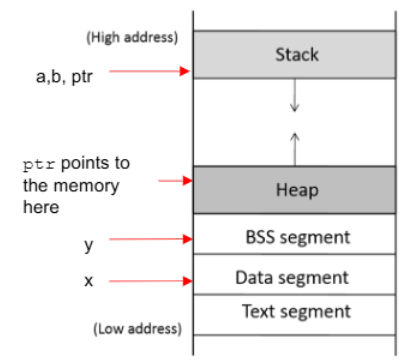
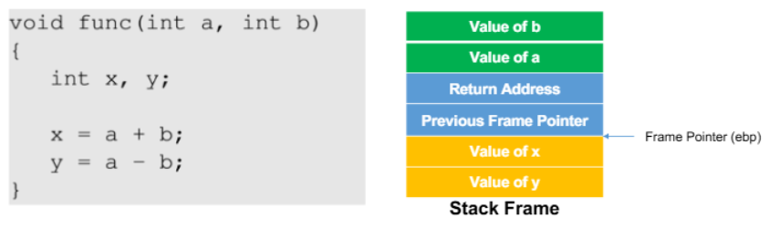
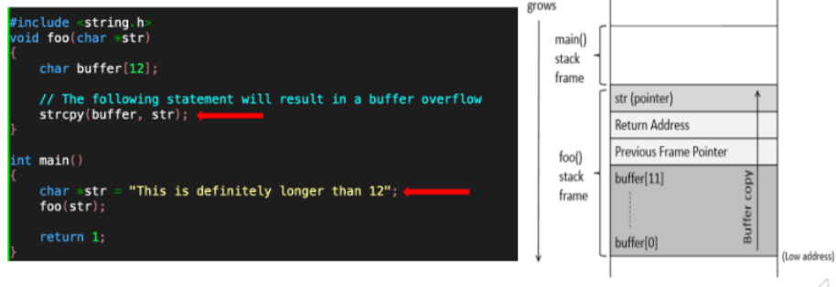

프로그램 메모리 구조

Text Segment - 프로그램 코드 저장(실행가능한 코드이며, 읽기 전용) Overwritten 될 수 없음
Data Segment - 초기화된 전역변수
BSS Segment - 초기화되지 않은 전역/정적 변수
Heap 공간 - 동적 메모리 할당 
Stack 공간 - 지역변수, 함수 호출 정보 저장

함수가 호출되면 Stack frame이 발생

return address는 함수가 return 할 주소로, 꼭 필요함
이걸 바꾸면 함수가 종료되었을 때, 악성코드를 사용해서 엉뚱한 코드로 return하도록 할 수 있음
=> 버퍼 오버플로우 공격

strcpy는 null을 만날때 까지 복사하는데, 입력값이 너무 길면 overflow 발생
=> 버퍼를 넘어서 return address까지 영향을 미치게 됨
=> return address를 수정하고 악성 코드가 있는 곳으로 return을 시켜버리면 악성 코드가 실행됨

Question1.
Physical address는 실제 메모리상의 주소이고, Virtual-address는 os가 프로세스에 제공하는 논리적인 주소이다.
가상 주소는 프로세스 관점, 물리 주소는 하드웨어 관점이라고 생각하면 좋을 것 같다. OS에서는 가상 주소 어딘가에 있다고 판단하는 반면 MMU를 통해 페이지 테이블을 사용해서 매핑된 주소를 확인해보면 다른 물리적인 주소에 존재한다. 

Question2.
Stack pointer는 현재 스택의 최상단 주소를 가리키고,
Frame pointer는 함수가 호출될 때 생성되는 스택 프레임의 기준점이 되는 포인터이다.
스택포인터는 push나 pop을 하면서 변수를 스택에 쌓으면서 계속 움직이는데, 프레임 포인터는 고정된 위치기 때문에 프레임 포인터 기준으로 인자 및 변수 위치를 정확히 찾을 수 있게 된다.