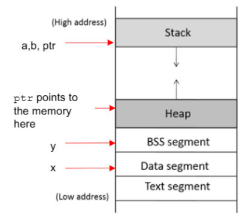
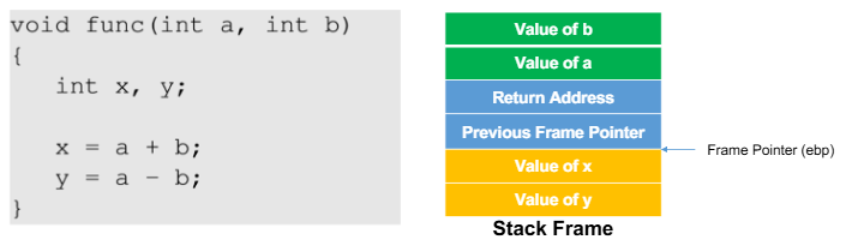
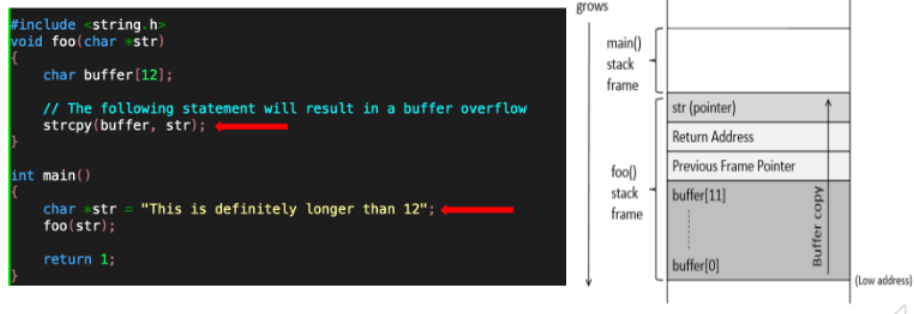
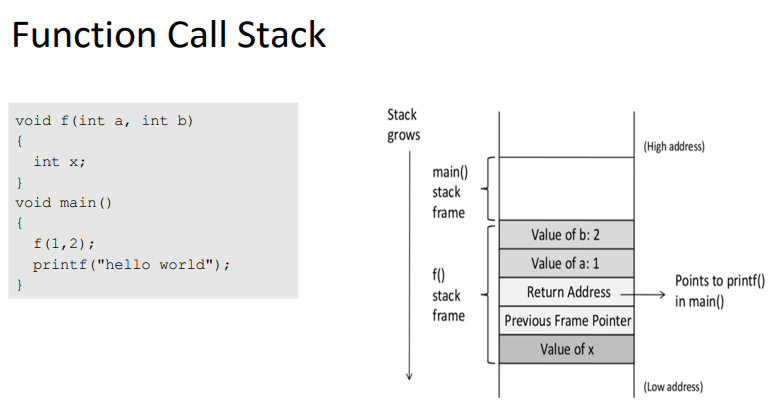
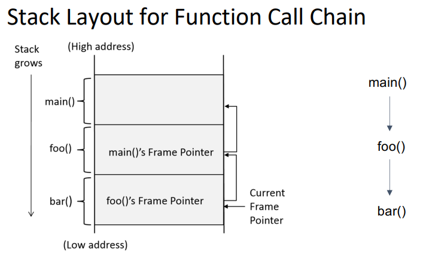
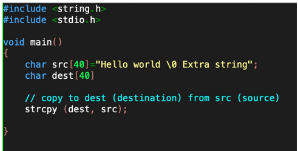
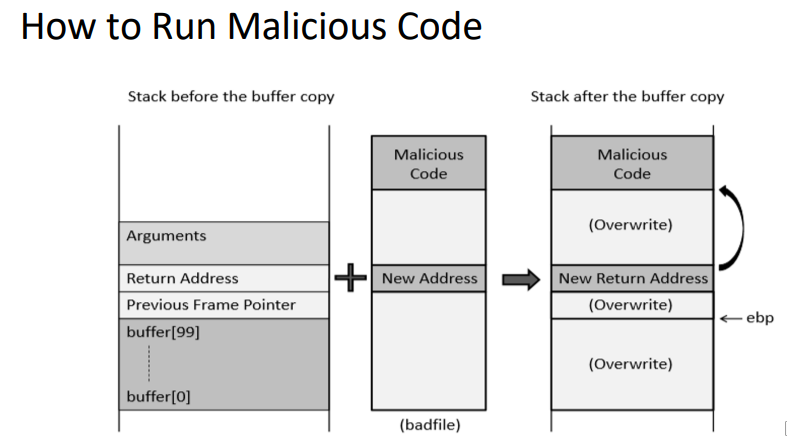
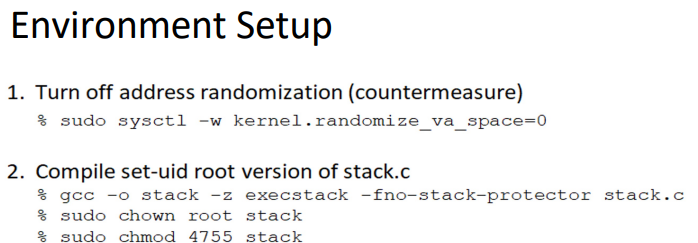

---

# 🧠 Buffer Overflow & 메모리 구조 정리

---

## 📦 프로그램 메모리 구조

| 영역               | 설명                                           |
| ---------------- | -------------------------------------------- |
| **Text Segment** | 실행 가능한 코드 저장 (읽기 전용, **덮어쓸 수 없음**)           |
| **Data Segment** | 초기화된 전역 변수 저장                                |
| **BSS Segment**  | 초기화되지 않은 전역/정적 변수 저장                         |
| **Heap**         | `malloc()` 등을 통해 **동적 메모리 할당**되는 공간          |
| **Stack**        | 함수 호출 시 **지역 변수, return address, ebp 등** 저장됨 |

---

## 🧩 함수 호출 시 Stack Frame

* 함수가 호출되면 Stack 위에 **Frame이 생성됨**
* `Return Address`는 호출한 함수로 돌아갈 주소로 **반드시 필요**
* 이 **Return Address를 조작**하면 공격자가 원하는 곳으로 점프 가능
  → 🧨 **버퍼 오버플로우 공격**

---

## 🧨 strcpy와 버퍼 오버플로우

* `strcpy()`는 **`\0`을 만날 때까지** 복사함
* 입력이 너무 길면 `buffer`를 넘어서 → **Return Address까지 덮어씀**
* 이때 Return Address를 **악성 코드 주소로 바꾸면**,
  → 함수가 끝날 때 공격자의 코드를 실행

---

## 🧱 Stack Frame 구조 복습

* **Previous Frame Pointer** = 이전 함수의 `ebp`
* `ebp + 4` 위치 = **Return Address**
* 따라서 `ebp`를 기준으로 오프셋을 계산할 수 있음

---

* 함수가 종료될 때 `pop %ebp` → **이전 함수의 기준점 복원**
* `ret` → **return address**로 점프
  → **그 값이 조작되어 있으면 shellcode로 이동**

---

## 📥 strcpy로 Buffer 덮어쓰기

* `strcpy()`는 **크기를 검사하지 않음**
* 입력이 길면 → 스택 위의 **ebp, return address까지 오염**

---

## 💣 공격 구조

* 공격자는 `badfile` 안에:

  1. NOP sled (여유 공간 확보용)
  2. Shellcode
  3. **Fake return address** (→ shellcode 위치)

* `strcpy(buffer, badfile)`으로 복사
  → Return Address 덮힘 → `ret` 시 shellcode 실행

---

## 🛡️ 환경 세팅 (Exploit 가능하게)

1. **ASLR 비활성화** (주소 랜덤화 방지)
2. `Set-UID bit` 설정 → `root` 권한으로 실행되도록

---

## ❓ Question 1: Physical vs Virtual Address

> **Virtual Address**: OS가 프로세스에 제공하는 **논리 주소** (사용자 관점)
> **Physical Address**: 실제 **RAM 메모리 상의 물리 주소** (하드웨어 관점)

* Virtual Address는 MMU + 페이지 테이블을 통해 Physical Address로 매핑됨
* 프로세스는 항상 Virtual Address만 다룸

---

## ❓ Question 2: Stack Pointer vs Frame Pointer

| 포인터                          | 역할                          |
| ---------------------------- | --------------------------- |
| **Stack Pointer (SP / esp)** | 스택의 **현재 최상단**을 가리킴 (계속 변함) |
| **Frame Pointer (FP / ebp)** | 함수 호출 시 고정되는 **프레임 기준점**    |

* 함수 내 지역 변수나 인자 접근 시 → `ebp ± offset`으로 안정적으로 계산
* `esp`는 계속 변하기 때문에 직접 사용하면 불안정함

---
