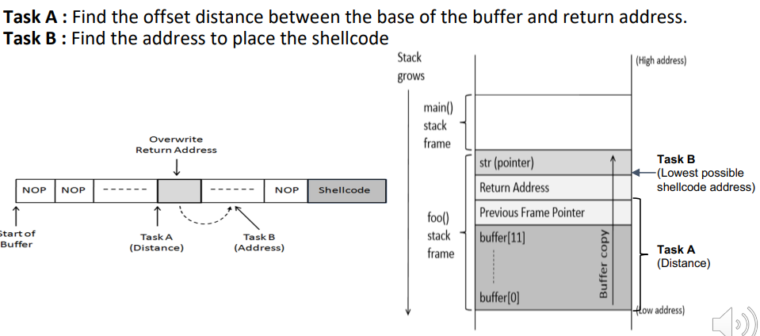
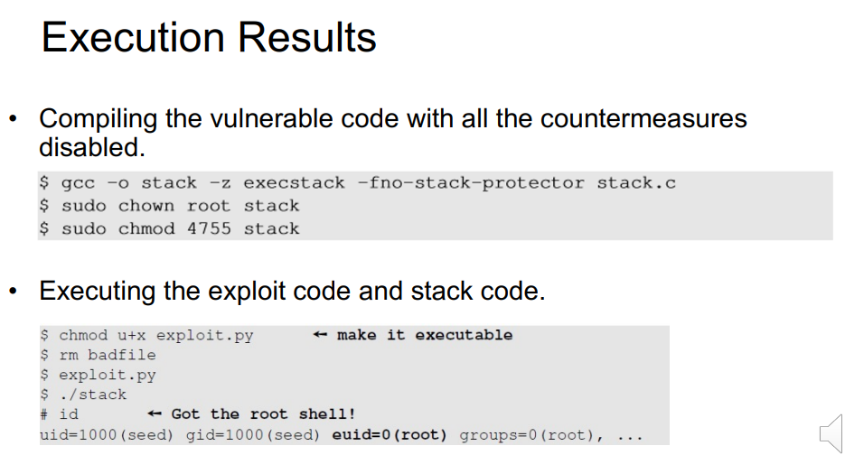

---

## 💥 Buffer Overflow 실습 요약

### 🧪 Task A: `buffer`와 `ebp` 사이 거리 계산

* `buffer`에서 시작하여 `Previous Frame Pointer (ebp)`까지의 거리 계산
* **Return Address는 ebp 바로 위에 있으므로 +4 추가**
* 📌 **총 offset = (ebp - buffer) + 4**

---

### 🧱 Task B: 정확한 shellcode 주소로 Jump하는 법

* 스택 주소는 고정되어 있지 않아 정확히 shellcode에 Jump하기 어려움
* 👉 해결 방법: **NOP sled 사용**

#### 🔁 NOP sled란?

* `0x90` (NOP 명령)을 반복 삽입한 영역
* Return Address가 정확히 shellcode를 가리키지 않더라도 **슬라이딩**해서 shellcode에 도달할 수 있음

---

### ❗ strcpy()의 취약점

* `strcpy()`는 **null 바이트(0x00)** 를 만나면 복사 중단
* 📌 **shellcode와 return address는 null 바이트를 포함하면 안 됨**

#### 예시:

* ❌ `0xbffff200` → 마지막 바이트 `0x00` → 복사 중단
* ✅ `0xbffff178` → 모든 바이트 유효 → 복사 OK

---

## ⚙️ 실행 결과 및 컴파일 설정

### ✅ 컴파일 시 보안 기능 비활성화

```bash
$ gcc -o stack -z execstack -fno-stack-protector stack.c
```

| 옵션                     | 설명                                   |
| ---------------------- | ------------------------------------ |
| `-z execstack`         | 스택을 **실행 가능**하게 설정 (shellcode 실행 허용) |
| `-fno-stack-protector` | **Stack Canary 보호 기능 제거**            |

---

### 🔓 Set-UID 설정 (root 권한으로 실행되도록 설정)

```bash
$ sudo chown root stack
$ sudo chmod 4755 stack
```

* 소유자를 root로 변경
* `chmod 4755` → Set-UID bit 설정
  → 일반 사용자도 실행 시 **root 권한으로 동작**

---



---

## 🚀 Exploit 실행 결과

```bash
$ chmod u+x exploit.py  # exploit 파일 실행 권한 설정
$ rm badfile            # 기존 badfile 제거
$ ./exploit.py          # 새로운 badfile 생성
$ ./stack               # 취약한 프로그램 실행
# id                    # 쉘 획득 여부 확인
uid=1000(seed) gid=1000(seed) euid=0(root)
```

✅ **root shell 획득 성공!**

---



---

## 🛡️ Buffer Overflow 방어 기법 정리 (Countermeasures)

### 👨‍💻 1. 개발자 관점

| 위험 함수      | 안전한 대체 함수   |
| ---------- | ----------- |
| `strcpy()` | `strncpy()` |
| `strcat()` | `strncat()` |
| `gets()`   | `fgets()`   |

---

### 🧩 2. OS 관점

#### ✅ ASLR (Address Space Layout Randomization)

* 스택/힙/라이브러리/코드 주소를 무작위화하여
  → 공격자가 정확한 주소 예측 못하게 함

---

### 🧵 3. 컴파일러 관점

#### ✅ StackGuard / Stack Canary

* Return Address 앞에 **무작위값(Canary)** 삽입
* Canary가 바뀌면 → 오버플로우 탐지 → 프로그램 종료

---

### 💻 4. 하드웨어 관점

#### ✅ Non-Executable Stack

* 스택 영역은 **데이터만 저장**, 실행 불가
* → shellcode 실행 자체를 하드웨어 수준에서 차단

---

## ✅ 요약

| 계층   | 방어 방법                |
| ---- | -------------------- |
| 개발자  | 안전한 문자열 함수 사용        |
| OS   | ASLR                 |
| 컴파일러 | Stack Canary         |
| 하드웨어 | Non-Executable Stack |

---
