---

# 📘 Environment Variable & Dynamic Linker Security Summary

---

## 🔓 How to Access

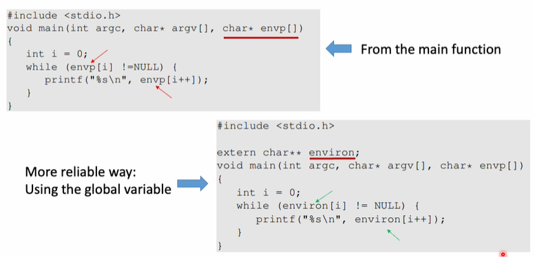

* `main()` 함수의 `envp[]` 인자는 **항상 보장되지 않음**
  → **`environ` 전역 변수**를 사용하는 것이 안전함

---
## How does a process get Environment Variables?
* fork()를 사용하면, 자식 프로세스가 부모 프로세스의 환경 변수를 상속받음
* execve()로 새로운 프로그램을 실행하면, 새로운 환경 변수 세트를 명시적으로 전달해야 함
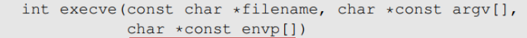

---
---
## 🧠 Memory Location of Environment Variables

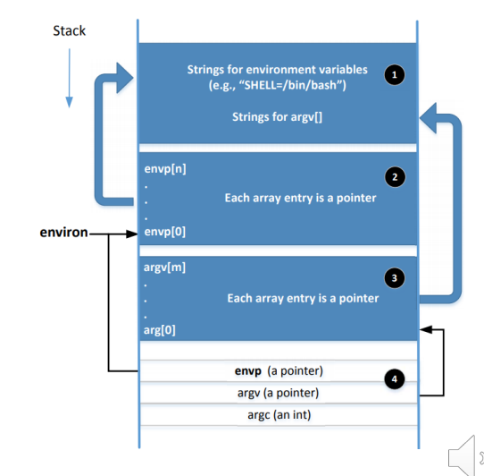

* `envp`와 `environ`은 **초기엔 같은 공간**을 가리킴
* `envp`: `main()` 함수에서만 접근 가능
* `environ`: **전역 변수**, 모든 함수에서 접근 가능
* **환경변수에 변화가 생기면**, 해당 위치는 **힙으로 이동**
  → 이때 `envp`는 이전 주소를 계속 가리킴

---

## 🧩 Shell vs Environment Variables

### 🔹 정의

* **Shell Variables**: 쉘 내부에서만 사용하는 변수 (내부 명령어로 관리)
* **Environment Variables**: 자식 프로세스에게 전달될 수 있는 변수

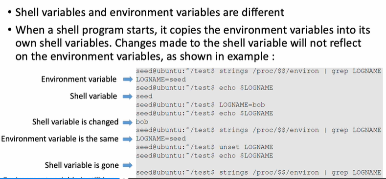

* 초기에는 shell 변수 = environment 변수
* **shell 변수 변화는 env 변수에 자동 반영되지 않음**

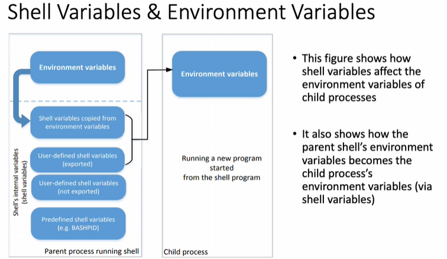

* `export`를 사용하면 **shell 변수 → environment 변수로 승격**
* 이렇게 승격된 변수는 **자식 프로세스에 전달됨**

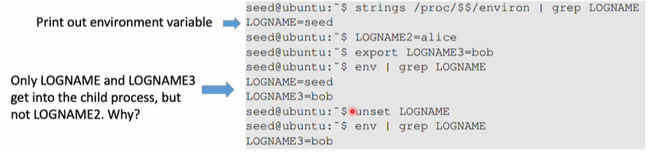

* `LOGNAME`은 초기 환경 변수
* `LOGNAME2`는 shell 변수로만 존재
* `LOGNAME3`는 `export`했기 때문에 환경 변수로 등록됨
  → `env | grep LOGNAME` 시, `LOGNAME`, `LOGNAME3`만 출력

---

## ⚠️ Attacks via Dynamic Linker

### 📦 Linking 방식

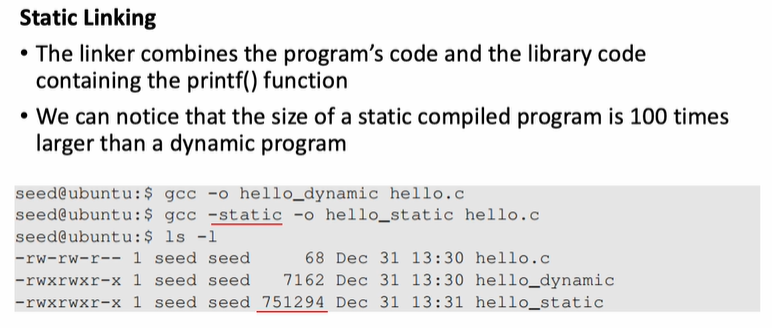

* **Static Linking**: 실행 파일 크기 큼 (Dynamic보다 100배 이상)
* **Dynamic Linking**: 실행 중 필요한 라이브러리 연결

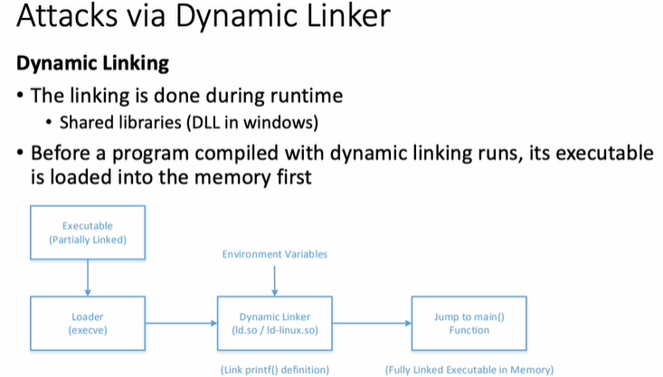

* 컴파일 시, 일부 코드는 **undecided 상태**
  → 실행 파일은 **Partially Linked**

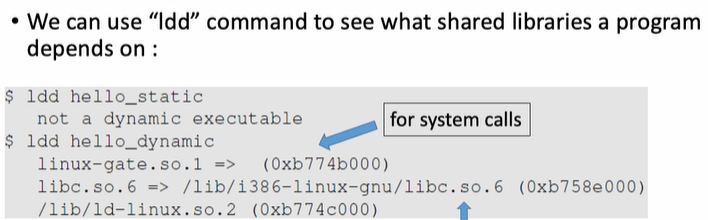

* `ldd` 명령어: 실행파일이 의존하는 라이브러리 확인

```
$ ldd ./a.out
```

* 출력 예시:

  1. system call 관련
  2. libc 라이브러리
  3. dynamic linker

---

## 🛑 Risks of Dynamic Linker

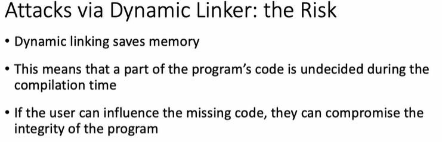

* **장점**: 메모리 효율적
* **단점**: 일부 코드가 runtime에 결정됨 → 공격자가 해당 코드를 **조작 가능**

### 🧪 Case Study 1

#### LD\_PRELOAD

* 지정된 라이브러리를 **가장 먼저 로딩**하게 함
* 공격자가 만든 **가짜 라이브러리**를 먼저 실행 가능

#### LD\_LIBRARY\_PATH

* 경로 우선순위를 조작하여 **가짜 라이브러리 실행 가능**

> **주의**: Set-UID 프로그램에서 사용되면 **root 권한**으로 악성코드 실행됨

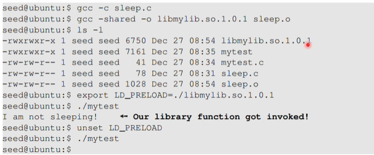

* `sleep()` 함수를 조작한 라이브러리를 preload함
  → `I am not sleeping` 출력

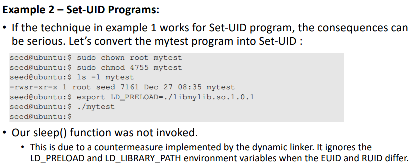
EUID와 RUID가 다르면, LD_PRELOAD와 LD_LIBRARY_PATH가 무시됨
=> Countermeasure

---

## ❓ 명령어 차이 (Question 1)

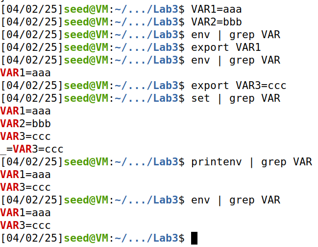

| 명령어        | 설명                   |
| ---------- | -------------------- |
| `env`      | 환경 변수 목록 출력          |
| `printenv` | 환경 변수 출력 (일부 쉘은 제한됨) |
| `set`      | 쉘 변수 + 환경 변수 모두 출력   |

> `VAR1=value`는 쉘 변수
> → `export VAR1` 후에야 환경 변수로 인식되어 `env`로 확인 가능

---

## 🧠 exec 함수들 차이 (Question 2)

* `execvp()`, `execlp()` 등: **전역 변수 `environ` 사용** → 환경 변수 자동 전달
* `execve()`: 세 번째 인자로 **환경변수 배열 직접 전달** 필요
  → `envp == NULL`이면 환경 없이 실행됨

---

## 🧪 실습 Subtasks

### Subtask 1: HANYANG 환경변수 설정

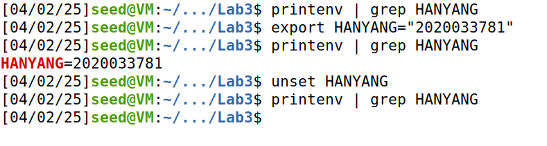

```bash
export HANYANG=20231234
```

---

### Subtask 2: 부모-자식 환경 변수 비교

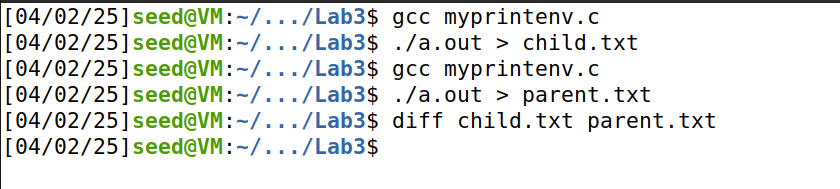

* 자식 프로세스는 **부모의 환경변수 상속**
* 동일하게 출력되는 것으로 확인됨

---

## ⚙️ Task 실습

### Task 1: LD\_LIBRARY\_PATH는 왜 출력 안됨?

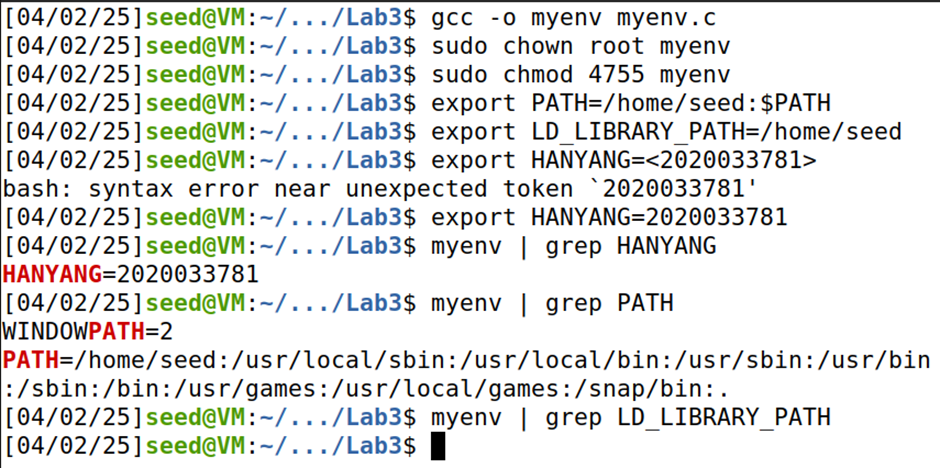

* `PATH`, `HANYANG`은 `env` 출력됨
* `LD_LIBRARY_PATH`는 **Set-UID 환경에서 무시됨**

> 📌 EUID ≠ RUID → 보안 상 `LD_*` 변수 무시됨

---

### Task 2: PATH 조작을 통한 외부 명령어 공격

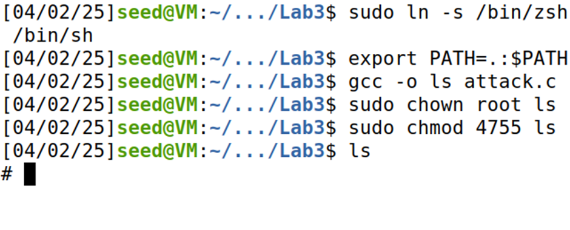

* `PATH=".:$PATH"` 설정 → 현재 디렉토리 우선 실행
* `ls`라는 공격용 바이너리를 만든 뒤 **Set-UID + root 권한 부여**
* `ls` 실행 시, **공격 파일 실행** → **루트 셸 획득 가능**

---

### Task 3: LD\_PRELOAD를 통한 가짜 라이브러리 실행

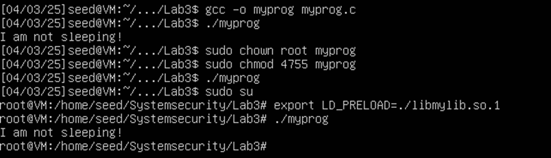

```bash
$ gcc -fPIC -g -c mylib.c
$ gcc -shared -o libmylib.so.1 mylib.o -lc
$ export LD_PRELOAD=./libmylib.so.1
```

* 일반 실행: 가짜 라이브러리 실행됨 → "I'm not sleeping"
* Set-UID 실행: **LD\_PRELOAD 무시** → 정상 실행
* `sudo su` 후 실행: 가짜 라이브러리 실행 가능

---

이 마크다운 문서는 리눅스 환경 변수, 쉘 변수, 동적 링커 취약점에 대한 학습을 정리한 자료로 활용할 수 있습니다. 필요시 PDF로 변환하거나 노션/위키 등에 붙여넣어 활용 가능합니다.
