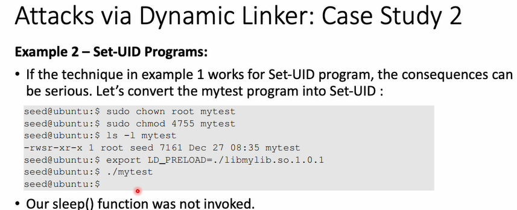
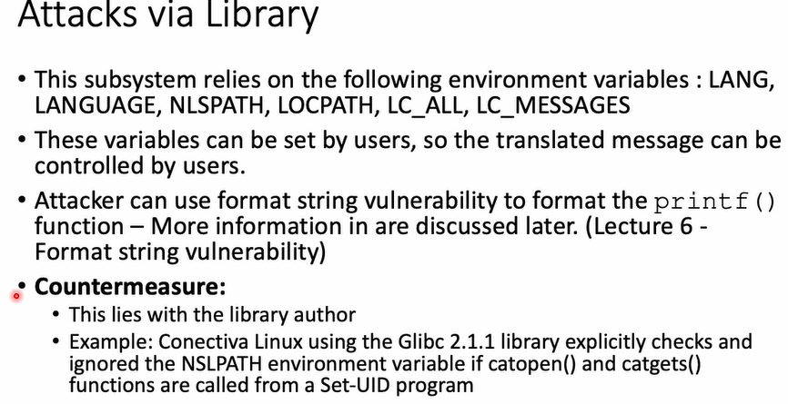
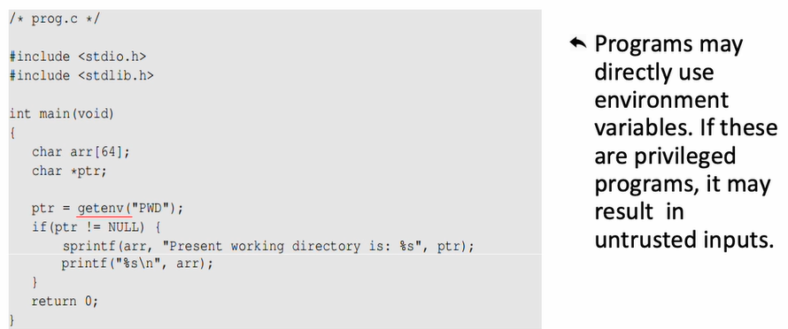
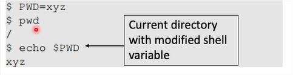
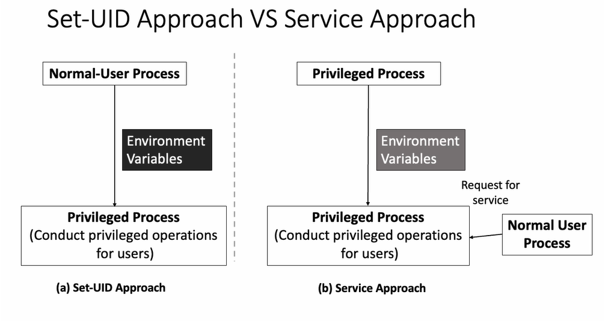

Risk of Using Dynamic Linker

Case Study 2:

이번에는 Set-UID를 설정했더니, 정상적으로 sleep이 작동했다.
EUID와 RUID가 다르면 LD_PREALOD와 LD_LIDBRARY_PATH를 무시함

Attacks via External
외부에서 프로그램을 실행하는 일반적인 방법
exec() 계열 함수
- 결국 execve()를 호출해서 직접 프로그램을 실행
공격할 수 있는 곳: 내 프로그램, 실행된 외부 프로그램

System() 함수
- 내부적으로 execl() -> shell을 통해 명령어 실행
공격할 수 있는 곳 : 내 프로그램, 실행된 외부 프로그램, 쉘

Path 변경을 통해 root shell 얻기 가능

Attacks via Library

Case Study: Locale in Unix
환경 변수 조작, 포맷 문자열 취약점 공격이 가능한데, 이러한 문제는 라이브러리 개발자가 막아야 함
catopen이나 catgets 함수가 Set-UID에서 호출 될 경우 NSLPATH 변수를 무시하도록 설정  

Attacks via Application Code

PWD를 바로 가져와서 사용하는데, PWD를 조작하면 문제가 발생할 수 있음

echo로 불렀을 때는, 변경된 shell 변수가 출력됨

Countermeasures
getenv()는 환경 변수를 읽을 때 사용하는 함수로, PATH에 들어있는 문자열을 반환
secure_getenv()은 EUID와 RUID가 다르면 환경 변수를 무시하고, NULL을 반환

Set-UID 방식은 사용자가 실행한 프로그램이지만, root 권한으로 실행됨
=> 환경 변수 등 사용자가 조작 가능한 값이 사용되면 보안상 위험함

서비스 방식은 특정 권한을 가진 별도의 서비스 프로그램(daemon)이 항상 실행중임
일반 사용자는 그 서비스에 요청만 보내고, 환경 변수는 서비스에 직접 전달되지 않아서 보안상 더 안전함
