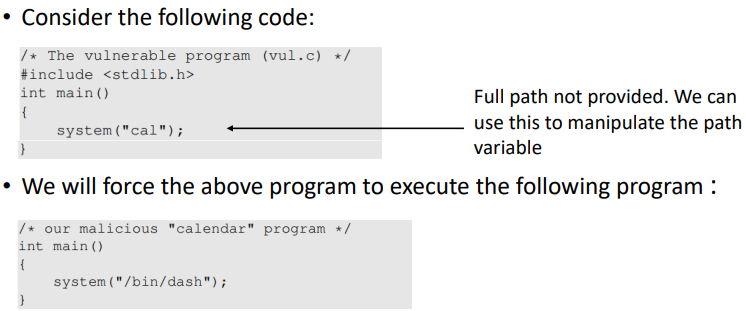
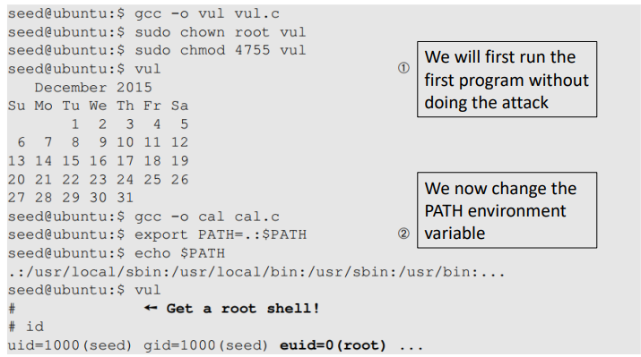

---

# 🛡️ Risk of Using Dynamic Linker

---

## 🔍 Case Study 2: Set-UID 프로그램에서의 동작

* 이번 실험에서는 Set-UID 프로그램을 실행했을 때, **정상적으로 `sleep()` 함수가 호출됨**
* 왜냐하면 이 경우에는 **EUID(실행 권한)와 RUID(사용자 권한)가 같기 때문**
* ⚠️ 동적 링커는 `EUID ≠ RUID`인 경우에만 `LD_PRELOAD`, `LD_LIBRARY_PATH` 등을 **무시**

---

# 🧨 Attacks via External Program

## ✅ 외부 프로그램 호출 방식

### 1. `exec()` 계열 함수

* 내부적으로 `execve()`를 호출하여 **직접 외부 프로그램 실행**
* **공격 지점**:

  * 내 프로그램
  * 실행된 외부 프로그램

---

### 2. `system()` 함수

* 내부적으로 `execl()` → `/bin/sh -c`를 호출하여 **셸을 통해 명령어 실행**
* **공격 지점**:

  * 내 프로그램
  * 실행된 외부 프로그램
  * **쉘 프로그램 자체 (셸 변수, 리디렉션, 파이프 조작 등)**

---

### ⚠️ 위험 예시

* `PATH`를 조작하여, 시스템이 `/bin/ls` 대신 **현재 디렉토리에 있는 가짜 ls** 실행하도록 유도
  → **Set-UID 프로그램이면 root shell 획득 가능**

---

# 📚 Attacks via Library

vul은 취약한 코드, cal은 공격용 코드
cal이 정상적으로 실행되면 calendar가 출력됨
하지만 PATH의 경로를 바꿔서, 현재 주소로 부터 system()에 있는 cal을 찾게 만들어서 공격용 코드가 실행되도록 함
그래서 실행시 root권한을 가지고 실행되는 vul을 실행함으로써, 악성 코드의 /bin/dash를 실행시켜 최종적으로 root 쉘을 얻을 수 있게 됨
=> 쉘 해석을 하지 않는 execve() 함수를 사용한다면 countermeasure

## 📌 사례: Locale 설정 관련 공격

* UNIX에서 `catopen()`, `catgets()` 함수는 로케일(locale) 정보를 가져올 때 환경 변수 `NLSPATH`를 참조
* **Set-UID 프로그램에서 이 환경 변수를 조작하면 공격 가능**
* 해결 방법: 라이브러리 개발자가 **Set-UID 상황에서 `NLSPATH` 무시하도록 구현**

---

# 💻 Attacks via Application Code

## 🐛 문제 예: 환경 변수 `PWD` 사용

* 애플리케이션이 `PWD`를 직접 신뢰하면, 공격자가 이를 조작할 수 있음
  → 예: `chdir()` 대신 `getenv("PWD")`를 신뢰하는 경우

---

* 예시에서 `echo $PWD`는 조작된 셸 변수를 그대로 출력함
  → 내부적으로 잘못된 경로를 기반으로 동작할 수 있음

---

# 🛡️ Countermeasures

### ✅ `getenv()` vs `secure_getenv()`

* `getenv()`
  → 단순히 환경 변수 값을 읽어옴 (보안 체크 없음)

* `secure_getenv()`
  → **`EUID ≠ RUID`일 경우, `NULL` 반환**
  → Set-UID 프로그램에서 안전하게 환경 변수 접근 가능

---

### ✅ Set-UID 방식 vs 서비스 방식

| 구분             | 설명                                    | 보안 위험                                             |
| -------------- | ------------------------------------- | ------------------------------------------------- |
| **Set-UID 방식** | 사용자가 실행하는 프로그램이지만 **루트 권한으로 실행**됨     | 사용자가 조작한 환경 변수나 경로 등이 시스템 권한으로 실행되어 **보안상 매우 위험** |
| **서비스 방식**     | 루트 권한의 데몬이 항상 실행되고, 일반 사용자는 단지 요청만 보냄 | 요청 시 **환경 변수는 전달되지 않음**, 상대적으로 **더 안전**           |

---

## ✅ 결론 요약

* `LD_PRELOAD`, `LD_LIBRARY_PATH` 같은 환경 변수는 **위험한 공격 벡터**
* Set-UID 프로그램에서는 반드시 `secure_getenv()` 또는 변수 무시 처리를 해야 안전
* 가능한 경우 **Set-UID 방식보다 서비스-요청 방식으로 설계**하는 것이 보안에 유리함

---
