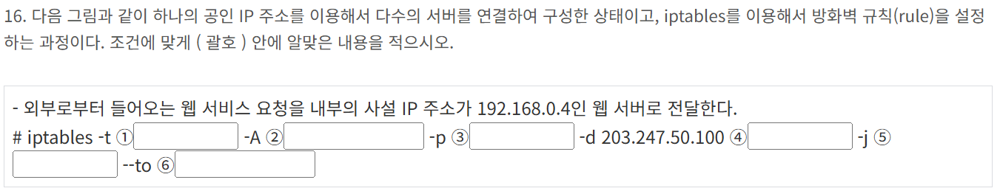

1. passwd
2. -d
3. chage 
4. -e

/etc/fstab
파일 시스템에 대한 다양한 정보를 담고 있는 파일
부팅 시 마운트 할 파티션 정보가 기록되어 있음
mount, fsck가 수행될 때 이 파일의 정보 참조
fstab 파일은 장치, 마운트 지점, 파일 시스템, 마운트 옵션, 덤프 여부, fsck 순서로 총 6개의 필드로 구성됨.  
사용자 쿼터 제한은 usrquota
그룹 쿼터 제한은 grpquota
쿼터 정보를 초기화/생성하는 명령어는 quotacheck
1. /etc/fstab
2. 4
3. usrquota
4. quotacheck

1. crontab 
2. -e
3. 5 4 * * 1,4,5
4. */10 * * * *

rpm으로 무언가 조회 및 확인할 때는 -q를 붙이자
1. -q--requires
2. -qf
3. -qlp
4. -qc

1. 
2. depmod
3. make modules
4. make modules_install

1. /proc/cpuinfo
2. /proc/meminfo
3. /proc/mdstat
4. /proc/version

1. *.emerg;
2. root,ihduser
3. mail.=error
4. /dev/tty2

1. last
2. lastlog -u
3. lastb
4. lastb -3

1. -l kaituser 192.168.12.22 / kaituser@192.168.12.22
2. -p 180 192.168.12.22
3. 192.168.12.22 mkdir data
4. ssh-keygen

dd는 디스크를 블록단위로 백업
cpio는 파일 목록을 기준으로 파일을 백업하거나 복원하는 명령어  
dump는 파일 시스템 자체로 통째로 백업하는 도구
1. dd
2. if=/dev/sda1 of=/dev/sda1 bs=4k

htpasswd로 사용자 생성
1. htpasswd
2. -c
3. AuthConfig
4. .htaccess

smbclient -L 은 서버의 공유 리스트를 보여줌
smbclient //서버IP/공유 이름
1. smbclient
2. -L
3. //192.168.5.13/data
4. testparm

외부에서 메일을 받을 때 로컬로 넘기기 -> virtusertable (makemap 필요)  
시스템 계정(root,apache)의 메일을 다른 사용자로 넘기기 -> aliases  
1. /etc/mail/virtusertable
2. ceo@ihd.or.kr ihduser
3. ceo@kait.or.kr kaituser
4. makemap hash /etc/mail/virtusertable < /etc/mail/virtusertable  

acl로 IP 목록 제어
forward only는 지정된 forwarders 에게만 질의
forward first는 우선 forwarders에게 질의하고, 실패하면 루트로부터 재귀 질의 수행
1. acl "ihd" {192.168.5.13; 192.168.12.22; 192.168.6/24}
2. forward first;
3. forwarders {168.126.63.1;};
4. allow-query {192.168.28/24; 192.168.12.17; ihd;};

데몬 단위로 접근 제어를 하기 때문에 d를 붙이는게 좋을 것 같음. 
1. ALL:ALL
2. in.telnetd: 192.168.5.
3. sshd: 192.168.5.13
4. vsftpd: .ihd.or.kr

DNAT은 들어오는 패킷의 목적지IP 를 바꿈 DNAT은 PREROUTING
SNAT는 나가는 패킷의 출발지 IP를 바꿈 SNAT은 POSTROUTING
1. nat
2. PREROUTING
3. tcp
4. --dport 80
5. DNAT
6. 192.168.0.4:80