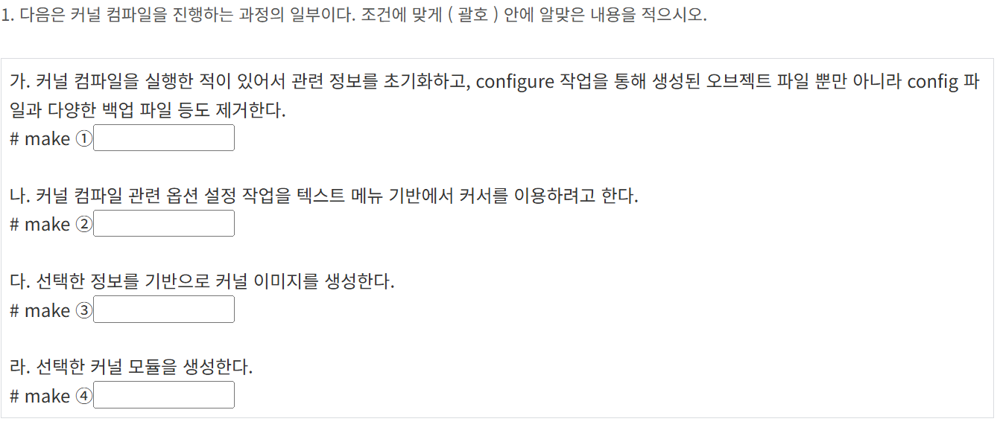
커널 컴파일은 4단계로 이루어짐
청소 -> 설정 -> 이미지 생성(build) -> 모듈 컴파일
mrproper / distclean -> menuconfig -> bzimage -> modules
1. mrproper
2. menuconfig
3. bzimage
4. modules

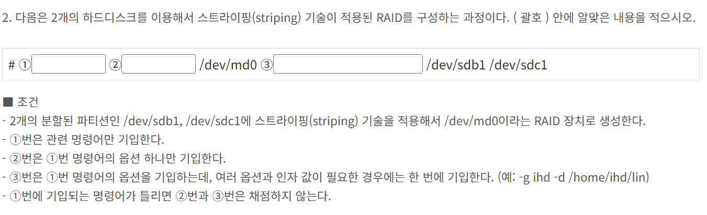
mdadm은 Raid 설정을 위한 명령어  
스트라이핑은 RAID 0 이니까 -l 0  
두개의 디스크를 사용하므로 -n 2
1. mdadm 
2. --create/ -C
3. -l 0 -n 2

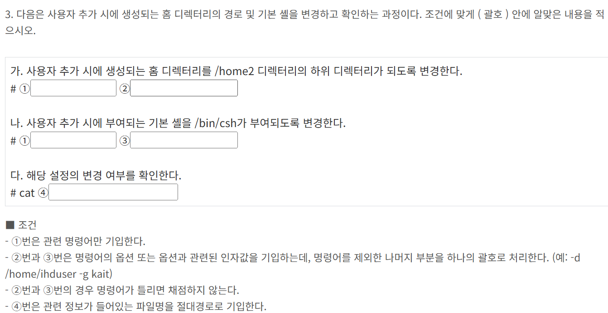
-D 옵션을 사용하면 default로 되어있는 환경설정 파일을 변경한다는 뜻  
-b 는 홈 디렉터리 경로 지정  
-d 는 특정 사용자만을 위한 홈 디렉터리 저장하고 싶을 때  
1. useradd 
2. -D -d /home2
3. -D -s /bin/csh
4. /etc/default/useradd

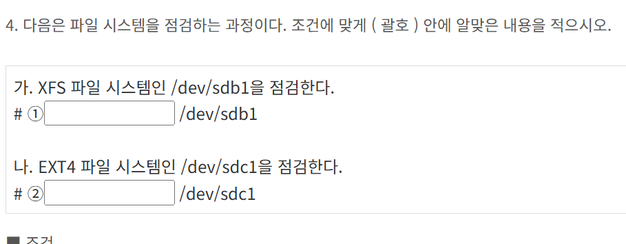
ext 계열은 fsck으로 점검하고, xfs는 repair로 검사함  
1. xfs_estimate  
2. fsck.ext4  

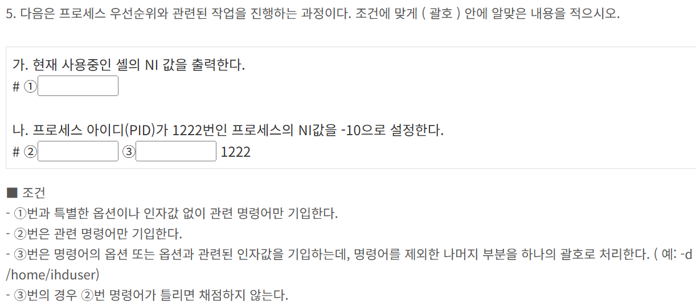
1. nice  
2. renice  
3. -n -10  

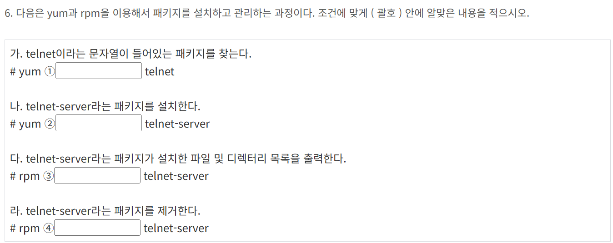
1. search
2. install
3. -ql
4. -e 

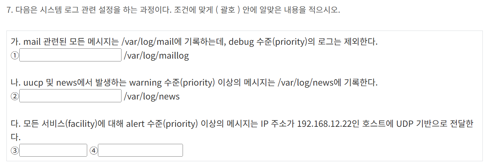
facility는 로그의 출차 (mail,auth,cron,etc..)    
priority는 로그의 심각도 수준 (debug ~ emerg)  
action 은 로그를 어디로 보낼지    
facility.priority action 으로 구성되어 있음    
mail.*;mail.!=debug (메일관련 모든 로그에서, debug 수준의 메일은 제외)  
uucp.warn;news.warn  
원격 서버로 보낼 때 @IP 이면 UDP, @@IP이면 TCP
1. mail.*;mail.!=debug  
2. uucp.warn;news.warn  
3. *.alert  

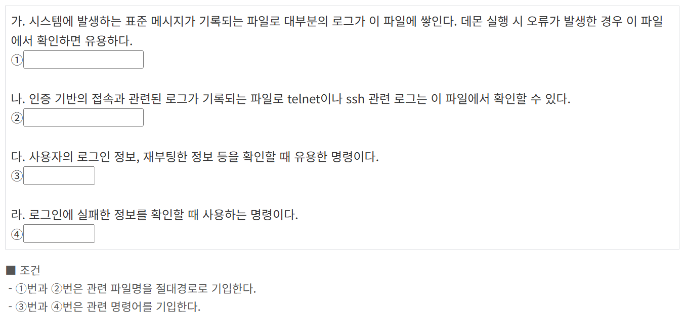
1. /var/log/messages
2. /var/log/secure
3. last
4. lastb

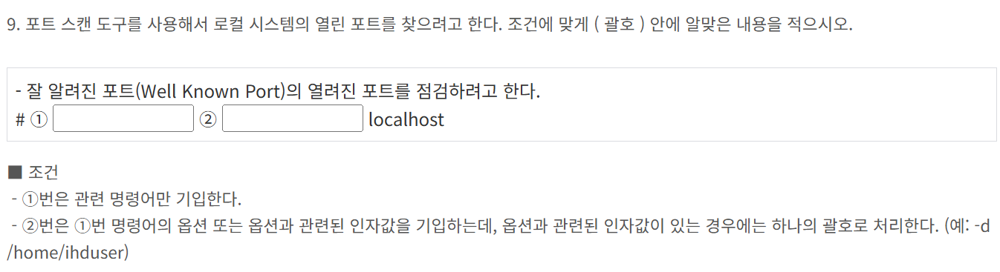
포트 스캔은 열려있는 포트를 찾는 것  
Well Known Port는 0~1023번에 해당  
nmap을 가장 많이 사용
1. nmap
2. -p 0-1023

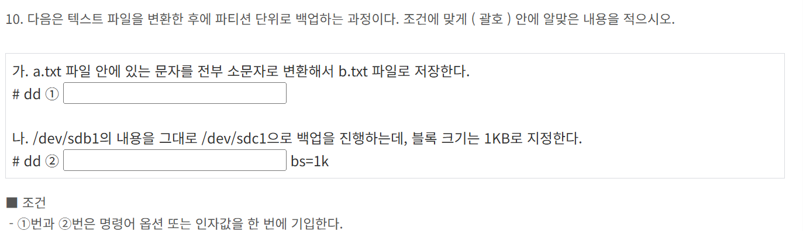
if=File 은 입력 파일  
of=File 은 출력 파일  
conv=lcase  는 대문자 -> 소문자
1. conv=lcase if=a.txt of=b.txt
2. if=/dev/sdb1 of=/dev/sdc1

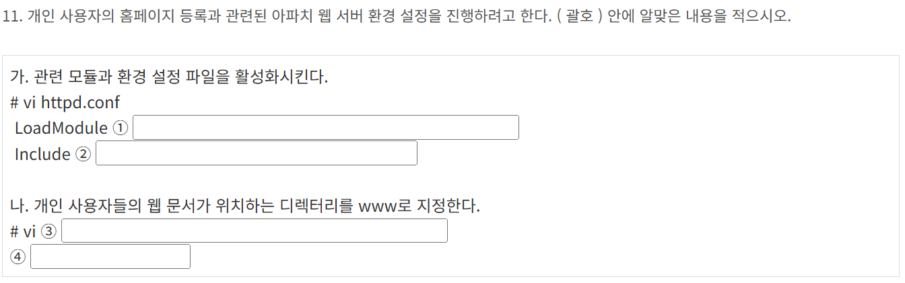
개인 홈페이지 환경 설정 파일은 userdir임
grep -ri userdir 디렉토리 경로로 찾아보면 됨
1. userdir_module modules/mod_userdir.so
2. conf/extra/httpd-userdir.conf
3. /usr/local/apache/conf/extra/httpd-userdir.conf
4. UserDir www

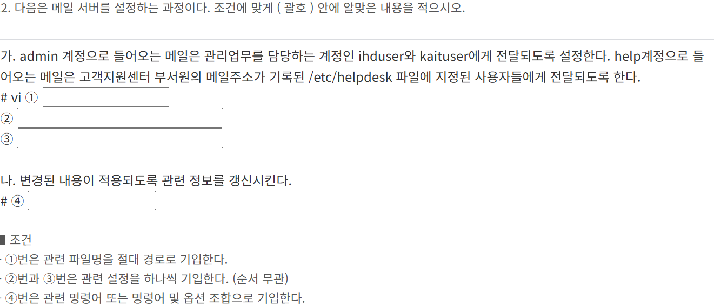
메일 별칭을 사용하여 특정 계정으로 온 메일을 다른 사용자에게 전달하는 방법  
이때 사용하는 것은 /etc/aliases  
설정 후에는 newaliases 명령어로 갱신해야 함  
다른 파일에 있는 사용자 목록을 참조하고 싶을 때는 :include: 사용
1. /etc/aliases  
2. admin:ihduser kaituser  
3. help::include:/etc/helpdesk  
4. newaliases  

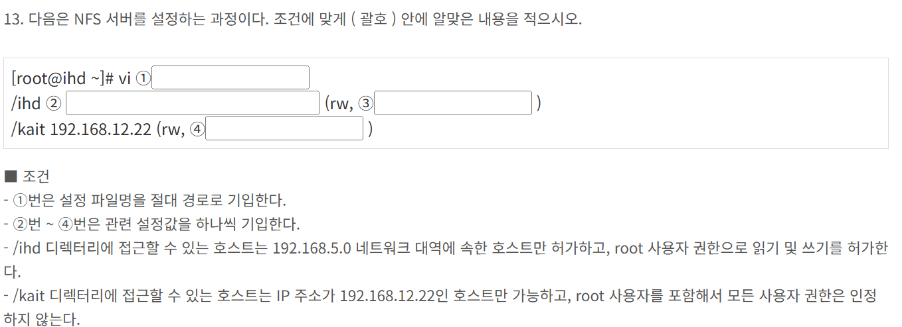
NFS는 서버의 디렉터리를 다른 클라이언트가 네트워크를 통해 마운트해서 사용할 수 있게 해주는 서비스
NFS 서버 설정 파일은 /etc/exports
1. /etc/exports
2. 192.168.5.0/24
3. no_root_squash
4. all_squash 

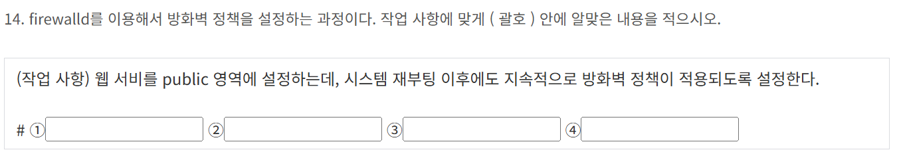
Zone 과 Service 개념을 기반으로 방화벽 정책 관리
firewall-cmd 로 명령
웹 서비스를 public 영역에 설정하고, 재부팅 후에도 적용되게 해야 함
Zone : public
Service : http
영구 적용 : --permanent
즉시 반영 : --reload
1. firewall-cmd 
2. --zone=public 
3. --add-service=http 
4. --permanent

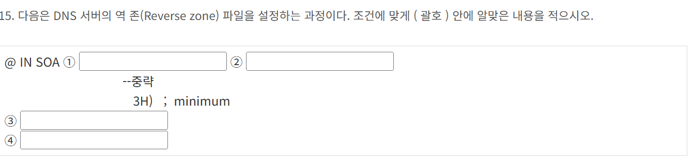
1. ns.ihd.or.kr.
2. kait.ihd.or.kr.
3. IN NS ns.ihd.or.kr.
4. 15 IN PTR ihd.or.kr.

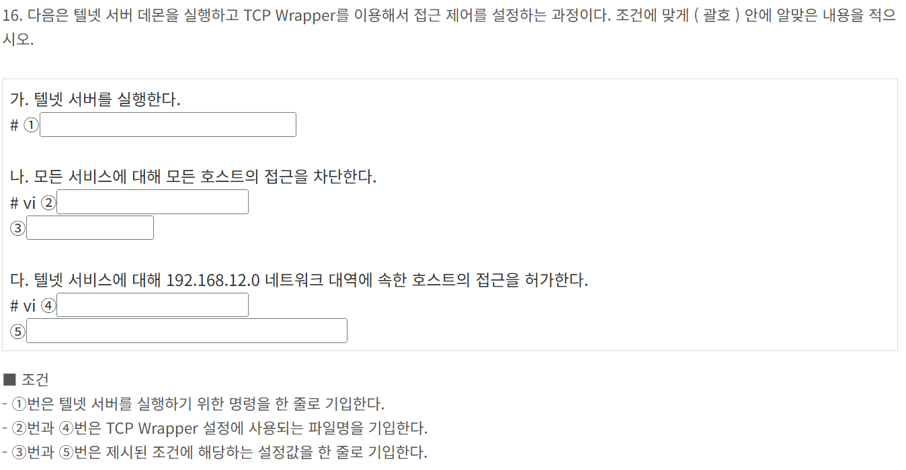  
TCP Wrapper은 접근 제어용 시스템 보안 도구로,  
/etc/hosts.allow 와 /etc/hosts.deny 파일을 통해 접근 허용 및 거부  
1. systemctl telnet.socket  
2. /etc/hosts.deny  
3. ALL:ALL  
4. /etc/hosts.allow  
5. in.telnetd:192.168.12.0/24  