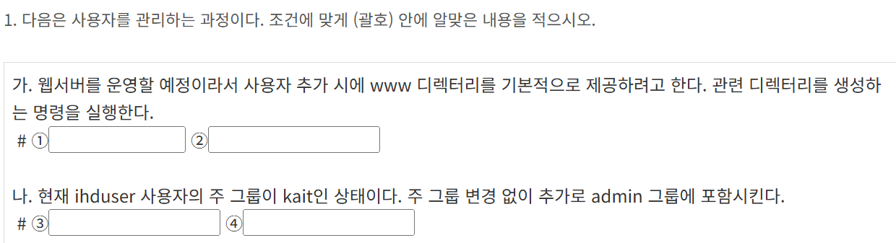
1. mkdir
2. /etc/skel/www
/etc/skel에 www폴더를 미리 생성하는 것
3. usermod
4. -G admin

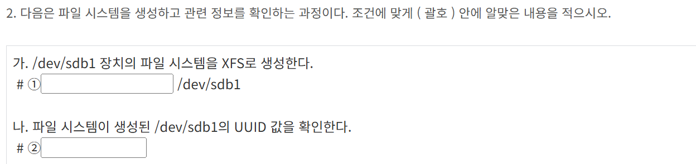
1. mkfs.xfs
mkfs 는 make filesystem의 약자이며, mkfs.xfs는 XFS 형식으로 포맷하겠다는 의미
mkfs.xfs -f 는 강제로 파일 시스템 생성(덮어쓰기 가능)
2. blkid
blkid는 블록의 UUID, 타입 등을 한번에 보여줌

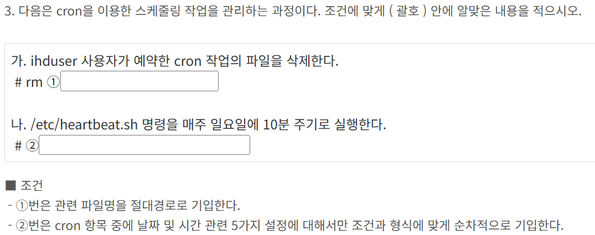
1. /var/spool/cron/ihduser
/var/spool/cron은 crontab 명령어로 만든 cron들을 모아둔 파일
2. */10 * * * 0 

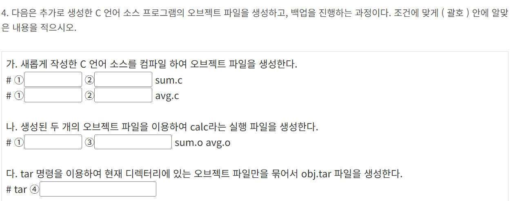
1. gcc 
2. -c
-c 옵션은 컴파일만 하고 링크는 하지 않는다는 의미로, 오브젝트파일만 생성함
3. -o cal
4. -cf obj.tar *.o
-c (create)는 새로운 tar 파일 만들기
-f (file)은 파일 이름 지정
파일 이름 obj.tar을 설정하고, 뒤에 묶을 파일 목록 *.o 를 적는다. => -cf obj.tar *.o

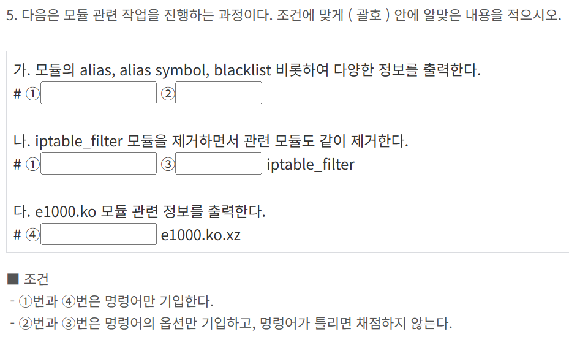
모듈에 대한 정보를 출력할 때는, modinfo 또는 modprobe -c 를 찾아본다.
modinfo는 특정 모듈 파일을 입력해서 정보를 보여주는 것이고,
1. modprobe  는 현재 시스템 전체의 모듈 alias, symbol, blacklist 설정 정보를 보여줌
모듈을 제거하면서 관련 모듈도 같이 제거 -> 의존성 고려 삭제
2. -c
3. -r
4. modinfo

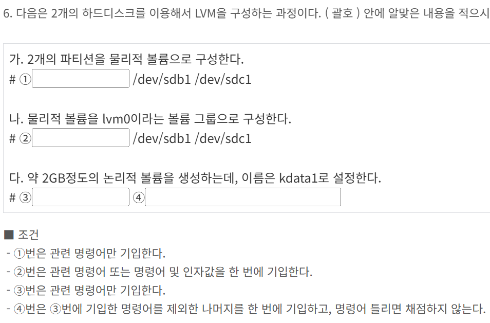
1. pvcreate
2. vgcreate lvm0
3. lvcreate 
4. -L 2000M -n kdata lvm0

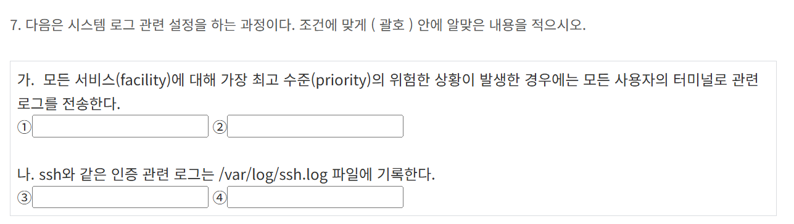
1. *.emerg
2. *
모든 비상 상황에, 모든 사용자에게 로그 발송
3. authpriv.* /var/log/ssh.log
facility가 나온다? => /etc/rsyslog 찾아가라

emerg	시스템 사용 불가 수준 오류 (가장 높음)
alert	즉각 조치 필요한 상황
crit	심각한 상황
err	에러 발생
warning	경고 발생
notice	정상적이지만 중요한 정보
info	일반 정보
debug	디버깅 정보 (가장 낮음)

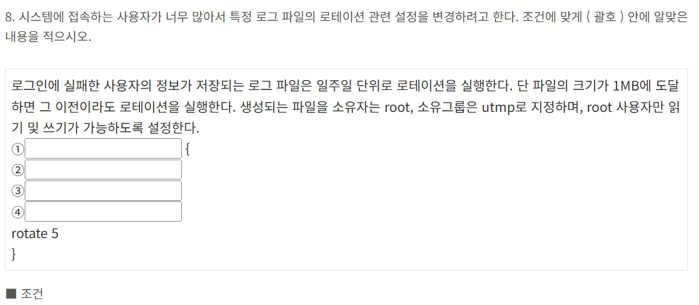
1. /etc/logrotate.d/btmp
정답은 /var/log/btmp로, 여기가 로그가 쌓이는 파일임
/etc/logrotate.d/btmp는 규칙을 설정하는 파일임
2. weekly
3. 1MB
minsize 1M 
4. create 0600 root utmp

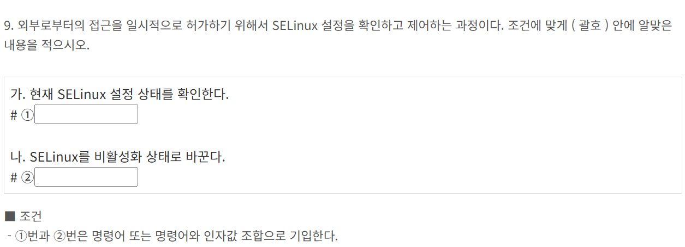
1. getenforce
getenforce를 사용하면 Enforcing 모드인지, Permissive 모드인지 알 수 있음
2. setenforce 0
setenforce 0 이면 비활성화(Permissive)
setenforce 1 이면 활성화(Enforcing)
이것들은 일시적인 활성화 및 비활성화이고,
/etc/selinux/config 파일을 수정하면 영구적

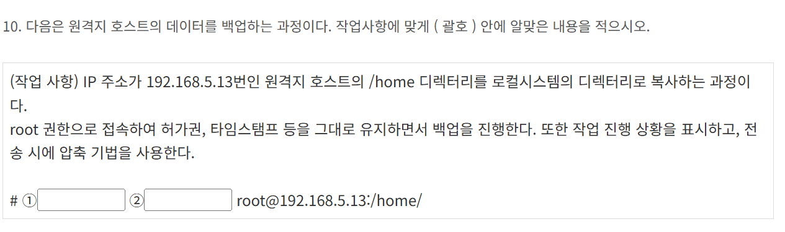
dump는 디스크나 파티션 백업용
디렉토리 복사 및 서버 간 파일 전송은 rsync
-a 옵션은 퍼미션, 타임스탬프, 소유자 등 보존
-v 진행상황
-z 전송 중 압축
/home 디렉토리만 복사하고 싶다	rsync -avz
/dev/sda1 전체 백업하고 싶다	dump
1. rsync 
2. -avz

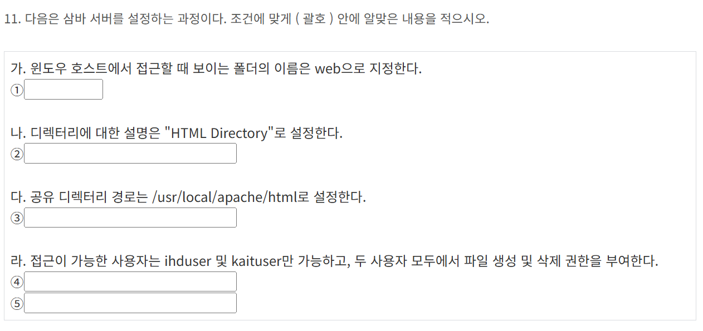
1. [web]
2. comment = Home Directory
3. path = /usr/local/apache/html
4. vaild users = ihduser kaituser
5. writeable = yes

1. /etc/mail/access
2. From:spam.com DISCARD
3. makemap hash 
4. < 

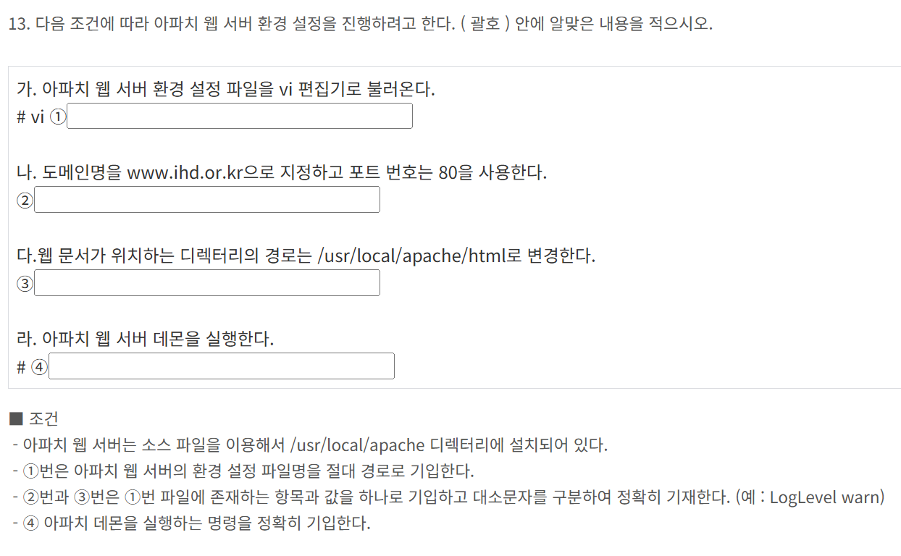
1. /usr/local/apache/conf/httpd.conf
2. ServerName www.ihd.okr.kr:80
3. DirectoryRoot "/usr/local/apache/html"
4. /usr/local/apache/bin/apachectl start
apachectl 명령어들은 /usr/local/apache/bin/apachectl에 적재되어있어서 경로를 작성하고 옵션을 작성해야함

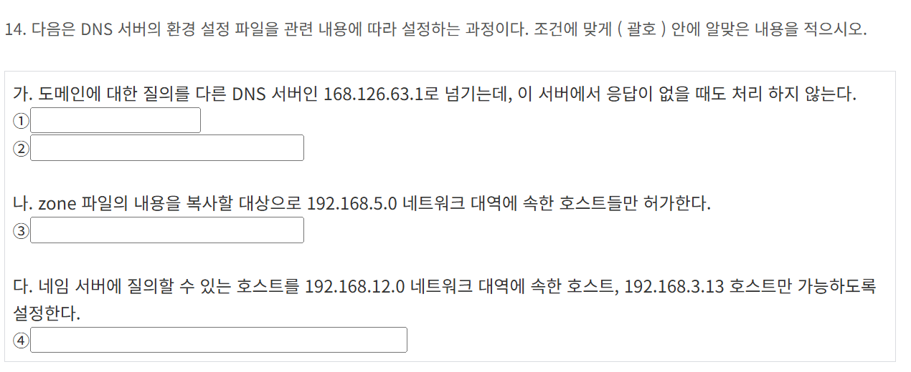
dns 서버 환경설정한다 -> /etc/named.conf나 zone 설정 파일 수정

1. forward only
2. forwards {168.126.63.1;};
대부분의 상황에서 이 둘은 같이 사용함
only 말고는 first 옵션이 있음. 포워더에 질의해보고, 실패하면 직접 DNS 서버부터 다시 질의함
3. allow-transfer {192.168.5/24;};
4. allow-query{192.168.12.0/24; 192.168.3.13;};

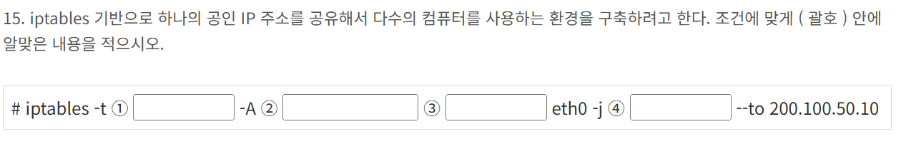
1. nat
--to 200.100.50.10 이라는 IP를 보면 SNAT라는 것을 할 수 있음
2. POSTROUTING
나가는 패킷에 SNAT 적용 내부-> 외부
PREROUTING은 외부 -> 내부
3. -o
출력 인터페이스 지정
4. SNAT
출발 IP를 200.100.50.10으로 설정

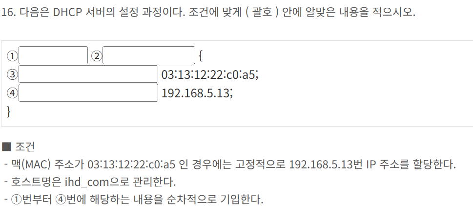
Mac주소 기반으로 고정 IP 할당 -> dhcpd.conf 파일 안에서 host 블록 사용
고정 할당할 때 hardware ethernet, fixed-address
1. host
2. ihd_com
3. hardware ethernet
4. fixed-address
