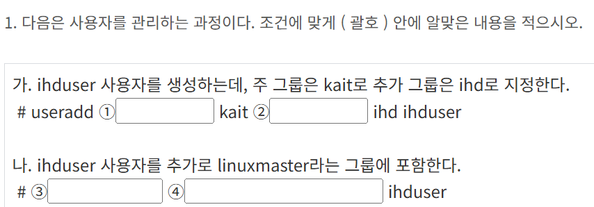
1. -g 주 그룹 설정
2. -G 추가로 그룹 설정
3. usermod 
4. -a -G  linuxmaster
man usermod와 man useradd를 통해 찾음

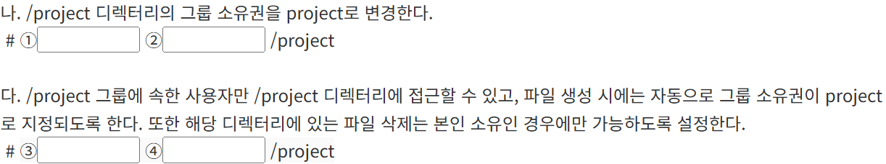
1. chown(chgrp 도 가능능)
2. project 
3. chmod
4. 
파일 생성시 자동으로 그룹 소유자가 project가 되려면 Set-GID를 설정해야 하고, 본인 파일만 삭제 가능하려면 Sticky bit를 설정해야 함
=> 2+1 = 3
다른 그룹 사람들은 접근 못하게,해야 하므로 770 or 070 이여야 함
=> 3770 or 3070

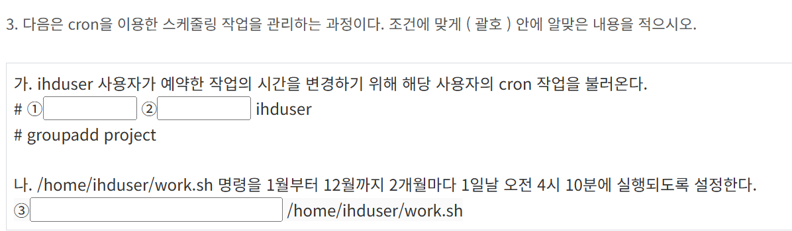
1. crontab
2. -u
-u는 define user, -e 는 edit user's crontab
=> -e -u 를 둘 다 사용해야 함
3. 10 4 1 */2 * (분 시 일 월 요일)

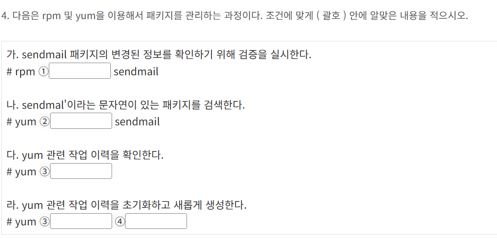
1. -V
검증할때는 -V
2. search
3. 
작업내용 확인할 때는 history
4. 
작업 내용 초기화를 history로 하고 초기화 및 생성은 new로!

1. lsmod
2. modinfo
3. modprobe
4. -r 

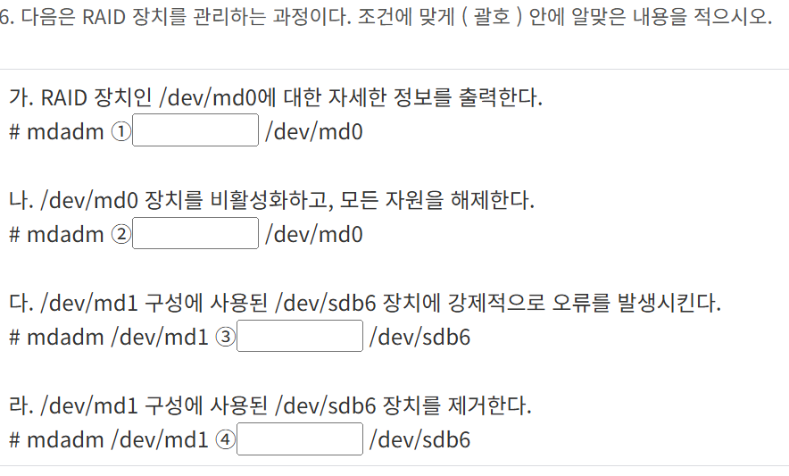
1. detail
2. stop
3. fail
4. remove

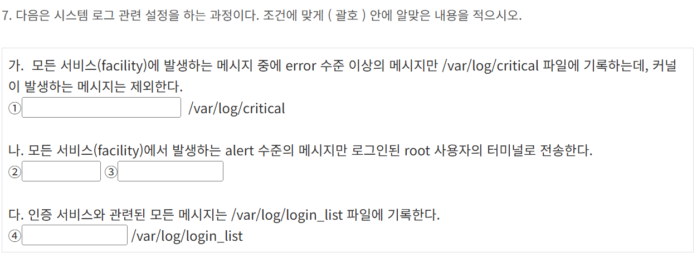
이런 문제는 /etc/rsyslog에서 확인
1. *.error;kern.none
2. *.alret
3. root
4. authpriv.*

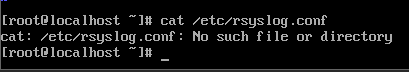
로그인 기록 확인 명령어 문제
last, lastlog, lastb를 활용
로그인 기록 last
로그인 실패 기록 lastb
1. lastlog -t 3
2. last ihduser
3. lastb kaituser
4. lastlog -u kaituser

1. sysctl
2. -a
3. -w
4. net.ipv4.icmp_echo_ignore_all=1

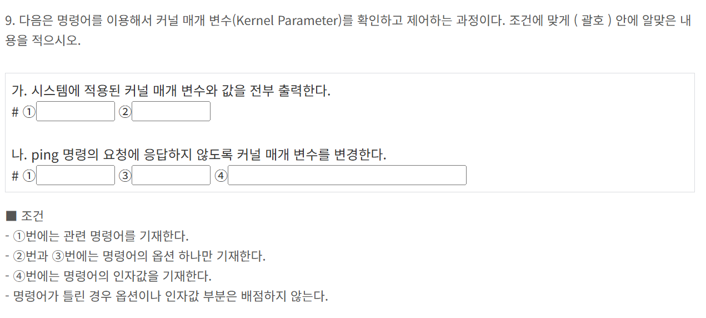
cpio는 파일을 묶기 및 풀기하는 명령어 백업이라고 봐도 무방함
1. cpio 
2. -ovF (o는 백업 생성, v는 진행 상황출력, F는 파일 이름 설정)
3. -tF(t는 백업된 내용 출력)
4. -ivF(i는 백업된 내용 추출)

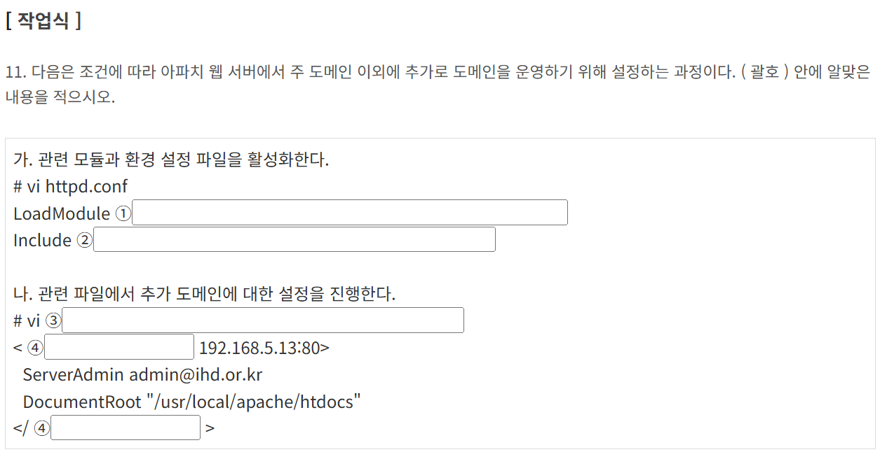
주 도메인 이외에 추가 도메인 운영 설정 과정을 묻고 있음
=> 가상호스트 설정하라는 의미
=> /usr/local/apache/conf/httpd.conf 파일을 cat으로 확인해봄
1. vhost_alias_module
2. conf/extar/httpd-vhosts.conf
3. /usr/local/apache/conf/extar/httpd-vhosts.conf
4. VirtualHost

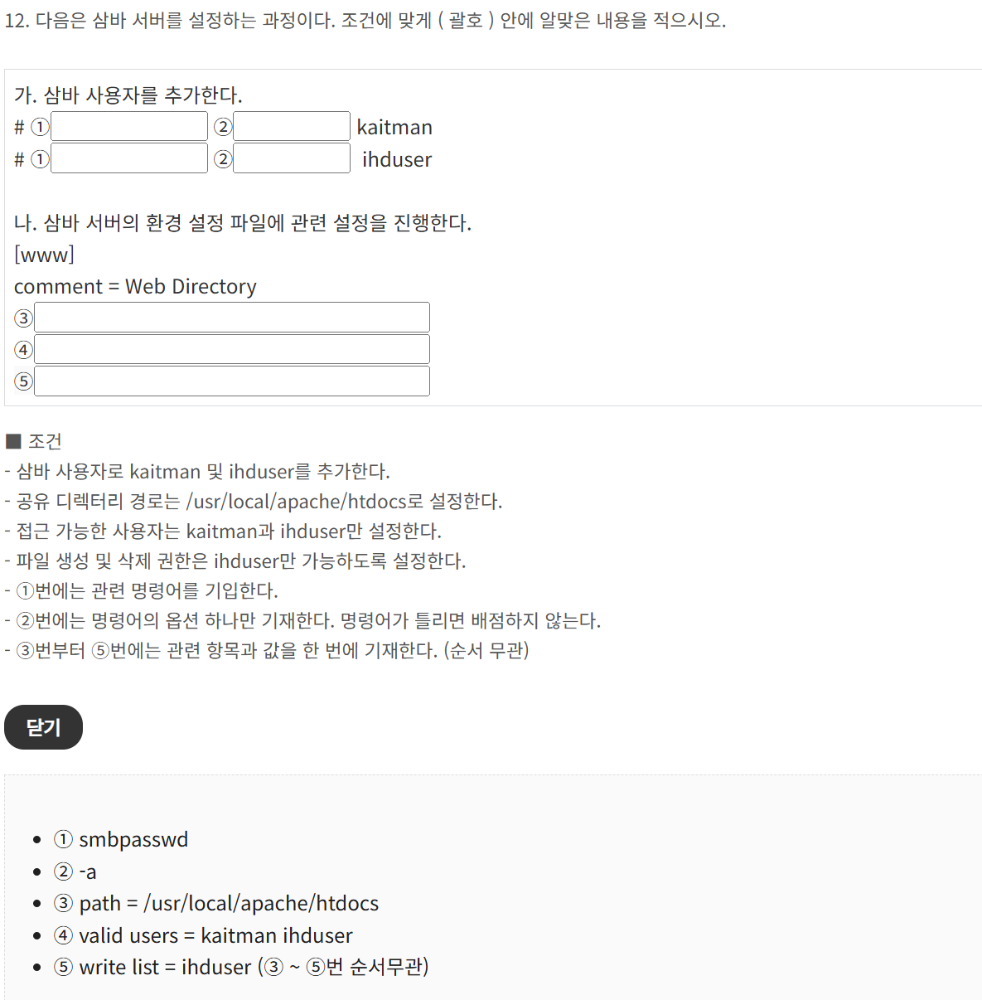
Samba는 리눅스와 윈도우 간 파일 및 프린터 공유
주요 데몬으로는 smbd가 존재함
/etc/samba/smb.conf
사용자 추가는 smbpasswd -a
1. smbpasswd
2. -a
3. path = /usr/local/apache/htodcs
4. valid users = kaitman idhuser
5. write list = ihduser

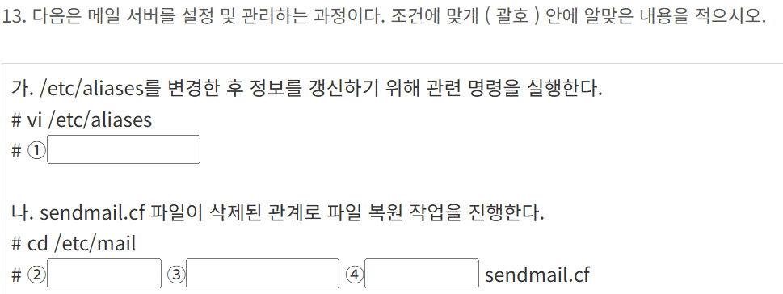
1. newaliases
2. Makemap hash /etc/mail/sendmail < 가 아니라
m4 = 매크로로 명령어
3. 
sendmail.mc = 설정을 정의하는 소스파일
4. 
> 리다이렉션

m4는 소스파일을 가지고 건물을 짓는 작업
makemap은 전화번호부를 빠르게 찾도록 인덱스를 만들어주는 작업
/etc/mail/sendmail.mc 는 sendmail 매크로 설정 파일
/etc/aliases 는 메일 별칭 설정 파일로, newaliases or makemap으로 갱신
/etc/mail/access 는 메일 접근제어 설정 파일로, 수정 후 makemap hase access < access처럼 사용
/etc/mail/virtusertable 은 가상 사용자 매핑 파일

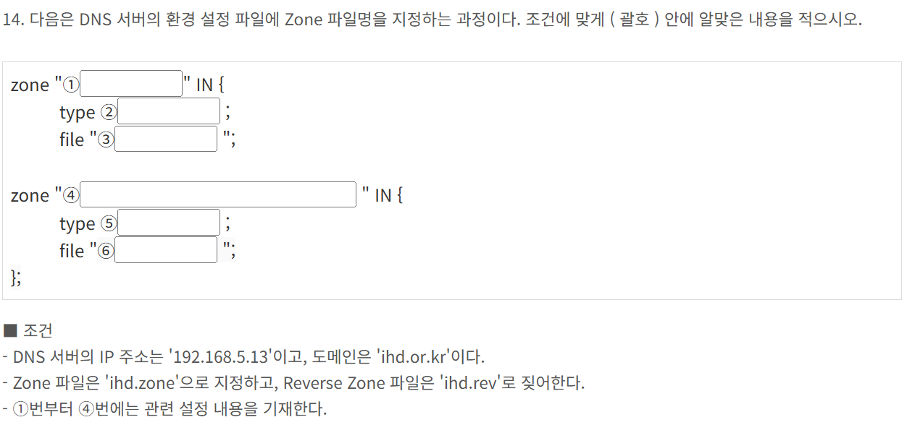
Zone 선언은
정방향(Forward Zone)은 도메인 이름
역방향(Reverse Zone)은 IP 주소를 거꾸로 (3번째 옥텟 기준) + .in-addr.arpa를 사용용

형식:
zone "도메인명" IN {
    type master;
    file "파일명";
};

zone "역방향 네임" IN {
    type master;
    file "역방향 파일명";
};
master는 내가 주인일 때, slave는 복사본을 관리할 때 사용
1. ihd.or.kr
2. master
3. ihd.zone
4. 5.168.192.in-addr-arpa
5. slave
6. ihd.rev

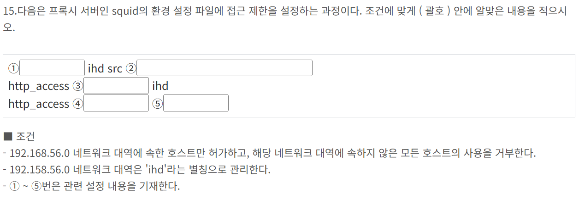
프록시 서버는 클라이언트와 인터넷 사이에 중계 서버 역할
TCP 3128번을 사용
설정 위치 /etc/squid/squid.conf

http_port - http_port 3128
acl - acl ihd src 192.168.56.0/24
http_access - http_access allow ihd
visibile_hostname - visible_hostname proxyserv

systemctl start squid
systemctl stop squid
systemctl restart squid
systemctl status squid
squid -k reconfigure - 설정 파일 수정 후 재적용
squid -z - 캐시 디렉터리 초기화

ACL
src - acl ihd src 192.168.0.0/16 은 IP 주소 기반 제어
dst - acl ihd dst google.com 은 목적지 주소 기반 필터링
time - acl worktimes time 09:00-17:00 은 시간 기반 제어
method - acl methods method GET POST 는 HTTP 메소드 기반 제어

1. acl
2. 192.168.56.0/24
3. allow
4. deny
5. all

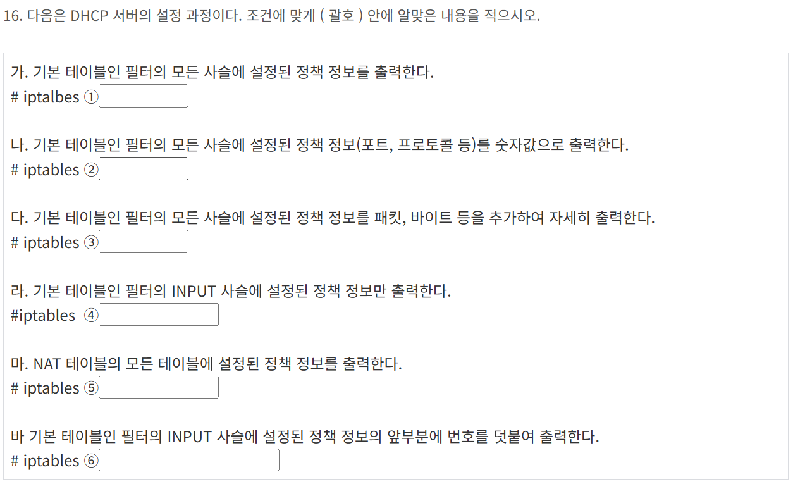

-L : 모든 체인(rule) 보기
-n : 숫자로 보여줘 (IP, 포트 이름 대신 숫자)
-v : 패킷/바이트 수까지 자세히
-t nat : NAT 테이블 설정 보기
--line-numbers : 번호 붙여서 출력
1. -L
2. -nL
3. -vL
4. -L INPUT
5. -t nat -L (t는 테이블 지정(filter,nat,mangle,raw,security)이므로 옵션과 따로 사용해야 함)
6. -L INPUT --line-numbers
