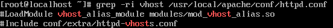

chmod
    파일 생성시 자동으로 그룹 소유자가 project가 되려면 Set-GID를 설정해야 하고, 본인 파일만 삭제 가능하려면 Sticky bit를 설정해야 함

crontab
    -u는 define user, -e 는 edit user's crontab
    => -e -u 를 둘 다 사용해야 함
    /var/spool/cron은 crontab 명령어로 만든 cron들을 모아둔 파일

module
    - lsmod	현재 로드된 모듈 목록 보기 (Loaded Modules)
    - modprobe	모듈을 로드/제거 (의존성 자동 처리)
    - insmod  모듈 직접 삽입 (의존성 무시하고 *.ko 파일 직접 지정)
    - rmmod	 모듈 제거 (단순 제거, 의존성 고려 안 함)
    - modinfo	모듈 정보 출력 (버전, 설명, 의존성 등)
    - depmod	의존성 목록 생성 (modules.dep 파일 생성/갱신)
    - dmesg	커널 메시지 확인 (모듈 로드/오류 로그 확인용)

RAID 
    mdadm 소프트웨어 RAID 생성, 관리, 확인에 사용하는 핵심 명령
        --detail 상태 상세 보기
        --examine 디스크에 기록된 RAID 메타데이터 확인
        --query 구성 여부 간단 확인
        --manage
        --add
        --remove
        --fail 실패 상태로 지정
        --stop 정지
        --assemble 재조립
        --run 강제 시작
    lsblk RAID 포함 전체 블록 디바이스 구조 확인 
    blkid 디스크 및 파티션의 UUID, 파일 시스템 확인
    df -h 용량 확인
    mkfs.ext4 RAID 디바이스에 파일 시스템 생성

login 기록록
    last, lastlog, lastb를 활용  
    로그인 기록 last
    로그인 실패 기록 lastb

커널 매개변수
    sysctl -a 전체 목록 보기
    /etc/sysctl.conf 전체 목록 보기

아파치 Virtualhost
    주 도메인 이외에 추가 도메인 운영 설정 과정을 묻고 있음
    => 가상호스트 설정하라는 의미
    => /usr/local/apache/conf/httpd.conf 파일을 cat으로 확인해봄
    

Samba
    리눅스와 윈도우 간 파일 및 프린터 공유
    주요 데몬으로는 smbd가 존재함
    /etc/samba/smb.conf
    사용자 추가는 smbpasswd -a
    path = /usr/local/apache/htodcs
    valid users = kaitman idhuser
    write list = ihduser

Squid
    프록시 서버는 클라이언트와 인터넷 사이에 중계 서버 역할
    TCP 3128번을 사용  
    설정 위치 /etc/squid/squid.conf  

    acl - acl ihd src 192.168.56.0/24
    http_access - http_access allow ihd  
    visibile_hostname - visible_hostname proxyserv  

    systemctl start squid  
    systemctl stop squid  
    systemctl restart squid  
    systemctl status squid  
    squid -k reconfigure - 설정 파일 수정 후 재적용  
    squid -z - 캐시 디렉터리 초기화  

    ACL  
    src - acl ihd src 192.168.0.0/16 은 IP 주소 기반 제어  
    dst - acl ihd dst google.com 은 목적지 주소 기반 필터링  
    time - acl worktimes time 09:00-17:00 은 시간 기반 제어  
    method - acl methods method GET POST 는 HTTP 메소드 기반 제어

