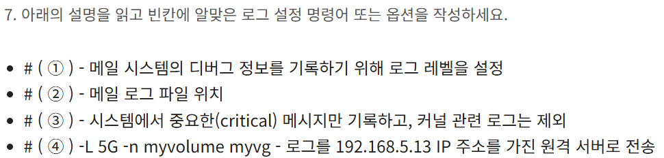
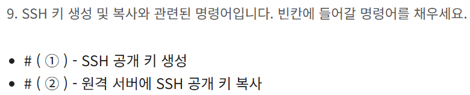

usermod -L -e 2024-12-31 -f 3
 usermod : 사용자 계정 관리(셸, 홈 디렉터리, 그룹, UID, GID 등 대부분의 정보 변경 가능) 
 -l : 사용자 아이디 변경(--login) 
 -d : 사용자의 홈 디렉터리 변경(--home) 
 -m : 기존에 사용하던 파일, 디렉터리 그대로 옮겨오도록 설정(--move-home) 
 -G : 추가로 다른 그룹에 속하게 함 
 -L : 사용자의 로그인 일시 정지(--lock) 
 -e : EXPIRE_DATE(yy-mm-dd)에 계정 만기(--expiredate) 
 -f : 패스워드 만기일이 지난 후 패스워드에 Lock 설정할 유예 기간 지정(--inactive) 
 -g : 사용자의 그룹 변경 
 -s : 사용자의 셸 변경 -u : 사용자의 UID 값 변경

 
 dd는 파일을 복사하고 변환하는 명령어
 if=/dev/zero 는 입력파일로 /dev/zero를 사용해 0으로 채워진 데이터를 계속 뱉는 장치
 of=/swapfile은 출력파일로 실제 /swapfile을 만듬
 KB * 1024 * 1024 = 1GB

 첫 문장은 1GB크기의 0으로 채워진 스왑 파일 생성

 mkswap : 파일을 스왑 영역으로 설정
 swapon : 스왑을 실제 메모리처럼 사용하도록 활성화

 
 nice --39 bash / nice -n -39 bash 도 가능
 renice -20 1222 / renice -n -20 -p 1222 가능 
 명령어 -n 사용을 권장함

 
 명령어를 확인할 때 man yum으로는 정보가 부족함
 yum --help를 사용했지만, 화면의 크기가 부족해서 문제가 발생
 -> yum --help | less를 통해서 한줄씩 보도록 가능했음
yum search
yum repoinfo(repolist)
yum --enablerepo=powertools (--repo도 가능함)
yum install

Jxvf
J는 xz 형식 지원
x는 압축해제
v는 진행상황 보기
f는 파일 지정

make menuconfig
make bzimage
uname 

vgscan
lvscan
pvscan
lvcreate
volume 관련한 명령어의 이름이 생각나지 않았음
-> man -k volume (키워드 기반으로 찾아줌)

명령어를 찾았는데 사용방법 모르겠으면 command --help or man command로 찾아보기

로그 관련은 아래의 파일들 찾아보기
/etc/rsyslog.conf
/etc/logrotate.conf (로그 순환 설정)

로그 레벨 설정 : mail.debug

경로 찾을 때 2>/dev/null을 작성하면 에러없이 답만 출력해줌
로그 파일 경로 : /var/log/maillog
critical만 기록 : *.=crit;kern.none
로그를 원격 서버로 전송 : @@192.168.5.13 (rsyslog.conf에 설정)

로그 입력 → logger

일반 메시지 → /var/log/messages
로그인 성공 → last, who, /var/log/wtmp
로그인 실패 → lastb, /var/log/btmp
인증 관련 → /var/log/secure

설정 보기 → /etc/rsyslog.conf
 
위치는 이렇게 찾아라.

모르니까 man -k ssh로 검색해봄

scp - 보안 파일 복사
sftp - 파일전송
ssh-add - 개인 키를 ssh-agent에 추가
ssh-agent - ssh 인증 에이전트
ssh-copy-id - 로컬에 있는 공개 키를 원격 서버에 복사하여 인증 자동화
ssh-keygen - SSH 키쌍 생성 도구
ssh-keyscan - 원격 서버의 ssh 공개 키를 수집

dump [옵션] [백업할 파일 시스템]

-0 ~ -9	: 백업 레벨 지정
-0 : 전체 백업
-1~9 : 증분 백업
-f [파일명]	: 백업을 저장할 파일 지정 (-f home.xdump)
-u : 백업 날짜를 /etc/dumpdates에 기록
-h [숫자] : 백업 보존 레벨 지정 (디폴트: 1)
-b [숫자] : 블록 크기 지정 (기본은 512바이트)
-B [숫자] : 한번에 쓰는 최대 블록 수
-W : 백업이 필요한 파일시스템을 보여줌
-w : 오늘 백업이 필요한 파일시스템만 보여줌

restore [옵션] [백업파일명]
-r : 전체 복원 (restore entire dump)
-t : 복원 전에 트리 구조만 출력
-x : 특정 파일/디렉토리만 복원 (경로 지정 가능)
-i : 대화형(인터랙티브) 모드로 복원
-f : 입력 파일 지정 (dump 파일)
-C : 현재 디렉토리에서 복원 (기본 동작과 유사)

아파치는 /usr/local/apache/ 에 설치되어 있음
/usr/local/apache/bin/ : 실행 파일 (apachectl, httpd 등)
/usr/local/apache/conf/	: 메인 설정 파일 (httpd.conf)
/usr/local/apache/conf/extra/ : 서브 설정 파일 (httpd-userdir.conf 등)
/usr/local/apache/modules/ : .so 모듈 파일

grep 
-r : 디렉터리를 탐색하며 모든 파일 검색
-i : 대소문자 구분X
-ri를 주로 사용

1. /usr/local/apache 폴더로 이동해서 대부분의 모듈이 있는 conf/httpd.conf 폴더에서 찾았음
2. 사용자 디렉토리같은 부가 기능 설정 파일은 conf/extra/ 폴더에 있음
3. 전체 경로의 사용자 디렉터리 설정 파일은 /usr/local/apache + 사용자 디렉터리 설정 파일 
4. UserDir 
5. /usr/local/apache/bin/apachectl start 

vsftpd - FTP 서버 설정
/etc/vsftpd/vsftpd.conf : vsftpd의 환경 설정 파일
/etc/pam.d/vsftpd : vsftpd의 PAM 관련 설정 파일
/etc/vsftpd/ftpusers : PAM 관련 설정파일에 사용되는 파일이고, default로 접근 거부될 사용자 목록
/etc/vsftpd/user_list : vsftpd를 이용하는 사용자 목록 파일이며, 허가 및 거부 목록으로 사용가능함. 하지만 기본 설정은 deny여서 거부 목록 파일
/etc/logrotate.d/vsftpd : vsftpd의 로그 로테이트 관련 파일 

키워드를 잘 알아라.

1. anonymous
2. chroot
3. writeable은 환경설정안에 없을 수 있는 내용이라서 man 5 vsftpd를 통해서 writeable 이라는 키워드 찾기

4,5번은 경로를 찾는 것이므로 rpm -qc를 활용하면 됨.

메일 서버 관련 패키지는 sendmail
rpm - qc sendmail 으로 주요 환경설정 파일 찾기
메일 관련 파일은 virtusertable 이라는 점을 명심
virtusertable은 하나의 메일 서버에 여러 도메인을 함께 사용하는 환경에서 한 계정을 다른 계정으로 포워딩할 때 사용됨
/etc/mail/local-host-names : 최종 수신지 도메인 설정
/etc/mail/sendmail.cf : 발신 도메인 설정
/etc/mail/access : 메일 Relay 제한 및 스팸메일 방지 설정, 메일 서버로 접근하는 호스트나 도메인 접근 제어
- RELAY : 중계 허용
- REJECT : 메일 거절 메시지를 보냄
- DISCARD : 무조건 거절
- OK : DNS 조회가 되지 않은 경우라도 메일 허가
/etc/alias
/etc/mail/virtusertable : 하나의 메일 서버에 여러 도메인을 사용하는 환경에서 동일한 메일 계정 요구 시 메일을 각각 도메인으로 포워딩 
/etc/mail/sendmail.mc 
makemap은 텍스트 테이블 파일을 .db 형태로 변환함

1. /etc/mail/sendmail.cf
2. makemap hash /etc/mail/virtusertable < /etc/mail/virtusertable
makemap은 기본적으로 표준 입력을 데이터로 받음
=> 왼쪽은 출력 파일, 오른쪽은 입력파일
3. 별칭 데이터 갱신하려면 /etc/aliases 파일에 있는 별칭 정보를 다시 갱신해야 함 newaliases
4. makemap hash /etc/mail/access < /etc/mail/access

/etc/named.conf : 메인 설정 파일
/var/named/도메인.zon : forward zone(도메인 -> IP)
/var/named/도메인.rev : reverse zone(IP -> 도메인)
/etc/resolv.conf : 클라이언트 DNS 설정
/etc/hosts : DNS보다 우선시 되는 고정 IP-호스트 매핑

SOA : 도메인에 대한 기본 정보 및 관리 책임자 (IN SOA ns.example.com. admin.example.com.)
NS : 네임서버 지정 (IN NS ns.example.com.)
A : 도메인 -> IP 주소 매핑 (www IN A 192.168.0.10)
PTR : IP주소 -> 도메인 (10 IN PTR www.example.com.)
MX: 메일 서버 지정 (@ IN MX 10 mail.example.com.로 MX뒤에 숫자는 우선순위를 나타냄) 
CNAME : 별칭 레코드

1. ns.ihd.or.kr.
2. kait.ihd.or.kr.
3. NS ns.ihd.or.kr.
4. A 192.168.5.13
5. MX 10 ihd.or.kr.
6. ns (IN) A 192.168.5.13

/etc/dhcp/dhcpd.conf : 메인 설정 파일
/var/lib/dhcpd/dhcpd.leases : 임대 기록 저장 파일
/etc/sysconfig/dhcpd : 서비스 포트/인터페이스 설정

option routers 192.5.1; : 기본 라우터 설정
option domain-name-servers 192.168.5.13 : DNS서버 설정
option domain-name "kait.or.kr" : 도메인 네임
default-lease-time 7200 : 기본 임대 시간
max-lease-time 14400 : 최대 임대 시간
option broadcast-address : 192.168.12.255 서브넷 브로드캐스트
option subnet-mask 255.255.255.0 : 서브넷 마스크
subnet 192.168.12.0 netmask 255.255.255.0 : 서브넷 범위
range 192.168.12.100 192.168.12.200 

sudo systemctl start dhcpd
sudo systemctl enable dhcpd
sudo systemctl status dhcpd
dhcpd -t : 설정 문법 검사

-t : 테이블 종류 (기본은 filter, Nat는 nat)
-A : 체인에 규칙 추가(Input, output, forward, prerouting, post routing)
-j : 동작 지정(Accept,Drop,Dnat(패킷 도착지 주소 변경),Snat(패킷 발신지 변경),Masquerade)
-F : 초기화(Flush)
-N : new chain

filter : Input, Output, Forward - 기본 방화벽
nat : Prerouting, Postrouting, Output - NAT, 포트 포워딩
mangle : 모든 체인 - 패킷 수정
raw : Prerouting,Output

1. iptables -t nat POSTROUTING
2. iptables -t nat -F PREROUTING
3. -A PREROUTING
4. --dport 80
5. -j DNAT