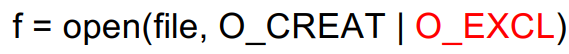

RaceCondition
동시에 여러 스레드가 공유된 자원에 접근하려고 하면 발생함

TOCTTOU
어떤 자원을 사용하기 전에 상태를 점검(check)했지만, 실제로 사용(use)할 때까지 그 상태가 바뀌는 바람에 발생하는 취약점

/tmp는 누구나 쓸 수 있는 디렉토리임
이 프로그램은 root 권한으로 실행되지만, 실제로는 access를 통해 realuser가 접근 가능한지 확인해봄
이후 open()을 통해 열때는 root 권한으로 열림
access와 open 사이에 /tmp/X 파일을 민감한 시스템 파일로 바꿀 수 있음

access는 실제 사용자 기준으로 검사하므로 실제 사용자가 권한이 있는 파일만 열도록 제한하지만, open은 EUID를 기준으로 파일을 열기 때문에 모든 파일을 열 수 있음

심볼릭 링크를 활용한 공격

1. /tmp 디렉토리 안에 일반 파일 X를 생성함. /tmp 디렉터리는 모든 사용자가 쓰기 가능한 디렉토리라 access()를 사용한 권한 확인을 통과할 수 있음
2. 파일 X를 심볼릭 링크로 바꿔서 /etc/passwd 와 같은 중요한 파일을 가리키도록 함
3. 이후 open()을 실행되고, root (EUID)권한을 기준으로 파일을 열어서 검사를 통과함
4. 그 결과 /etc/passwd가 쓰기모드로 열림

쉬워보이지만 쉽지만은 않음

프로그램은 1초에 수십억개의 명령어를 실행하기 때문에 확인 시점과 사용 시점 사이의 시간이 매우 짧음
너무 일찍 심볼릭 링크로 바꿔도 안되고, 너무 늦게 바꿔도 안됨
이 문제를 해결하기 위해 2개의 프로세스를 사용해야 함

하나의 프로세스는 취약한 프로그램을 계속해서 실행함
다른 하나는 공격 프로그램으로 파일 X를 계속해서 심볼릭 링크로 바꿔주는 역할을 함

공격이 실패하면 공격 프로그램은 심볼릭 링크를 다시 공격자가 소유한 파일로 되돌리고 다시 중요 파일을 가리키도록 하는 작업을 반복함
=> 운 좋게 정확한 타이밍에 맞춰 공격에 성공하도록 함

두 프로그램이 교차되어 실행되기 때문에 순서가 섞여 실행될 수 있음

공격이 성공하려면 A1->V1->A2->V2 순서로 실행되어야 함

파일이 존재하는지 확인하고, 존재하지 않으면 새로 생성하는 프로그램
1. /tmp/X 파일이 존재하는지 확인
2. 존재하지 않으면 open() 을 통해 새 파일 생성
3. 확인과 생성 사이에 존재하는 짧은 틈이 공격 지점
4. 이미 파일이 존재하는 경우에도 open()은 실패하지않고, 파일을 열고 쓰기 모드로 접근함
5. 확인과 생성 사이의 짧은 틈을 노려 /etc/passwd 같은 파일을 가리키는 심볼릭 링크로 바꿔치기 할 수 있음

open()에 CREATE 옵션이 있는데, 파일이 존재하지 않으면 새로 만들고, 존재하면 그 파일을 여는 동작을 함

사용자로부터 입력을 받아 /tmp/XYZ라는 이름의 파일에 내용을 씀
1. access()로 RUID 권한 확인
2. fopen()을 통해 파일 열고 수정

Countermeasure

공격할 준비 단계
1. 공격 대상 파일 선택
2. 공격 실행
3. 결과 모니터링
4. Exploit 수행

위의 한 줄을 /etc/passwd에 추가함으로써 임의로 root 권한을 가진 계정을 만들어내고, 그 계정에 자신이 설정한 비밀번호로 시스템에 접근할 수 있게 됨

취약한 프로그램 실행 방식
계속해서 텍스트 파일의 내용을 입력으로 넘겨줌

공격프로그램 실행 방식
심볼릭 링크 XYZ가 가리키는 대상을 계쏙해서 바꿈
한번은 공격자가 소유한 파일, 다음은 /etc/passwd 같은 중요한 파일

공격이 성공했는지 확인하기 위해서는 파일의 수정 여부를 모니터링 해야 함
ls -l을 통해 old와 new에 값을 저장하고 new 값만을 갱신하며 old와 비교함

공격 프로그램과 취약한 프로그램을 동시에 실행하고, 마지막에 공격이 성공한 것을 확인할 수 있었음

Countermeasures

1. 원자적 연산
check와 use 사이의 틈을 아예 제거하는 방식

O_CREAT : 파일이 없으면 새로 만든다
O_EXCL : 파일이 이미 존재하면 열지 않는다

2. check-use 반복
공격은 명령어 실행 순서가 정확히 맞아 떨어지는가에 달려있음
check와 use를 여러 번 반복하게 해서 매우 정확한 타이밍을 맞추게 함으로써 공격 성공률을 낮출 수 있음

3. sticky Bit 및 심볼릭 링크 보호

심볼릭 링크의 소유자 or 심볼릭 링크가 존재하는 디렉터리 소유자와
해당 링크를 따라가려는 프로세스의 실행자가 같을 때

→ 이 조건을 만족하지 않으면,
링크를 따라가는 것이 차단됨

4. 최소 권한 원칙
프로그램은 특정 작업을 수행하는 데 필요한 권한만 사용해야 한다. 그 이상은 절대 사용하지 말 것

단순히 파일을 읽고 쓰는 작업을 수행하는데도 불필요하게 root 권한을 가지고 있으면 안됨

access같은 보안 점검이 오히려 새로운 race condition 취약점을 만들어냄
-> 보안 강화를 위한 접근이 새로운 보안 구멍을 만듬

