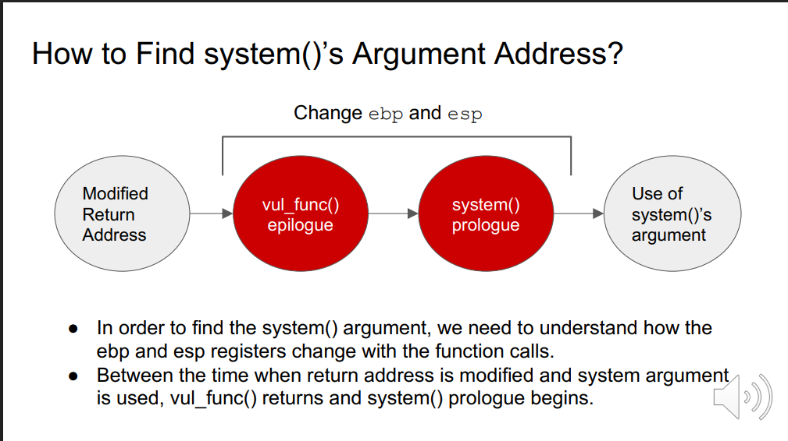

Return-to-libc 
- 쉘코드를 직접 스택에 올려 실행하지 않고, 이미 시스템에 존재하는 라이브러리 함수의 주소로 return address를 덮어쓰기하여 해당 함수를 실행시킴

Non-executable Stack
스택에 올라간 코드를 실행할 수 없도록 함

return address 위치에 system 함수를 실행하도록 system() 주소 작성

환경 설정

버퍼오버플로우 가능성이 존재하며, noexecutable stack 만 설정하고, 나머지는 비활성화

System 함수 주소 찾기

Myshell이라는 환경 변수를 스택 어딘가에 저장하고, 그 주소를 찾기
환경 변수의 주소는, 프로그램의 길이에 따라 저장되는 위치가 달라짐

ebp + 0 : 이전 ebp
ebp + 4 : return address
ebp + 8 : 첫 번째 인자

프롤로그와 에필로그

함수가 실행되면 프롤로그가 먼저 실행됨
1. push ebp를 하면서 Previous FP를 생성함
2. ebp를 esp의 위치로 옮김
3. 지역 변수 개수만큼 esp를 빼줌

1. 지역 변수들을 삭제하면서 esp를 옮겨줌
2. ebp를 pop 하면서 previous FP를 삭제함
3. ret 실행

1. vul_func()함수에서 버퍼 오버플로우를 통해 return address를 system() 주소로 덮어씀
2. (에필로그) 함수가 종료되며 ret 명령어 실행 -> system() 
3. system()의 Prologue가 실행되며 새로운 스택 프레임 구성
4. system() 내부에서 인자 (/bin/sh)를 스택에서 읽음

공격자는 스택을 직접 조작해서 system() 호출 직전 스택 구조를 미리 맞춰야 함
왜냐면 return address를 조작해서 system()으로 jump할 뿐이기 때문임

초기의 상태에서 vul_func()의 에필로그가 실행됨
지역변수 넣는 버퍼 삭제하면서 esp를 ebp위치로 옮기고, ebp를 pop해줌
이후 ret를 실행해야 하는데, 이 경우에선 return address가 system()의 주소임
그래서 system의 프롤로그가 실행됨
ebp+8의 위치에 인자들이 들어감

Return-Oriented Programming
chain many functions

Chaining Function Calls without Arguments

에필로그와 프롤로그에서 봐야할 점은 ebp의 위치가 +4가 된다는 점
Foo의 에필로그를 실행하고 나면 X+8의 위치에 esp가 있는데, 이 상태로 F 함수가 실행된다면 Previous FramePointer을 생성하고 X+4가 됨됨
=> 이 시점에서 ebp를 esp의 위치로 불러오기 때문에 ebp의 위치는 기존보다 +4가 된다는 점이 중요한 포인트

계속해서 X+4의 위치에 함수를 넣으면 chaining이 됨

Chaining Function Calls with Arguments

ebp+32를 통해서 인자는 최대 6개까지 입력 가능함
미리 값들을 스택에 셋팅해두는 방식임을 다시 한번 상기시켜야 함

