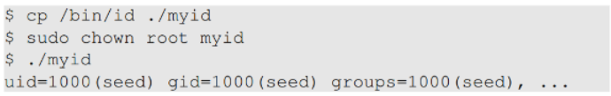
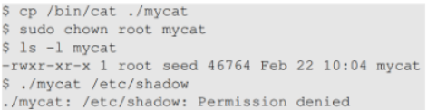
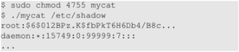
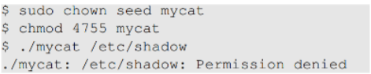
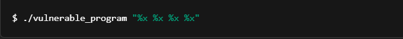
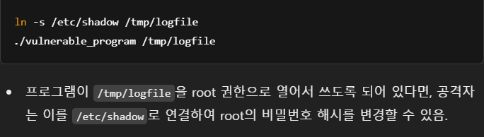
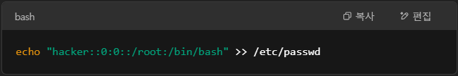
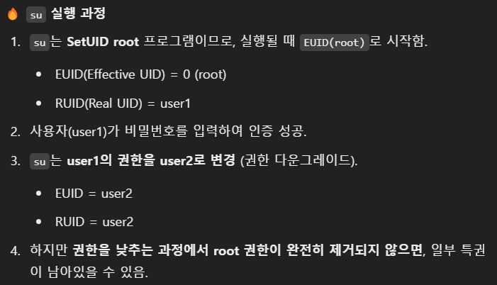
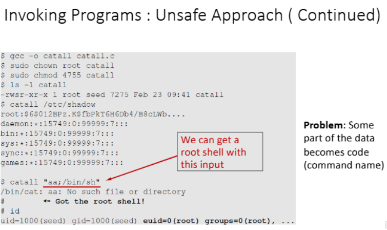

# Set UID

myid는 root의 소유로 변경되었지만, 실행하는 사용자의 UID가 seed(1000).

SetUID를 해줌으로써, 실행권한이 root의 권한으로 변경되어서, Effective UID는 root(0)이 됨.

SetUID 비트가 없을 때: 실행하는 사용자의 권한으로 실행됨.
SetUID 비트가 있을 때: 파일 소유자의 권한으로 실행됨.
즉, root가 소유한 실행 파일에 SetUID 비트가 설정되면, 실행하는 사용자는 누구든 root 권한으로 실행 가능.

/etc/shadow는 소유자만 읽을 수 있기 때문에 root가 아니면 접근할 수 없음.

SetUID bit를 설정해줌으로써, 사용자는 root의 권한으로 실행됨.

mycat 파일의 소유자를 seed로 변경했고, SetUID bit를 설정했으므로, seed의 권한으로 파일을 실행할 수 있음.
하지만 /etc/shadow를 읽을 수 있는 권한은 seed만 있기 때문에, 접근을 못함

일반적으로 사용자는 자신의 권한 범위 내에서만 명령을 실행할 수 있음.
하지만 SetUID가 설정된 실행 파일은 실행하는 사용자의 UID가 아닌, 파일의 소유자(보통 root)의 권한을 사용해서 실행됨.
이것이 **권한 상승(Privilege Escalation)**을 가능하게 함.

# SetUID 주의사항항
코드가 예상대로만 동작할 것이라는 가정은 보안적으로 위험하다.

개발자가 의도한 동작을 사용자가 그대로 따를 것이라고 믿으면 안 됨.
입력 검증, 권한 검사 등 보안 대책이 없으면 공격자가 이를 악용할 수 있음.
경로 우회(Path Manipulation) 공격이 가능하다.

원래는 특정 경로로만 접근해야 하지만, 공격자가 이를 바꿔서 보안이 뚫릴 수 있음.
예: 심볼릭 링크 공격, 환경 변수 변조(LD_PRELOAD), 파일 권한 조작 등.
SetUID 프로그램이 위험할 수 있다.

SetUID 프로그램은 일반 사용자라도 파일 소유자의 권한을 빌려 실행할 수 있음.
하지만 보안 검토 없이 만들면 권한 상승 공격이 발생할 가능성이 큼.

### Attack Surface란
소프트웨어 환경에서 공격자가 데이터를 입력하거나, 데이터를 빼낼 수 있는 모든 지점의 합을 의미함.
즉, 시스템이 노출된 부분(취약점, 접근 가능한 경로, 인터페이스 등)이 많을수록 공격 표면(Attack Surface)이 커짐.
공격 표면이 클수록 보안 위험이 증가하기 때문에, 가능한 한 공격 표면을 줄이는 것이 보안의 기본 원칙임.

## User Inputs (사용자 입력)
# Buffer OverFlow
SetUID 프로그램이 사용자로부터 직접 입력을 받는 경우, 공격자가 악의적인 입력을 전달할 수 있음.
예를 들어, gets() 같은 안전하지 않은 함수가 있으면 버퍼 오버플로우(Buffer Overflow) 공격을 통해 권한 상승(Privilege Escalation)이 가능함.

# Format String Vulnerability
printf() 같은 함수는 "%s", "%d" 같은 포맷 문자열을 사용하여 출력 형식을 지정함.
만약 사용자 입력이 포맷 문자열로 직접 사용되면, 공격자가 임의의 메모리 주소를 읽거나 덮어쓸 수 있음.

%x를 여러 번 사용하면 스택의 메모리 내용을 출력할 수 있음.
공격자는 이를 통해 메모리에서 중요한 정보를 유출할 수 있음 (예: 암호화 키, 비밀번호).

## System Inputs (사용자가 제어할 수 있는 시스템 입력)
# 심볼릭 링크
프로그램이 시스템 파일, 설정 파일 등을 읽거나 수정할 때, 공격자가 이를 조작할 수 있음.
심볼릭 링크(Symbolic Link) 공격을 통해 권한 상승이 가능.

## User Inputs
# CHSH
일반 사용자는 자신의 기본 셸만 변경할 수 있어야 하지만, 보안 취약점이 있으면 공격자가 이를 조작하여 root 계정을 만들 수도 있음.

hacker 계정이 root(UID=0, GID=0)로 등록됨.
이제 공격자는 su hacker 명령을 실행하여 root 권한을 얻을 수 있음.

# Environment Variables (환경 변수)
SetUID 프로그램이 실행될 때 **환경 변수(Environment Variables)**를 참조하면, 공격자가 이를 조작하여 악용할 수 있음.

## Capability Leaking (권한 유출)
Capability Leaking(권한 유출)이란, 특권을 가진 프로그램(SetUID 등)이 실행 중에 자신의 권한을 낮출 때, 완전히 정리되지 않은 특권이 남아 있어 악용될 수 있는 보안 취약점을 의미함.

# 권한 다운그레이드 (Privilege Downgrading)
일부 특권 프로그램(예: su, sudo)은 실행 도중 권한을 변경하여 특정 작업만 수행하도록 제한하는 기능을 가짐.
하지만 잘못된 방식으로 권한을 낮추면, 이전의 특권이 일부 남아있는 상태로 유지될 수 있음

# 실행 중인 프로세스가 특정 시스템 호출(System Calls)에 영향을 받을 수 있음
일부 시스템 호출(seteuid(), setgid())은 권한을 낮추지만, Saved UID(SUID)는 유지됨.
공격자는 이를 이용해 다시 root 권한을 복구할 수 있음.

# 환경 변수와 파일 핸들(Descriptors) 정리 부족
프로그램이 특권을 낮추기 전에 root 권한으로 연 파일을 닫지 않으면, 일반 사용자가 root 권한을 가진 파일을 조작할 수 있음.

## Invoking Programs(외부 프로그램 실행)

# 외부 프로그램 실행 (Invoking External Commands)
SetUID 프로그램이 내부에서 외부 명령어를 실행할 수 있음.
예를 들어, system(), exec() 같은 함수를 사용하여 명령어를 실행할 수 있음.
하지만 이 과정에서 사용자 입력을 제대로 검증하지 않으면 보안 취약점이 발생할 수 있음.
명령어 주입, PATH 변조 공격 등등 가능

system() 대신 execve() 같은 함수 사용하면 공격을 방어할 수 있음.

# Principle of Isolation (격리 원칙)
**원칙: Don't mix code and data.** (코드와 데이터를 섞지 마라.)
프로그램이 실행될 때, 코드(Code)와 데이터(Data)는 명확하게 구분되어야 함.
데이터는 단순한 정보로 사용되어야 하며, 실행 가능한 코드로 변환되거나 실행되지 않도록 해야 함.

# Principle of Least Privilege(최소 권한 원칙)
**모든 프로그램과 특권 사용자는 작업을 수행하는 데 필요한 최소한의 권한만 사용해야 한다.**

