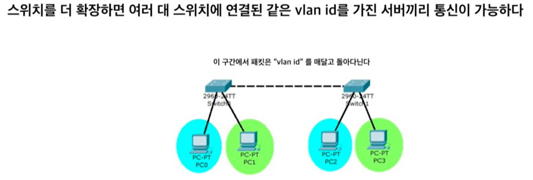
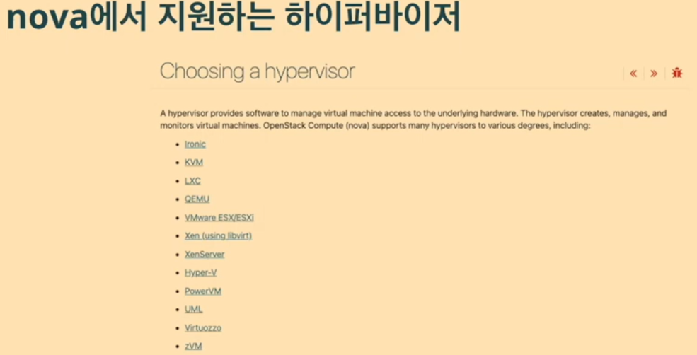

오픈스택의 주요 컴포넌트
물리적인 자원을 관리하고, 다룰 수 있도록 API 제공
오픈 스택은 자원을 생성하는 기능은 없고, 관리만 해줌 (실질적으로 자원을 다루는 서비스와 연동하려고 다양한 드라이버 사용)
Nova: 가상머신 생성 및 관리(EC2)
Neutron: VM간 통신, Security Group, 가상 IP (VPC)
KeyStone: 모든 서비스 인증 및 관리 (IAM)
Glance: OS 이미지 관리 (AMI)
Cinder: VM에 붙이는 하드디스크(EBS)
Manila: 파일 스토리지
Swift: 객체 스토리지

Cloud 
언제 어디서든 IT자원을 빌려서 사용할 수 있게 하는 것
가상화된 IT 자원들을 추상화하여 API로서 제공하는 것 (물리적인 서버를 쪼개서 it 자원 제공하여 복잡한 내부 동작을 알 필요없이 제공)

가상화
하드웨어를 논리적으로 나누는 방식

전가상화: 진짜 물리서버에 있는 것 처럼 속이는 방식 (하이퍼바이저가 명령어 번역해줘야해서 약간 느림)
반가상화: 가상 환경에 있음을 알고 협력하는 방식 (번역 속도가 줄어듦)
KVM: 리눅스에서 많이 사용하는데 리눅스 자체가 하이퍼바이저로, 하드웨어의 도움을 받아 전가상화임에도 반가상화만큼 속도가 빠름

네트워크
서브넷팅
tcp/ip

VLAN
스위치에 케이블 연결해서 사용하면 같은 연결된 서버는 같은 네트워크에 속함
VLAN을 사용하면 같은 스위치에 연결되어있어도, 네트워크 분리 가능

스위치가 달라도, 같은 vlan ID를 가지고 있다면 통신가능
파란색과 초록색 네트워크가 서로 소통하고 싶다? 위의 layer에서 router로 경로 전달해줌

vxlan
vlan ID는 12비트라서 부족하지만 vxlan은 24비트까지 가능

BGP
서로 다른 네트워크간 정보를 교환할 수 있도록 하는 프로토콜(주변의 여러 라우터들에게 어떤 라우터가 어느 AS에 속해 있는지에 대한 정보를 소문 내는 것)
iBGP: 서로 같은 AS 상의 Border Gateway들 끼리의 연결을 담당하는 BGP
eBGP: 서로 다른 AS 상의 Border Gateway들 끼리의 연결을 담당하는 BGP, inter-AS 라우팅

Nova

Neutron
어떤 형태의 가상 네트워크를 제공할 것 인가
먼저 가장 간단한 형태의 네트워크 분리 방식인 VLAN로 VPC 제공해볼 것

