OpenStack Network
- Management Network: 오픈스택의 서비스가 서로 소통하기 위한 통로
- Tunnel Network: vm instance 끼리 통신하게 만드는 가상 터널(VXLAN)
- Externel Network: vm instance가 외부와 소통하기 위한 네트워크

- Provider Network: 오픈스택을 서비스하는 사람이 구축한 네트워크가 vm instance 에 할당되는 네트워크
- Self-Service(Project) Network: 사용자가 필요에 따라 소프트웨어적으로 자유롭게 만들고 지울 수 있는 가상 네트워크

Neutron이 네트워크 형성하는 방식
ip netns로 namespace 공간 만들고, 가상 스위치인 브릿지를 생성 및 인터페이스를 통해 가상 머신을 이어줌
물리 서버 간 통신을 위해 vxlan 인터페이스 생성하고, L2 트래픽을 L3 패킷에 담아 보냄

- LinuxBridge를 이용하여 네트워크를 구축할 경우, linux bridge, namespace를 이용하여 가상 네트워크 구축
- linuxbridge는 vxlan만 지원하는데, bridge 명령어로 vxlan 설정
- self-service 네트워크는 provider 네트워크를 통해 외부와 통신

vxlan은 vlan같이 네트워크를 가상으로 분리하는 기술인데, 계층의 차이와, ID 개수의 차이가 있음
- VLAN은 ID가 12비트로 총 4096개지만, VXLAN은 ID가 24비트로 많은 가상 네트워크 제공
- VLAN은 스위치간 트렁크가 설정되어있어야 하지만, VXLAN은 L3에서 동작하기때문에 트렁크가 없어도 됨

이제 간단한 실습을 해볼 예정
openstack을 다운받기엔 노트북 용량이 감당이 되지 않기때문에 devstack으로 실행할 예정
devstack에서는 쿠버네티스를 활용하여 opensearch를 배포함으로써, devstack 및 k8s 로그를 수집 및 분석해볼 예정

Install Linux

vmware로 22.04 LTS 버전으로 vm 생성 후 시작했다.
생성하는 시작부터 에러가.. 발생했었는데
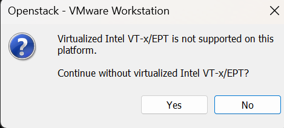

vmware에서 가상화 권한을 가져갈 수 있도록
Windows 기능에서 가상화 관련한 부분을 꺼주고,
BIOS에서도 가상화를 비활성화 해주었다.

그래도 실패해서.. Windows의 보안 기능에 메모리 무결성을 꺼줌으로써 드디어 시작했고, IP할당받고 시작!

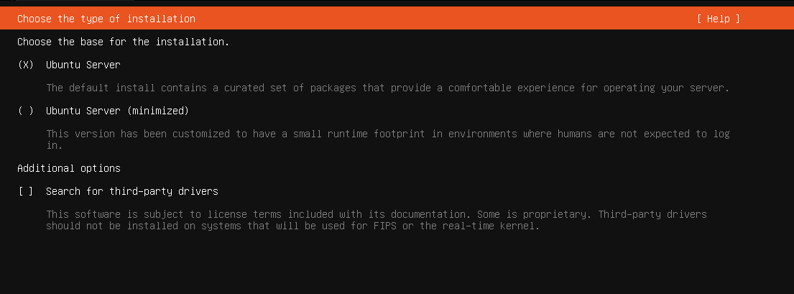
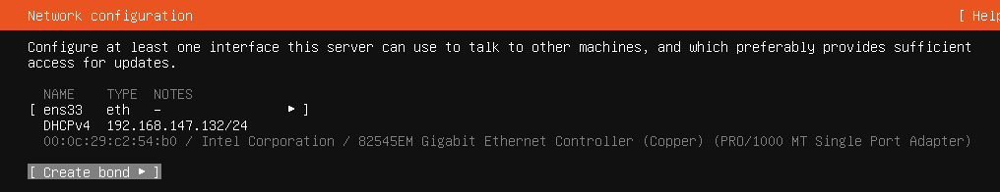

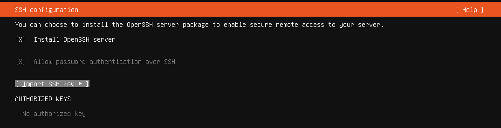
나중에 ssh해서 작업할 수 있을 것 같아서 미리 설정해두기

Add Stack User
openstack 공식 문서에보면, devstack 실행할 때 sudo 권한을 가진 root가 아닌 유저로 실행하라고 나옴
다른 파일시스템이나 네트워크 설정 환경이 파괴될 수 있고, 이후에 일반 사용자로 관리하기 어려워서 라고 함

Stack 유저 생성
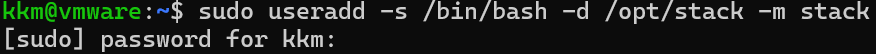

이후엔 sudo로 비밀번호 칠 필요없도록 수정하고, 사용자로 변경
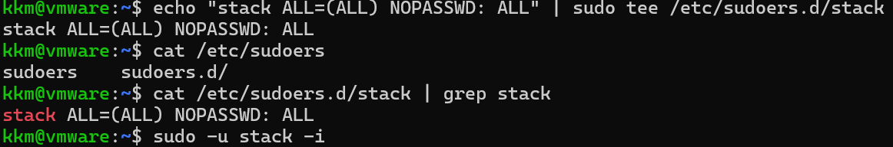

Download devstack
git clone으로 다운받아주고, local.conf 설정
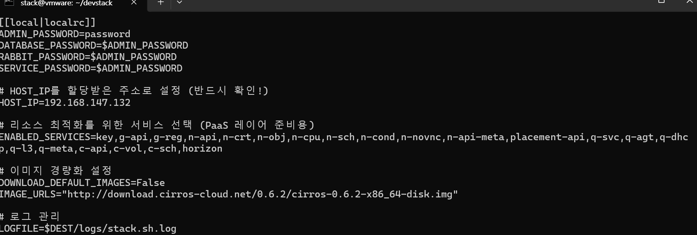

리소스 최적화하려고 주요 컴포넌트(keystone, glance, nova, neutron, cinder, horizon)만 사용
일단 설치까지 되는지 확인해보려고 가장 가벼운 os만 설치(나중에 ubuntu 설치할 것)

이후 ./stack.sh 실행

local.conf를 최소한으로 구성하려고 변화를 줬어서 그런지.. 생각보다 많은 에러가 발생했지만 결국 성공!

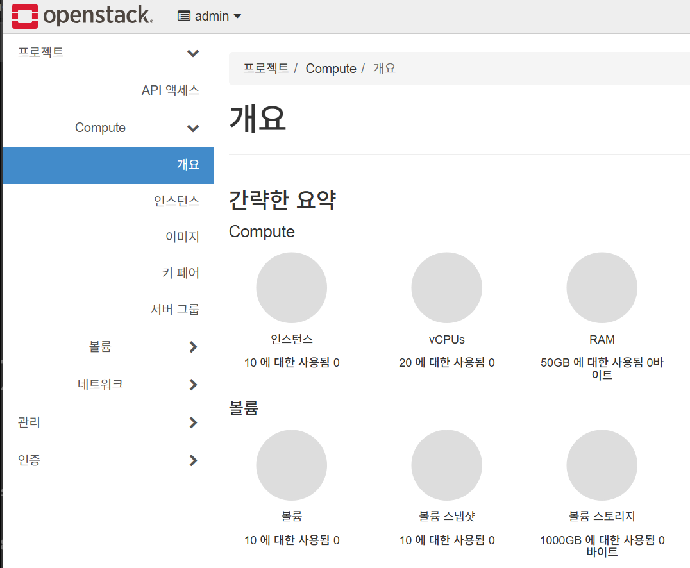

VM 설치
opensearch와 k3s를 돌릴 것이기 때문에 12GB중 6GB를 할당해보려고 함 

devstack이라 휘발되긴 하지만 로그를 담아두는 볼륨은 놔둬야된다고 생각해서 보존하는 방식으로 진행함

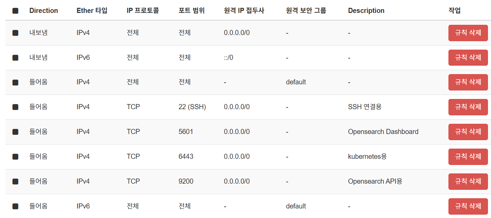

앞으로 있을 k3s, opensearch, ssh 등을 위해 보안그룹 추가 또한 진행해줬음

k3s로 opensearch 올리기
vm에 올리려고 했는데 기존의 crios 이미지는 테스트용이라고 해서, ubuntu로 이미지 수정예정
cloud용 ubuntu는 GUI가 없어서 그런지 용량이 작다는 걸 알게 되었다..

이후 ssh를 시도해봤지만 안되어서 콘솔을 확인해봤더니 부팅조차 되지 않고 있던 것..

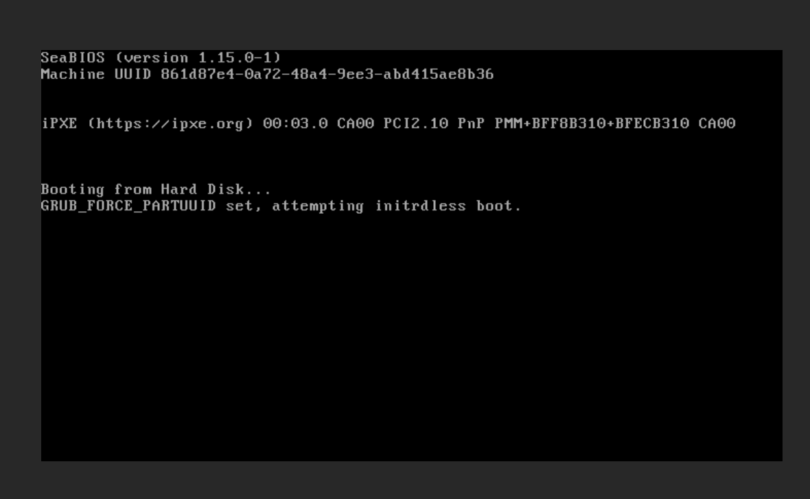

crrios OS는 되는 것으로 확인했는데, ubuntu는 되지않음..
=> 자원의 문제인가 ㅠㅠ

Reddit을 찾아보니 ubuntu kvm 이미지는 부팅속도 높이려고 초기화 과정을 건너뛰는데, 이것 때문에 중첩 가상화 환경에서 에러가 난다고 함

이후 부팅은 해결했지만 ubuntu login이 안됐었는데.. 인스턴스 생성할 때 구성 스크립트 작성해서 비밀번호 넣어줬더니 로그인 까지 해결!

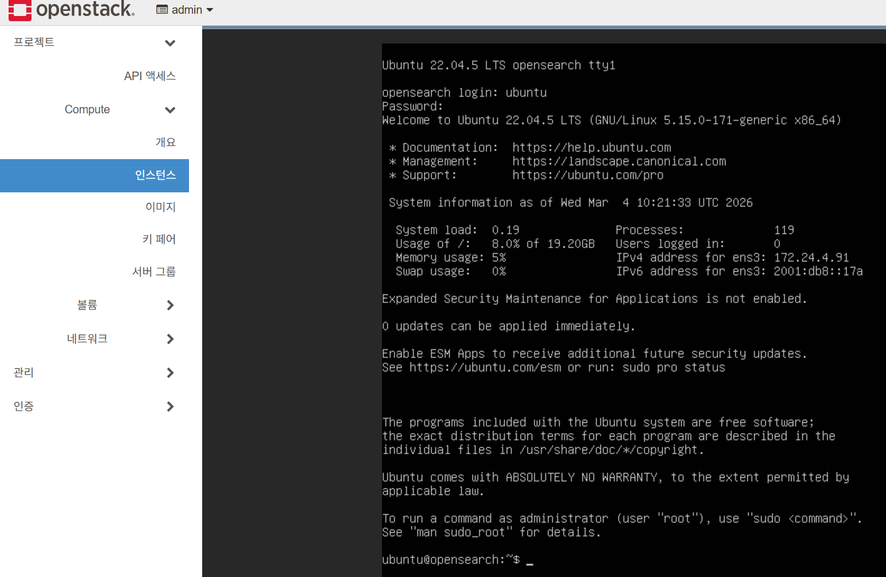

ssh로 하려고 했으나.. 바로 윈도우 터미널 -> openstack vm 으로는 연결이 되지 않음
route add 172.24.4.0 mask 255.255.255.0 192.168.147.132 명령어로 라우팅 길을 뚫어줌으로써 ssh 성공!

k3s 설치 스크립트를 curl로 받아오려고 했으나 파일을 내려받지 못했음..
인스턴스에서 google.com에 ping을 해봤더니 ping이 안가는 걸 확인할 수 있었음
=> /etc/resolv.conf에 구글 DNS를 수동으로 저장해줌으로써 해결

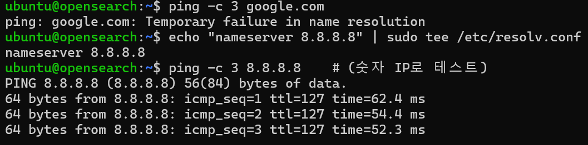

Opensearch은 mmap 방식을 사용하는데 매핑영역이 부족해 질 수 있어서 리눅스에선 영역을 추가해줘야 한다고 함
https://opensearch.org/blog/error-logs/error-log-max-virtual-memory-areas-vm-max_map_count-is-too-low/

사전 환경 조성해줬으니 이젠 opensearch 설치
직접 컴포넌트들을 다 조정하긴 힘들 것 같으니까 helm을 사용해서 설치

또 curl을 하려고 보니 다운이 되지 않음..
/etc/systemd/resolved.conf에서 DNS 주소 수정해줬는데, 아래와 같은 에러가..
ipv6로 보임

ping -c 3 google.com
PING google.com(nchkga-ap-in-x0e.1e100.net (2404:6800:4005:826::200e)) 56 data bytes
From _gateway (2001:db8::2) icmp_seq=1 Destination unreachable: No route
From _gateway (2001:db8::2) icmp_seq=2 Destination unreachable: No route

echo "precedence ::ffff:0:0/96 100" | sudo tee -a /etc/gai.conf 명령어를 통해서 ipv4의 우선순위를 높이도록 수정할 수 있었음

opensearch helm repo 다운받고, 차트 또한 다운 받으려고 했으나 권한문제가 발생했다
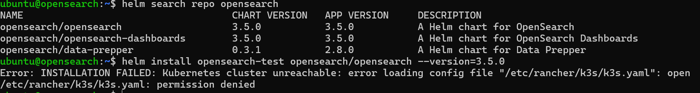

권한문제 해결하고 다운받은 opensearch pod를 확인했더니 또 에러가.. 한번에 될거라곤 생각 안 했어서 괜찮다..
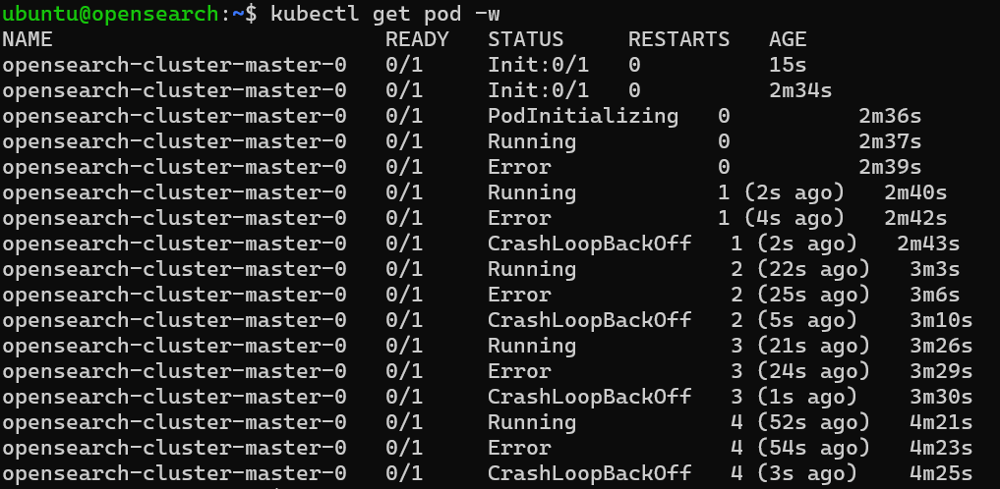

이후 kubectl logs 로 pod 로그를 확인해봤을 때, 초기 비밀번호를 생성하지 않아서 발생한 것 같다.
Plugin a change that requires an initial password for 'admin' user.
Please define an environment variable 'OPENSEARCH_INITIAL_ADMIN_PASSWORD' with a strong password string.
If a password is not provided, the setup will quit.

숫자로만 패스워드를 작성했더니 또 에러가.. 생각보다 깐깐하다
Password 2020033781 failed validation: "Password does not match validation regex". Please re-try with a minimum 8 character password and must contain at least one uppercase letter, one lowercase letter, one digit, and one special character that is strong. Password strength can be tested here: https://lowe.github.io/tryzxcvbn

아무튼 해결하고 opensearch 대시보드 까지 Helm chart로 생성 완료!
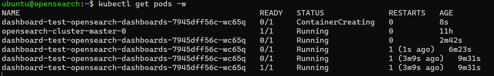

윈도우에서 오픈서치 대시보드에 접속하려면 포워딩을 또 해줘야 할 것 같음
포워딩 후 접속해보니.. 접속이 원활하지않다

pod가 Running 중이였는데, State는 unhealthy 한 상태여서 안되는 것 같다..
그래서 또 pod log를 봤는데
{"type":"log","@timestamp":"2026-03-05T05:28:22Z","tags":["error","opensearch","data"],"pid":1,"message":"[ConnectionError]: getaddrinfo EBUSY opensearch-cluster-master"} 해당 로그가 반복됨..

getaddrinfo는 해당 주소를 못 찾고 있다는거니까 DNS? 이런 문제라고 생각된다

그래서 dashboard chart 를 재설치할 때 HostIP를 제공했다.

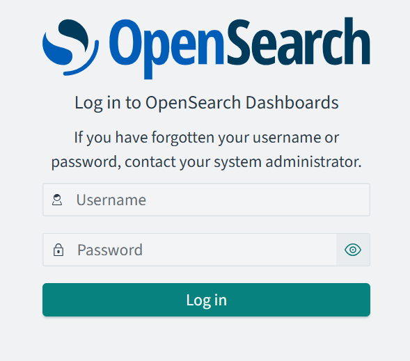

드디어 opensearch까지 접근 완료.. ㅠ

Opensearch로 로그 모으기

수집기로는 일단 가벼워야 할 것 같아서 Fluent bit을 사용할 예정이다.
helm chart로 다운 받았는데.. 역시나 또 바로바로 되진 않는다. 
알고보니 아까 대쉬보드처럼 내부 포드의 IP를 몰라서 그랬던 것..
해결 후 성공적으로 띄울 수 있었다

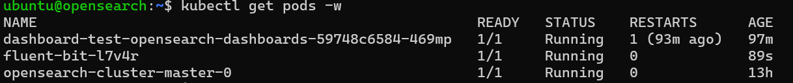

이후 opensearch에 들어갔더니 log가 있는 걸 확인..!

내가 보고싶은 데이터들 추가해서, log중 error가 발생한 로그만 확인해봤다.
아직 로그가 별로 없어서 error가 별로 없는 것 같다

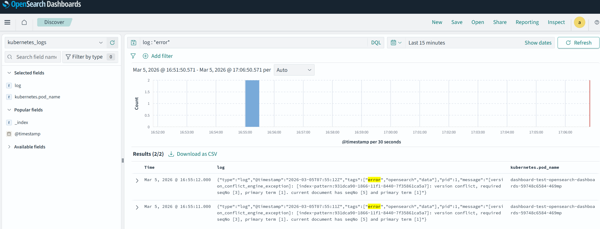
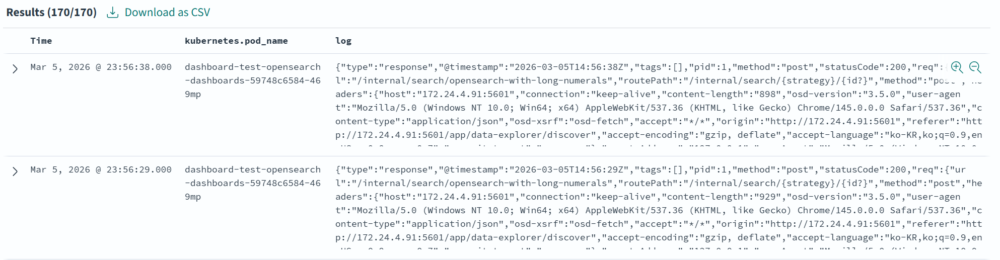
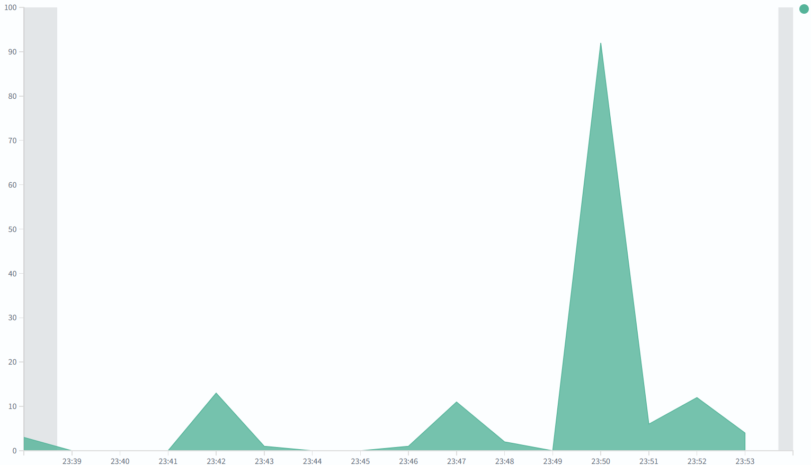

로그 분석 및 모니터링을 제대로 할만한게 없어서 아쉬웠지만 간단하게 테스트할 수 있어서 좋았다.
테스트 과정에서 배워가는 내용 덕분에 더 흥미로운 부분이 많은 것 같다.

