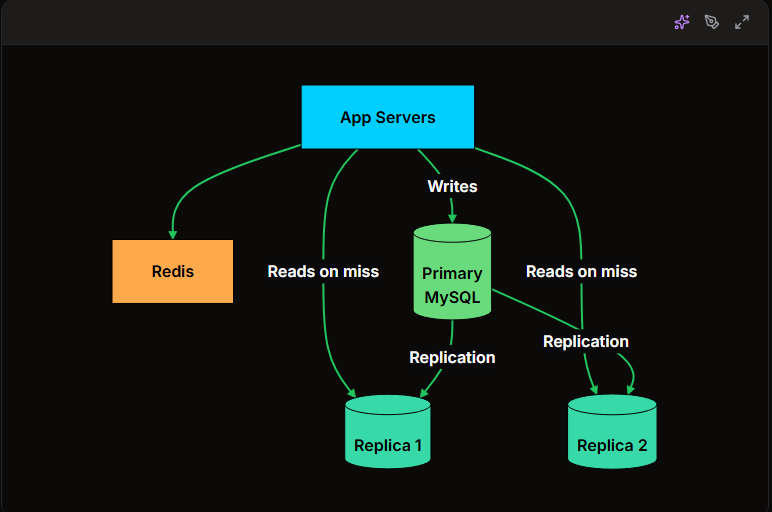

Scaling할 때는 연결되어 있는 다른 Component들에 영향을 주의해야 함

분산 시스템에서는 주로 Stateless(상태비저장) 상태로 사용자들의 접근을 받는데 이때 Redis를 사용해서 캐싱을 하는 방식 or JWT로 인증하는 방식이 메인인 것 같다.

또한 DB같은 경우에는 확장성이 좋은 Nosql 사용을 추천.

병목현상 케이스
Read가 많음 -> Read Replica 사용
Write가 많음 -> Sharding 사용
둘다 많음 -> 둘 다 사용
확장성이 필요함 -> Nosql 사용 검토

캐싱 서버 확장 전략
Redis Cluster -> Redis 버전 Sharding(Redis는 속도 목적, RDBMS는 저장용)
Consistent Hashing -> 서버 줄이거나 늘릴 때 데이터 재배치 최적화 알고리즘
Cache-aside pattern -> 캐시에 데이터 있으면 hit, 없으면 DB에서 가져오기 

사용자 수 별 스케일링 단계

0~1만: 단일 서버를 사용하며 주로 application 과 db를 같은 서버에 둠

1만~10만: 첫 확장은 주로 DB를 서버로 부터 꺼내는걸로 시작함 

10만~50만: 캐싱 layer를 추가함 app과 db사이에 캐시서버인 redis 같은 걸 추가함. 주로 80~90%의 읽기는 db를 거치지 않게 됨

50만~200만: LB를 두고 app server를 scaling(수평 확장)

200만~1000만: Read Replica용으로 복제본을 두고, master db에만 write하도록 함. 또한 Redis또한 App server뒤에 따로 사용

이후는 샤딩 검토

Autoscaling을 할때는 관련 컴포넌트와의 관계도 중요하다는 걸 알게 되었다. 그중에서도 scaling하는 앱과 연결된 DB.
만약 K8s에서 deployment에 앱과 DB를 같이 넣어두면 scaling하기에 어려움. DB 또한 여러개 생겨나기 때문에. 그냥 PV에 넣어두고 해당 deployment를 scaling하면 문제가 발생할 수 있음.

-> 이럴 때는 StatefulSet사용
StatefulSet은 미리 DB 인프라를 준비해두는 것
인프라를 준비해놓은 걸 기반으로 Operator를 사용해서 Scaling할때의 DB 관리를 자동으로 하도록 맡기는 방법이 존재함

