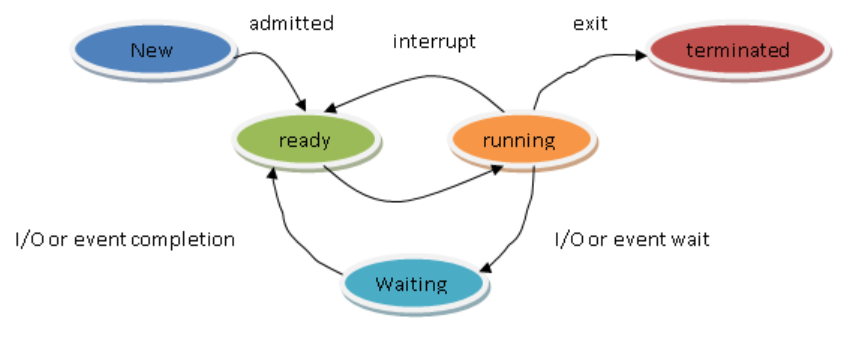

프로세스와 스레드의 차이점

    프로세스는 독립적인 메모리 공간을 가지며, PCB가 존재함
    스레드는 프로세스 내에서 실행되는 작업 단위로, 메모리를 공유함
    스레드는 코드, 데이터, 힙을 공유하며, 스택,PC,register은 독립

    스레드는 자원을 공유하기때문에 context switching 비용이 낮음

Context Switching
    CPU가 실행중인 프로세스를 바꿀 때, 저장하고 불러오는 작업

CPU 스케줄링
    CPU가 어떤 프로세스를 다음에 실행할지 결정하는 메커니즘
    프로세스가 ready queue에 있으면, OS가 스케줄러를 통해 하나를 선택해서 CPU 할당

    

    알고리즘 종류
    비선점형
    FCFS(First-Come First-Served) - 도착한 순서대로 실행하는 방식으로, 긴 작업이 오면 모두 기다려야하는 단점이 있음(Convoy Effect)
    SJF(Shortest Job First) - CPU 사용 시간이 짧은 프로세스 먼저 실행하는 방식으로, CPU 사용 시간이 긴 작업은 Starvation 가능 => Aging 기법을 사용하여 오래 기다린 프로세스의 우선순위를 점점 높여줌
    이론적으로 가장 효율적이지만, 다음에 올 작업의 CPU 할당 시간을 모르기 때문에 구현이 어려움

    선점형
    RoundRobin - 고정된 타임퀀텀만큼 실행 
    Priority - 우선순위 값을 설정하는 방식

메모리 관리
    운영체제는 한정된 물리 메모리(RAM)을 효율적으로 분배해야 함

    메모리 할당 방식
    연속 메모리 할당 - 프로세스 하나에 연속된 공간을 할당하지만, 외부 Fragmentation 발생 가능함(블록은 충분한데 연속된 공간이 없는 것)
    페이징 - 메모리를 같은 크기의 블록인 Page로 나눔
    Segmentation - 메모리를 논리적인 단위로 분할(사람의 사고방식과 유사함), 외부 Fragmentation 발생 가능함

    가상 메모리
    디스크의 일부를 메모리처럼 사용하는 기술로, 연속적인 논리 주소 공간을 제공하지만 실제로는 물리 메모리에 필요한 부분만 로딩

    Demand Paging - 실제로 접근할 때만 페이지 로딩
    Page Fault - 필요한 페이지가 메모리에 없을 때 발생

    페이지 교체 알고리즘
    FIFO
    LRU - 가장 오랫동안 사용되지 않은 페이지 제거
    Clock(Second Chance) - valid bit를 사용해서 1이면 0으로 바꾸고, 0이면 제거
    
    TLB - 페이지 테이블에 빠르게 접근하기 위한 캐시 메모리
    Swapping - 전체 프로세스를 디스크에 저장하고, 나중에 다시 메모리에 올리는 방법     

    논리주소를 물리주소로 MMU를 통해 바꿈.

    컨테이너와 가상화의 차이점은?
    => 컨테이너는 상태 비저장이며, 가상화는 상태 저장
    => 컨테이너는 빠르고 가벼워서 서버리스 구조에 자주 사용함(하이퍼바이저에 OS를 올리지 않아서 가벼움)
    => 가상화는 각 VM에 자체 OS를 탑재하기 때문에 무거움

동기화 
    멀티 프로세스 또는 멀티 스레드환경에서 공유자원에 동시에 접근할 때 데이터 일관성을 보장하기 위해 필요함
    멀티 프로세스는 파일, 소켓, 파이프, 공유 메모리를 공유하기때문에 동기화가 필요함

    mutex - 한번에 하나의 스레드만 접근 허용
    semaphore - 정수값의 개수만큼 접근 허용
    spinlock - 잠금이 풀릴 때 까지 계속 loop를 돌며 대기(context switching이 없지만, CPU 사용량은 많음)

    Deadlock - 여러 프로세스가 필요한 자원을 점유한채로 무한 대기
    Deadlock 발생 조건 4가지
    1. Mutual Exclusion (상호배제)
    2. Hold and Wait (점유 대기) - 모든 자원을 한번에 요청하도록 설계하면 해소 가능
    3. No Preemption (비선점) 
    4. Circular Wait (순환 대기) - 자원에 고정된 순서를 부여해서 번호 순서대로 요청하도록 설계하면 해소 가능

파일 시스템
    Inode - 파일의 메타데이터를 담고 있는 자료구조
    파일은 여러 개의 디스크 블록에 나눠서 저장됨

    파일 접근 방식
    순차 접근 - 처음부터 순서대로 읽기 (로그나 텍스트 파일)
    직접 접근 - 특정 오프셋으로 바로 이동 (DB)

    파일 읽기 예시
    1. 디렉토리에서 파일 이름 -> Inode 번호 찾기
    2. Inode를 통해 데이터 블록 주소 찾기
    3. 해당 블록에서 파일 내용 읽기

I/O System
    I/O 장치는 상대적으로 매우 느려서, 비동기적이고 효율적으로 처리해야 함
    Interrupt - 장치가 준비되면 CPU에 알리는 방식으로 Context switching 필요
    DMA는 장치가 메모리와 직접 데이터를 주고 받기 때문에, CPU가 데이터 복사 작업에서 해방되어 시스템 성능 향상

    버퍼링 - I/O 장치와 CPU의 속도 차이를 보완하기위한 버퍼

운영체제 구조
    사용자와 하드웨어 사이에서 중재자 역할을 하는 소프트웨어
    단일 구조 - 모든 OS 기능이 하나의 큰 커널에 통합
    계층형 구조 - 여러 계층으로 나눔
    마이크로커널 구조 - 커널에는 필수 기능만 포함

    System call - 유저 프로그램이 커널 기능을 요청
    
부팅과 커널
    부팅 순서
    BIOS 실행 -> 부트로더 로딩 -> 커널 로딩 -> init 실행 -> 사용자 환경 실행
    Bios가 먼저 실행되어 하드웨어를 초기화 하고, 부트로더를 메모리에 로딩한다. 이후 부트로더는 커널을 로딩하고 실행 권한을 넘긴다. 이후 커널은 메모리를 초기화 하고 init(systemd)를 실행하여 사용자 환경을 구성한다.

    커널은 운영체제의 핵심 부분으로, 하드웨어와 사용자 애플리케이션 사이 중재
    프로세스 관리, 메모리 관리, 파일 시스템, 입출력 관리, 시스템 콜 처리를 해줌
    init은 순차적으로 실행해서 느리지만, systemd는 병렬로 실행해서 빠름

기타 모음
    fork와 exec의 차이점
    fork - 현재 프로세스를 복제하여, 자식 프로세스 생성
    exec - 다른 프로그램을 실행하여, 현재 프로세스를 교체 (PID는 그대로)

    Context Switching
    시간 할당이 끝나고, I/O대기, 인터럽트가 있을 때 발생
    CPU가 실행중인 프로세스를 멈추고, 다른 프로세스로 전환할 때 PCB에 정보를 저장해두고 돌아옴

    Zombie & Orphan
    Zombie - 종료되었지만 부모가 wait을 호출하지 않아 PCB가 남아있는 상태
    Orphan - 부모가 먼저 종료되고 고아가 된 자식으로, OS가 대신 수거함

    Stack와 Heap 차이점
    Stack은 지역 변수 및 함수 호출 정보를 저장하고, 컴파일 타임에 할당
    Heap은 동적 배열 및 객체를 저장하고, 런타임에 할당
