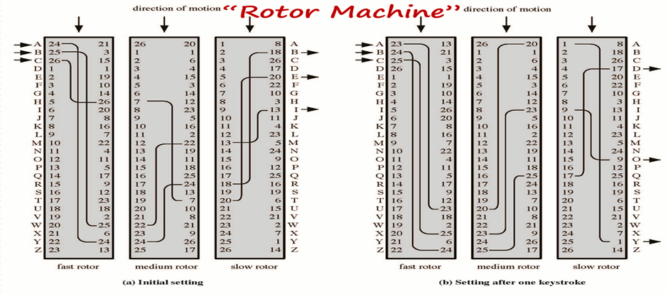
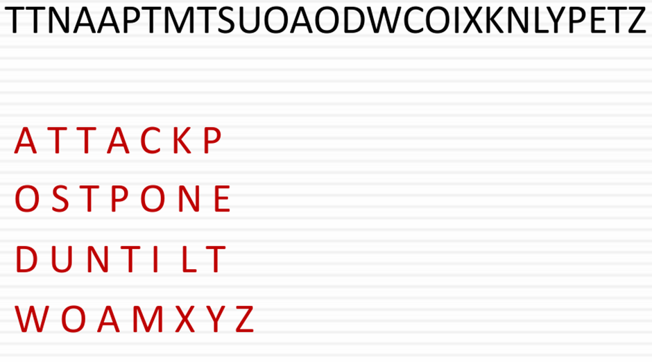

## 용어 정리
- **Cipher**은 평문을 암호문으로 바꾸는 알고리즘
- **Encipher(encrypt)** 암호화
- **Decipher(decrypt)** 복호화
- **Cryptography** 암호생성 분야의 암호학
- **Cryptanalysis(codebreaking)** 암호풀이 분야의 암호학
- **Cryptology** 암호학의 큰 범위(Cryptography+Cryptanalysis)

### Cryptography
- **대칭형 암호**는 암호를 생성할 때와 풀 때의 key가 같은 암호
- **비대칭형 암호**는 암호를 생성할 때의 key와 암호를 풀 때의 key가 다른 암호

## 암호의 특징
- 치환을 통해서 원래 있던 문자를 바꾸는 방식
- 글자의 배열을 바꾸는 방식

- **대칭형 암호**는 하나의 키를 사용하면서 비밀 키 방식
- **비대칭형 암호**는 두개의 키를 사용하면서 하나는 공개 키, 하나는 개인 키로 사용하는 방식

- 암호화의 단위는 block 단위거나 bit 단위로 나눌 수 있음

### Cryptanalysis
- 주 목적은 key를 알아내는 것
## 일반적인 접근
- # **cryptanalytic attack**
- 여러가지 암호 분석 방식이 존재
	암호문만 가지고 있는 경우 
	암호문과 평문을 가지고 있는 경우
	평문을 선택하고, 평문에 대한 암호문을 얻을 수 있는 경우
	암호문을 선택하고, 평문을 얻을 수 있는 경우
이러한 경우들에도 key를 얻기가 어려움

- **brute-force attack**
- key의 bit수가 많아질수록 시간이 엄청나게 걸리기 때문에 어려움

## More Definition
- **Unconditional security**는 절대 깨지지 않는 암호로, 암호의 이상적인 모습이지만 불가능
- **Computational security**는 계산은 가능한데, 현실에서는 시간이 부족해서 해결을 못하도록 하는 방식
- 현재 가장 흔하게 사용하는 128bits key는 **Computational security** 방식이다

**Monoalphabetic Ciphers** 는 불규칙하게 알파벳을 바꾸는 방식 (A to B , B to K) -> 26!개의 경우
- 경우가 많으니까 안전하지 않을까? -> 언어의 특성 때문에 안전하지 않음

## 언어의 특성
- 사람 언어는 중복성이 높음
- 한 글자가 주로 중복돼서 사용되지 않음
- 영어에서도 흔히 사용되는 글자가 있고, 사용이 잘 되지 않는 글자가 있음
- 결론적으로, **언어의 통계**가 있기 때문에 안전하지 않음

- **Monoalphabetic Ciphers**가 안전하지 않은 이유는, 글자를 바꿔도 원래 글자의 빈도수가 바뀌지 않기 때문

**Polyalphabetic Ciphers**는 각 글자마다 다른 table을 사용해서 통계가 잡히지 않도록 하는 방식으로, 통계가 잡히지 않아서 보안이 좋음

- 첫번째는 초기설정이고, 두 번째부터는 한칸 밀어서 실행하는 느낌

## One-Time Pad
- 키의 길이가 메시지의 길이와 같은 방식
- 한번 사용하고 재사용 하지 않는 방식

## Transposition Ciphers
- 순서를 변경시켜 암호문을 만드는 방식

- 위의 경우에는 위,아래를 번갈아가며 읽는 방식

- **Row Transposition Ciphers**는 어떠한 순서로 문자의 내용을 뽑아서 가로로 글자를 적어놓는 방식

## 현대 방식
- 현대 암호는 위의 여러가지 방법을 섞어서 사용
- 하나의 방식으로는 강하게 보안을 하려고 해도 한계가 있음

- 채널을 여러 개를 사용해서 보안 검증을 거치면 보안성이 높아짐
    인증을 할때, 문자를 받고 그 번호를 입력하는 방식인데 그 과정에서 두 개의 채널이 사용됨
    뚫으려면 채널 두 개를 뚫어야 해서 뚫기 어려움

- **Steganography**는 데이터 은폐 기술로, 데이터를 다른 데이터에 삽입하는 기술 (메시지를 숨기는 기술!)
    숨길 수 있는 정보량이 작아서 비용 등의 단점도 존재

