# Diffie-Hellman Key Exchange
- 비밀 키의 public 교환을 위해 내 개인키와 상대방의 공개키를 가지고 공유 키를 만드는 것이 목표
- 큰 소수 q
- a 는 mod q의 primitive root
- 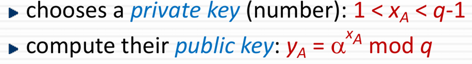
- x: secret, y,a,q : public
- 상대방의 공유키를 내 개인키로 계산함으로써 같은 공유 키를 생성

- 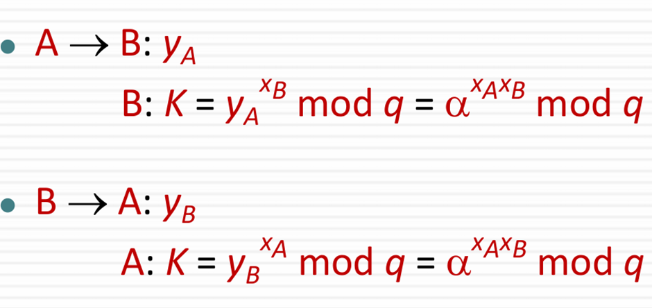
- K = 상대방의 공개키 ^ 개인 키 mod q를 하면 결국 같은 값이 나옴
- 이 똑같은 값을 Session key 로 사용 
- Discrete log 문제로 알기 어려움
- 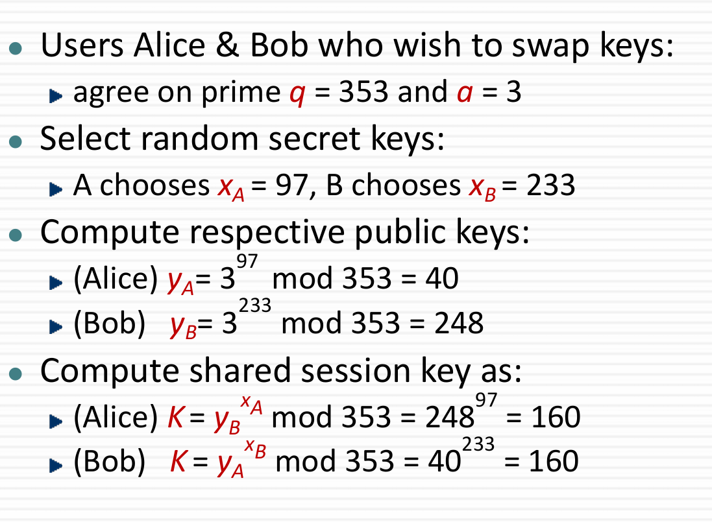

# Key Exchange Protocols
- random key를 사용할 수 있고, known key를 사용할 수 있음
- 두 방식 다 MITM 에 취약함
- 사용자에 대한 Authentication 필요
- 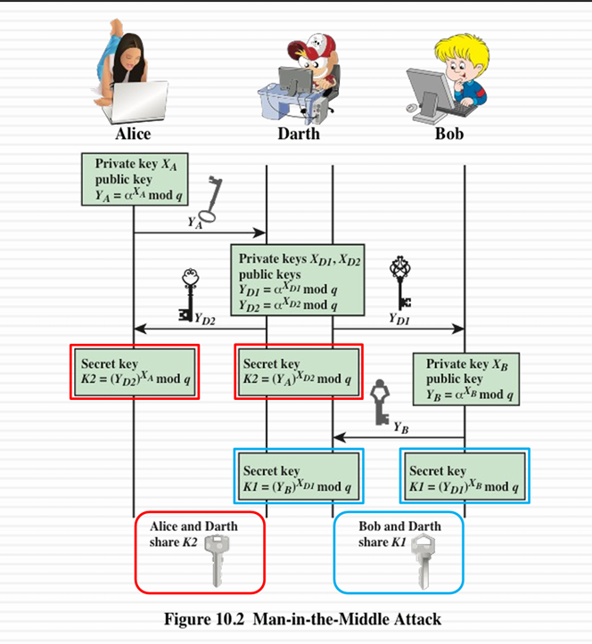
- Alice와 Darth, Darth와 Bob이 공유하는 Session key를 가지게 됨
- Authentication을 안 했기 때문

# ElGamal Cryptography
- 공개키 암호화방식으로, 메시지를 암호화하는 것이 목표
- Galois field 사용
- Discrete logarithms 의 계산적 어려움을 사용 (D-H처럼)
- 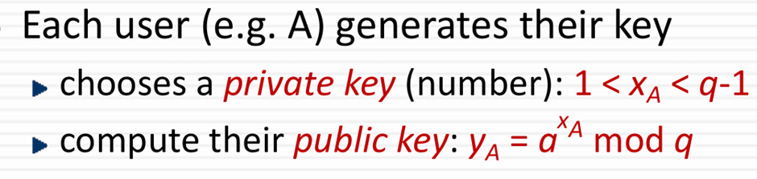
- 
- 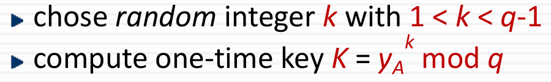
- - 상대방의 공개 키를 통해서 SessionKey K 를 생성
- 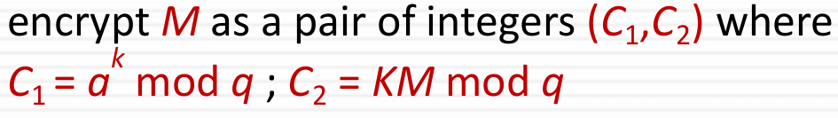
- - 수신자는 암호화된 C1,C2를 받는데, C1을 자신의 개인 키로 복호화를 하면 수신자의 공개키로 만들었던 K가 나옴
- - K의 역원을 C2에 곱하면 메시지 M 복구

- 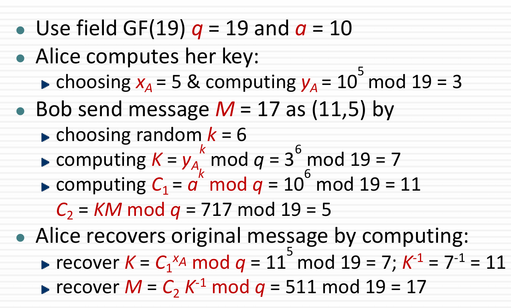

# Elliptic Curve Cryptography
- 공개 키 암호화의 메인
- RSA, D-H 는 큰 수를 다루기 때문에 저장 및 처리에 significant load를 유발함
- ECC는 더 작은 키를 사용해도 동일한 수준의 보안을 제공함으로써 공간 절약 및 연산 속도 향상

# Real Elliptic Curve
- 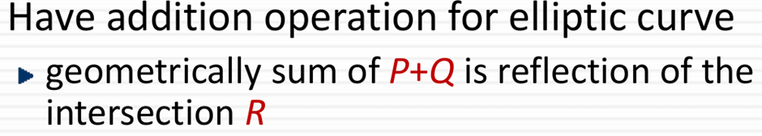
- P,Q는 타원곡선 위의 점
- 일반적인 합이 아닌, Geometrocally sum
- 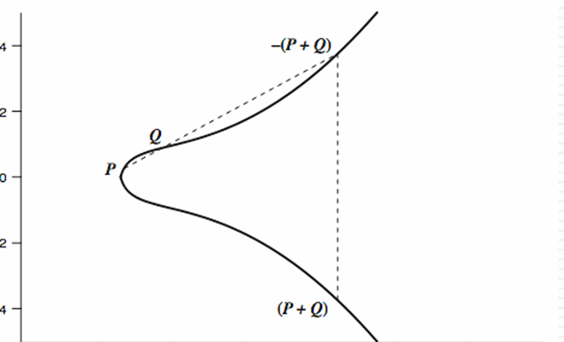
- P=(x,y), -P(x,-y)
- O=(inf,inf) = point at infinity (계산적으로 0과 같음)

# Addition at Elliptic Curve
- 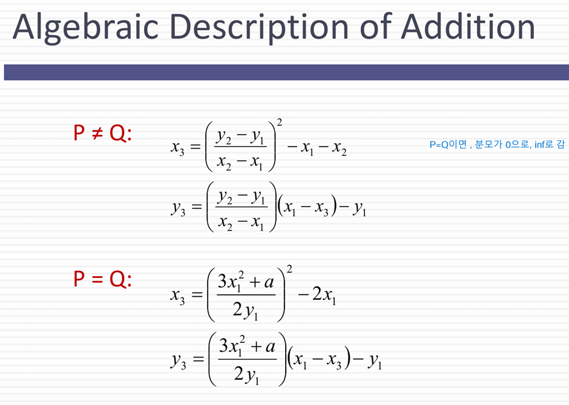
- P,Q가 같으면 자기 자신을 더하는 것

# Finite Elliptic Curve
- prime curves에서는 Zp, mod prime, best in software
- binary curves에서는 GF(2^n), use polynomials, best in hardware
- 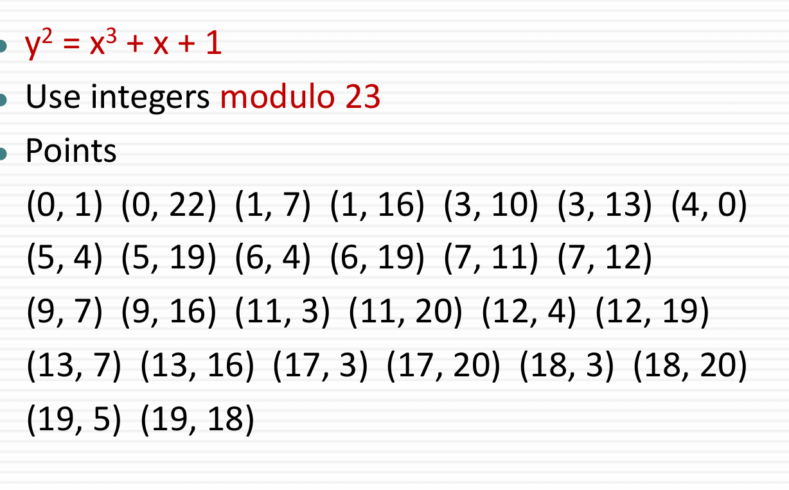
- - y값이 대칭되는 것을 알 수 있음
- 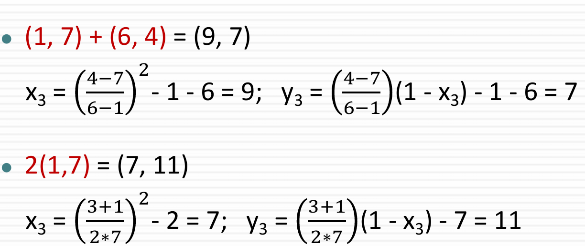
- - 존재하는 값끼리 더하면, 그 결과 값이 존재 -> 유한체 
- 곱셈은 어떻게 하는가? -> 더하면 됨(P=Q)

# Elliptic Curve Cryptography
- 기하학적인 덧셈
- 덧셈을 반복함으로써 mod exponential 방식
- Q=nP에서 Q와 P를 알려줬을 때, n을 알기 어려움(Discrete log효과)

# ECC Diffie-Hellman
- 이것도 Discrete Log를 사용한 방법인데, Elliptic curve로 같은 효과를 낼 수 있음(더 작은 bit를 사용함)
- Base point G를 선택 (nG = 0)
- 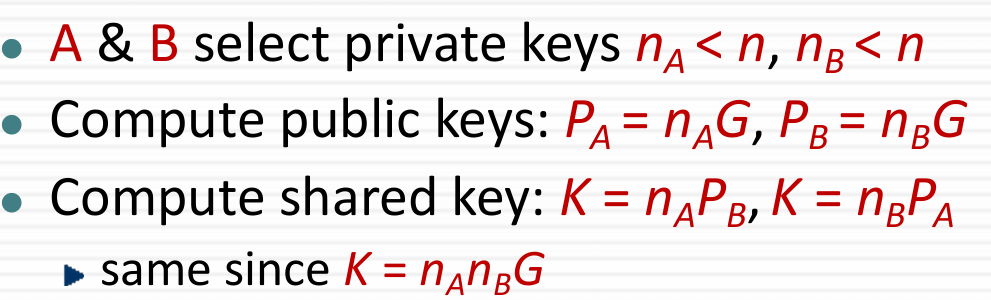
- Attacker는 공개되어있는 G, kG(공개 키)를 주면 k를 찾아야 하지만 어려움
- ECC Diffie-Hellman도 역시, 내 개인 키와 상대방의 공개 키를 조합해서 공유 키를 생성

## ECC Encryption/Decryption
- Message M을 타원곡선상의 점으로 변환 후 암호화
- 적합한 타원 곡선과 기준점 G를 선택(D-H와 유사)
- 개인키 n 선택 후 P=nG를 통해 공개 키 계산
# 메시지 암호화 과정
- 
- k: 송신자가 무작위 값 k를 생성
- kG: 임시 공개키 역할
- Pm : 암호화하려는 메시지를 타원 곡선 상의 점으로 표현
- P(a) : 수신자의 공개키, P(a) = nG
- kP(a) : P(a)에 대해 임시적으로 공유하는 값
- 송신자는 수신자의 공개 키를 통해 암호화된 메시지 Cm을 생성함
- 이걸 왜 암호화라고 하냐면 타원곡선의 수학적 성질을 통해 메시지를 변환하고 보호했기 때문임. k를 남들은 모르고, Pm도 숨겨져있음. 수신자의 개인 키 없이는 알 수 없음.

# 메시지 복호화 과정
- 
- 수신자는 송신자가 보낸 데이터 Cm={kG,Pm+kP(a)}를 수신
- kG는 임시 공개키 역할을 한다고 했으니, 수신자의 개인키 n으로 복호화를 통해 n(kG) = k(nG) = kP(a)를 성립
- Cm : Pm+kP(a)-n(kG) = Pm 으로 복호화 완료