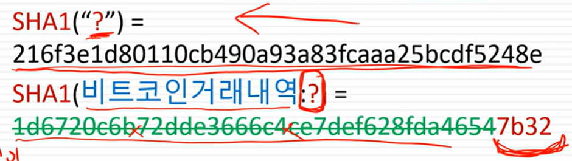
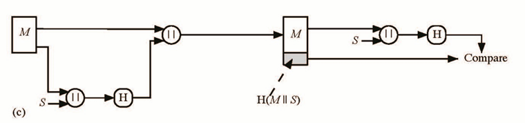
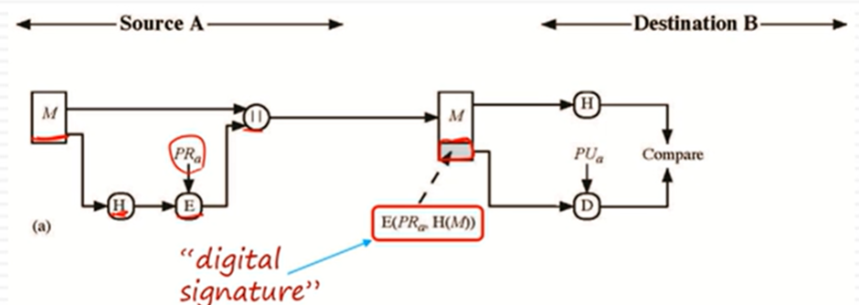

# Hash Function
- 임의의 메시지를 고정된 사이즈로 출력
- Input의 message는 무한대로 많음
- 
- 메시지의 변화를 감지할 때 좋음

# Hash 특징
- One-way property : 출력 값을 보고 Input을 알기 어려움
- Collision-free property : 여러 개의 input이 똑같은 결과를 가질 수 있음. 충돌이 일어나지 않을 수는 없지만, 최대한 충돌을 피해야 함 (Strong collision resistance)
- weak collision resistance : 하나의 입력에 대해서 다른 H(x')을 알 수 있어야 함

- 
- 값으로 ? 를 찾기는 어렵지만, 값의 젤 뒷자리 4개인 어떤 값을 찾으라고 하는 건 쉬움 -> 비트코인 채굴 방식

- 데이터 무결성을 위해 자주 Hash 사용
- 
- - H(data') 과 H(data)를 비교해서 같은지 확인

# MITM ATTACK
- 
- Darth가 아무런 데이터를 가져와서 H(data')한 값 비교
- MITM Attack이 존재하므로, Hash 값을 key를 통해서 암호화 및 복호화

# Hash Functions & Message Authentication
- 
- - Message +  H(M) 을 K로 암호화해서 전송하고, K로 복호화 한 이후 M을 해시한것과 H(M) Compare
- 
- - Message를 숨길 필요가 없는 경우, H(M)만 K로 암호화
- - 이후 H(M) 과 암호화했던 H(M)을 복호화하여 비교
- 
- - Message에 비밀 값을 붙여서 Hash하고, 이후 Compare
- 
- - Message + H(M+S)를 암호화 하는 방식

# MAC 
- secret key와 data block을 통해서 hash 값 생성
- 비밀 키 K을 사용함으로써 authenticate 가능
- Integrity + authentication = 무결성 + 인증

# Digital Signature
- MAC과 유사하지만 다름
- Hash 값을 개인 키로 암호화 (Mac은 대칭키로 암호화)
- 전자 서명은 단순한 메시지 인증보다 뛰어남

- 
- - 개인 키 및 공개 키 사용
- - 공개 키만 있으면 서명 block을 확인할 수 있음
- 
- - 메시지를 숨겨야 하는 경우 메시지 전체를 암호화

# Other Hash Function Usage
- One-way password file
- virus detection
- Pesudorandom function(PRF)

# Hash requirements
- Variable input size
- Fixed output size
- Efficiency
- Preimage resistant(One way property) : input값을 알아내기 어려워야 함
- Second preimage resistant : 동일한 값을 출력하는 input을 알아내기 어려워야 함
- Collision resistant(Strong collision resistant) : 어떤 입력인 H(x) = H(y)인 다른 x,y 의 pair을 찾는 것이 어려워야 함

# Attacks on hash
- A preimage or second preimage attack
- - H(y)가 hash 값과 같은 y를 찾음
- Collision resistance
- - H(x) = H(y)인 x,y를 찾음
- 

# Birthday Attack
- 서명 시스템은 해시값만 검증함
- valid message x 가 존재하는데, sign 하려고 함
- x와 같은 x'이 2^(m/2)개 존재
- 가짜 계약서 y가 2^(m/2)개 존재
- 각각의 x'y과 y'을 hash 하면 H(x')=H(y')이 존재할 확률이 50%가 넘음
- 만약 h(x')을 개인 키로 암호화 하고, 나중에 h('y)로 서명 및 암호화했다고 거짓말 한다면 H(x')=H(y')이기 때문에 알 방법이 없음

# SHA-512
- 
- M을 1024 비트로 분할하며, 마지막 블록이 1024bit보다 짧으면 패딩
- H0과 M1을 F로 결합한 이후, 결과 값과 H0를 add mod 
- 누적으로 결과값을 구해가면서, 마지막 H가 Hash Code

# SHA-3
- 차세대 hash algorithm
- Sponge Construction
- - 입력을 흡수하고, 흡수한 input에서 출력을 짜냄
- - input 도 variable, ouput도 variable
- - 원하는 길이만큼 출력
- 
- - l bit를 원하면, r bit block을 계속 만들어서 총 l 만큼 만들어 냄