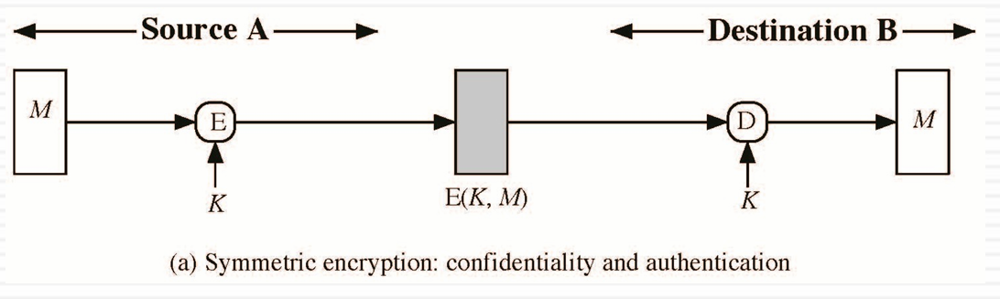
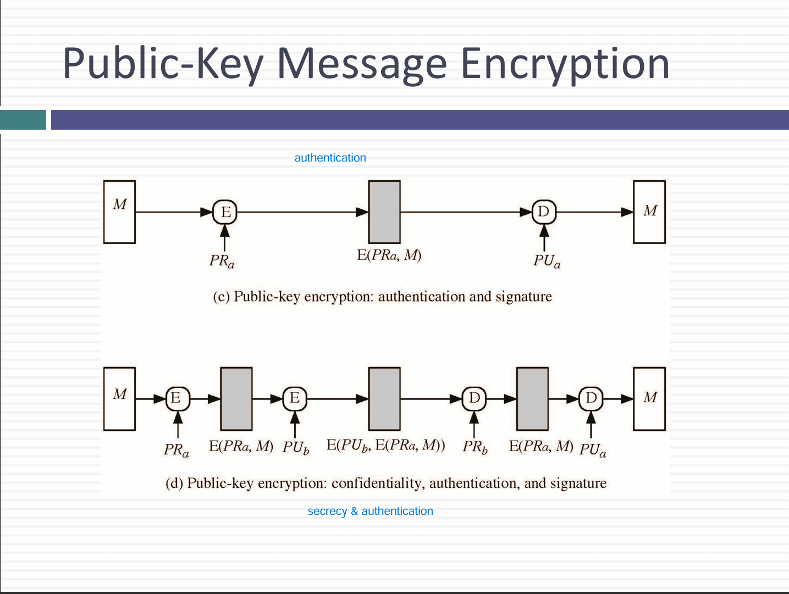
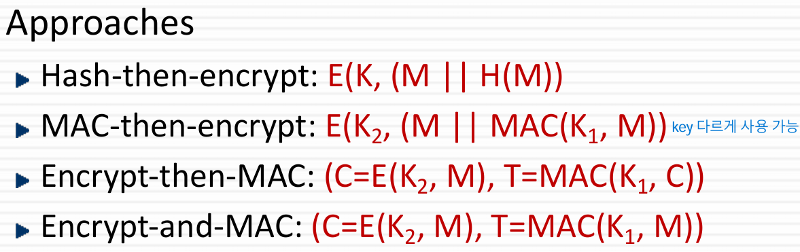
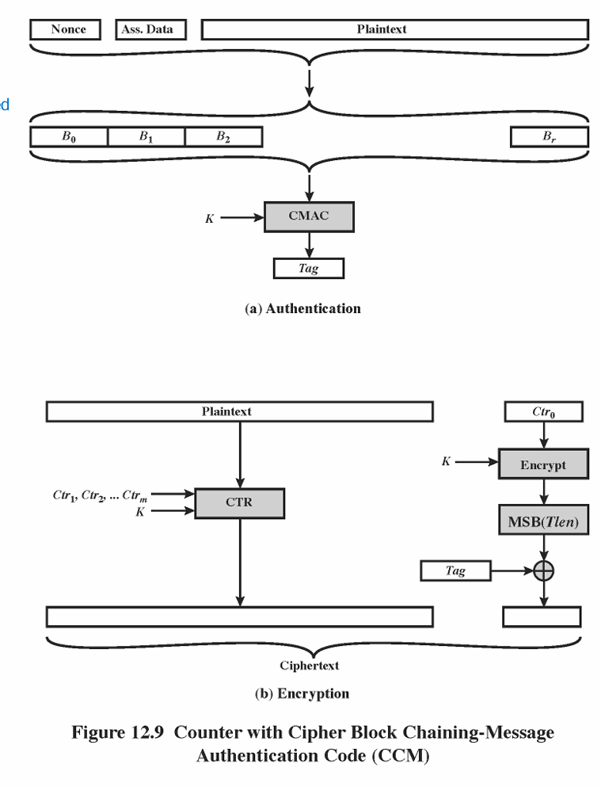
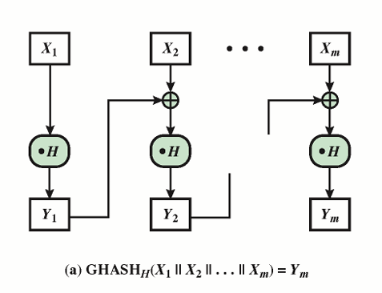
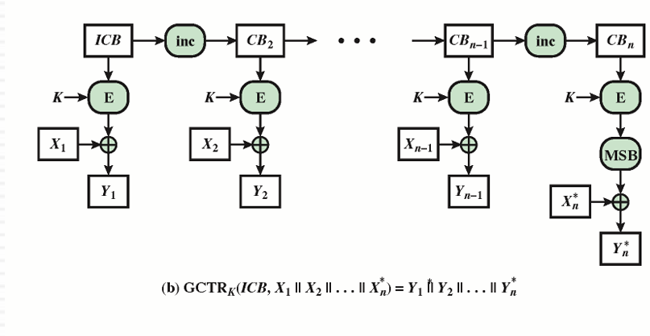
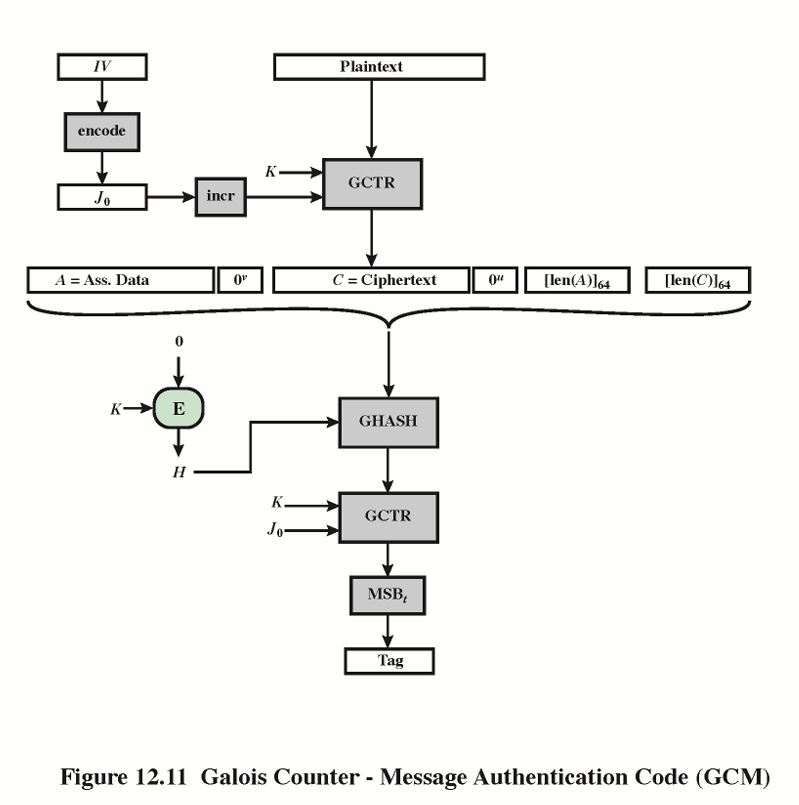

# Message Authentication
- hash function
- message encryption
- message authentication code (MAC)
- message + secret key로 구성됨
- message를 보낼 때 생성

# Why use MAC?
- 인증만 필요로 할 때 사용
- 암호화 보다 인증이 더 오래 지속되어야할 때 사용
- MAC은 전자서명이 아님(대칭키 사용)

# Symmetric Message Encryption
- 
- 복호화 이후 변화를 감지하기 위해 checksum or redundancy를 확인

# Public key Encryption
- 공개 키 암호화는 기본적으로 수신자의 공개 키로 메시지를 암호화
- 공개 키는 누구나 알 수 있기 때문에, 보낸 사람이 신뢰할 수 만은 없음
- 공개 키 암호화 방식만으로는 송신자 Authentication이 불가능

- 만약 송신자가 개인 키로 메시지를 sign한다면, 수신자가 송신자의 공개 키로 검증할 수 있음
- 이를 통해 secretary와 authentication 을 동시에 확보 가능
- 
- - 위 방식은 인증과 서명만 보장
- - 아래 방식은 메시지가 공개되지 않은 상태로 전달되므로 인증, 서명, 비밀성 보장

# Requirements for MACs
- 같은 MAC을 가지는 다른 메시지를 찾기 어려워야 함
- MAC 값이 균등하게 분포되어야 함
- MAC은 메시지의 모든 비트에 동일하게 의존해야 함

# HMAC
- 해시 알고리즘의 강도에 크게 의존
- 비밀 키 K가 블록 크기보다 짧다면, 0으로 패딩하여 K+ 
- K+와 ipad를 xor하여 Si 생성
- 내부 해시 H(Si||M) 계산
- 외부 해시 H(S0||내부 해시)를 통해 두 번째 해시 계산
- n bits 결과 값 생성 

# Attacking HMAC
- BruteForce Attack
- Birthday Attack 

# Authenticated Encryption
- 
- Hash-then-Encrypt: 해시함수를 적용하고, 원문을 암호화 
- - 해시 함수 자체에 키가 없어서 MITM 가능
- Mac-then-Encrpty: 비밀키 K로 MAC을 구하고, 원문과 이어붙여 암호화
- - 복호화 하기 전에는 MAC 검증 불가
- Encrpyt-then-MAC: 메시지를 암호화 한뒤, 암호문 자체를 MAC으로 인증하는 방식
- - 많이 선호하는 방식
- Encrpyt-and-MAC : 평문과 MAC을 별도로 암호화하여 보냄
- - 복호화 하기 전에는 MAC 검증 불가 (MAC-then-Encrpty)와 유사함
# CCM
- Couter with Cipher Block Chaining
- 암호화와 인증을 동시에 제공하는 block cypher
- AES, CTR, CMAC 사용
- 암호화와 인증을 위해 같은 비밀 키 사용
- 
- - 데이터들을 Block으로 구성하여, 준비된 블록을 CMAC에 입력하여 최종적으로 고정된 길이의 Tag 생성
- - 암호화 할때 Stream cipher 처럼 평문을 Xor 연산하여 암호문 생성
- - Tag 또한 Ctr0 블록을 암호화 한 출력값과 Xor하여 암호화 
- - CMAC 인증 태그 생성 -> CTR로 평문 암호화 -> Tag 또한 CTR0 블록과 암호화

# GCM 
- GCTR 모드에 기반한 암호화로, 높은 병렬성이 특징
- 
- H는 K를 바탕으로 미리 계산된 128비트 값
- Galois field 상에서의 곱

- 
- Nonce와 CTR을 조합한 initial counter block 생성하고, 이후에는 카운터를 1씩 증가시키며 새로운 카운터 블록 사용

- 
- Tag 생성방식
