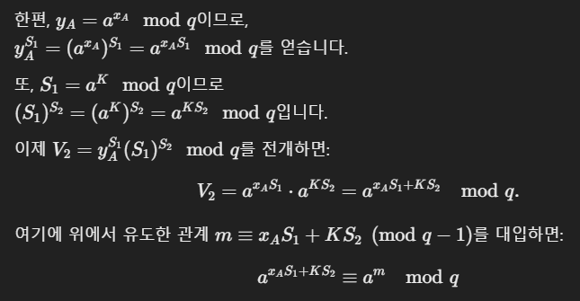

# Digital Signatures
- 
- 이전에 말했듯이, 공개 키 방식을 통해 Hash값 검증
- 
- 
- Total Break: 가장 강력한 공격. 개인 키를 알아내어 마음대로 서명.
- Universal Forgery: 개인 키 없이도 임의 메시지 서명 생성 가능.
- Selective Forgery: 특정한 목표 메시지에 대한 서명만 위조 가능.
- Existential Forgery: 공격자가 의도하지 않은 메시지라도, 적어도 하나의 서명을 위조할 수 있는 상황.

# Digital Signatures Requirements
- 디지털 서명은 메시지 내용에 연관되어 있어야 하며, 일부 변경하면 서명 검증에 실패하도록 설계
- 서명자만이 알고 있는 private ket를 사용해야 함
- 빠른 연산 필요
- private 키 없이 서명을 생산하는 것이 매우 어려워야 함
- 서명은 장기간 보관할 수 있어야 함

# ElGmal Digital Signature
- finite Galois field 사용
- Discrete logarithms 방식
- sign할 때 개인 키, verify할 때 공개 키 사용
- private key 선택 1 < x < q-1
- public key 계산 y = a^x mod q
- 

- 검증 과정
- 
- 
- 

# Schnorr Digital Signature
- Choose prime p,q
- Choose a, a^q = 1 mod p
- a,p,q : global parameter
- Choose private key 0 < s < q, compute public key v = a ^-s mod p
- 

# RSA vs DSS Signature
- 
- v == r이면 서명 유효

# DSA 특징
- 서명 결과로 (r,s)를 반환하는데, r과 s는 각각 160비트 이상
- 1024~3072 비트 길이의 도메인 파라미터 사용
- 서명 전용 알고리즘
- Discrete Log
- ElGamal 과 Schnorr 서명에서 파생된 변형

# ECDSA
- 

# RSS-PSS
- 
- 