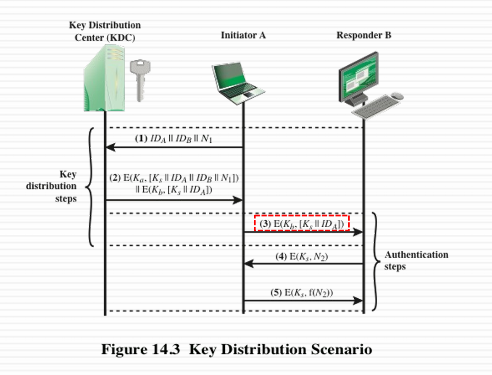
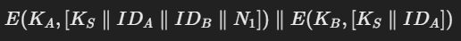
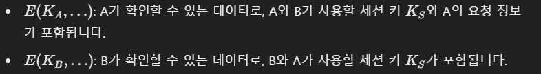
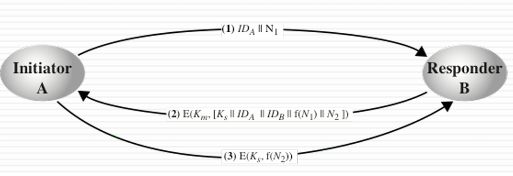
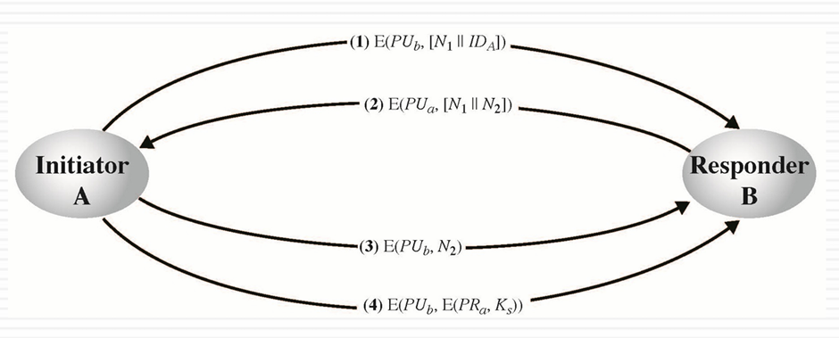
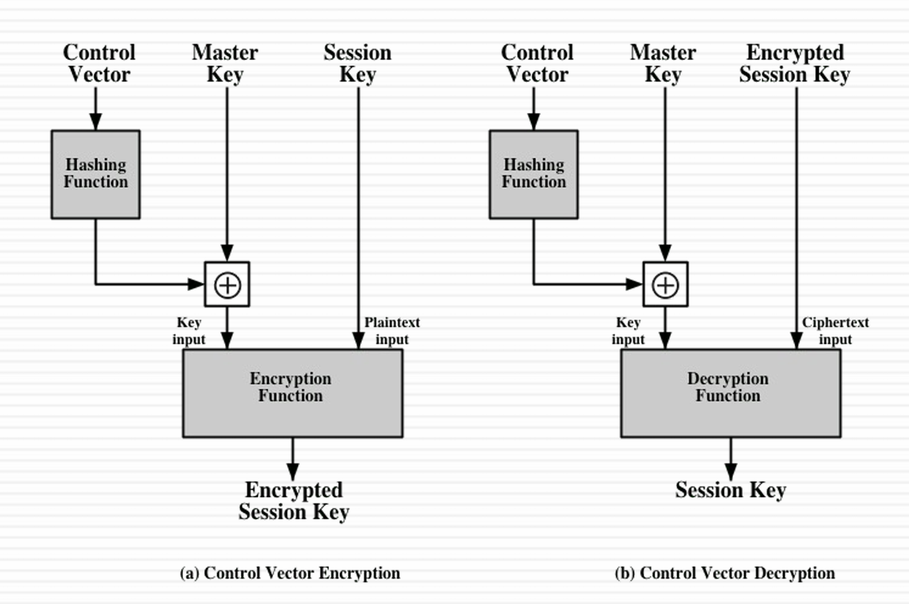
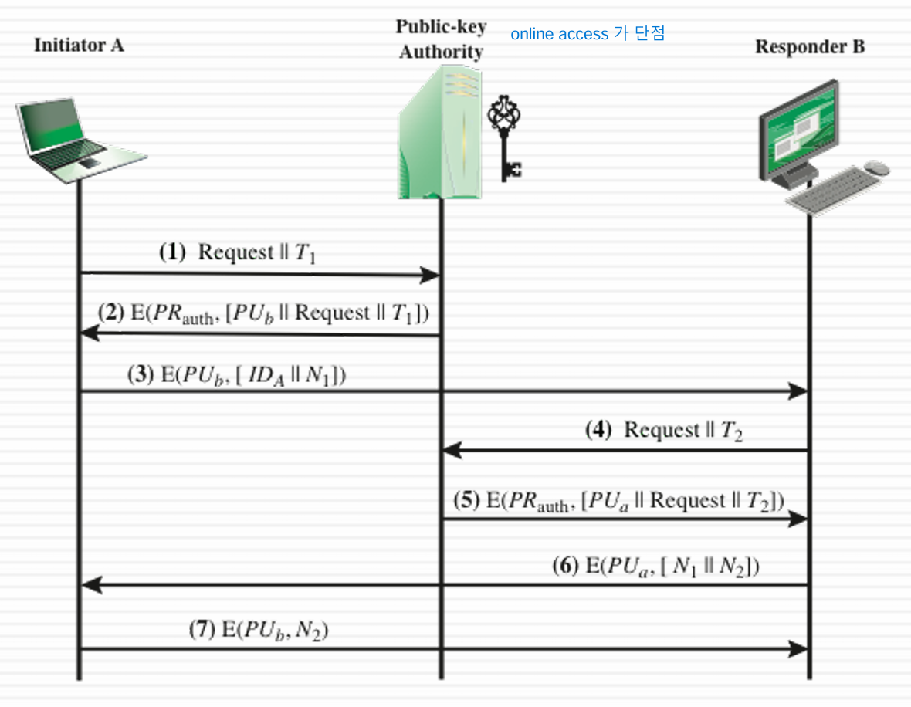
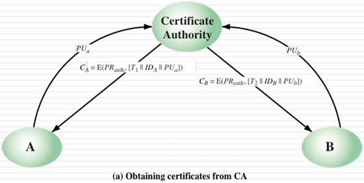
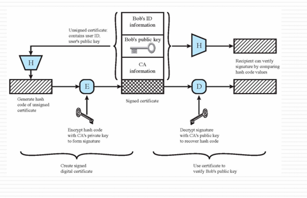

# Key management and distribution
- 공개 키 암호화 : 공개한 키가 진짜인지 확인해봐야 함
- 키 분배: 주기적으로 키를 변경할 수 있어야 함
- 키 분배 대안
- - 물리적으로 전달
- - 믿을만한 제 3자가 키를 고르는 방식
- - 원래 있던 키로 재설정
- - 중계자를 통해서 교환

# Key hierarchy
- Session key: 일회성 키로, user들 간 데이터 암호화 하는데 사용
- Makser key - 쭉 사용하는 키로, Seesion 키 암호화 하는데 사용

# Key Distribution
- 
- N1을 뒤에 붙임으로써 인증을 위해 사용
- Ek는 A와 B가 공유할 세션키, IDa, IDb는 식별자 ID
- 
- 
- B가 세션 키를 수신한 후, 새로운 난수 N2를 생성하여 세션 키로 암호화 해서 보내고, A는 이에 응답하며 N2를 특정 함수를 통한 결과와 함께 보냄 
- 만약 3번 과정에서 Ks가 노출되면 공격자는 A의 행세를 하면서 B의 메시지를 몰래 가로챌 수 있음

## Key Distribution system
# Auto
- KDC에 connection 요청
- KDC에 session key 요청
- 키 분배
- Buffered packet 전송 

# Decentralized
- 

- 
- 3,4번은 따로 필요없음

# Control Vector
- 

# 공개 키 분배 방식
- Public announcement
- Publicly available directory
- public-key authority
- - 
- - 서로의 public key를 사용함으로써 Authority 에게 받았음을 증명
- - 이후 증명을 위해 N1뒤에 N2를 붙이고, A 또한 B에게 N2를 잘 받았음을 증명
- public-key certificates(공인 인증서) 주로 사용함
- - 공개키에 대해 identity 식별 가능
- - real-time access 하지 않아도 키 교환 가능
- - 
- - 공개 키를 주면 인증 기관의 private key로 암호화 해서 줌
- - A와 B는 각각 자신들의 인증서 Ca와 Cb를 얻음
- - 이후 A는 자신의 인증서 Ca를 B에게 전송하고, B는 Ca의 공개 키를 사용해 복호화하고, A의 공개 키를 얻음
- - B도 반복 

# Certificate 
- 
- 전체를 Hash 한것
- 전체를 Hash 한것을 CA's private key로 암호화하고, CA's public key로 복호화 한 것
- 이 둘을 비교했을 때 당연히 같은 값이 나와야 함 