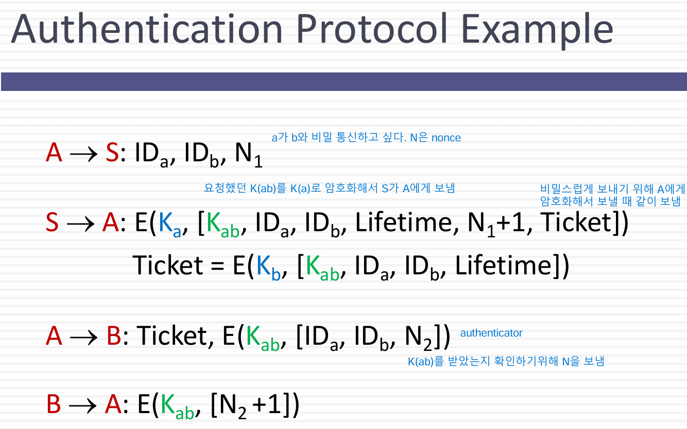
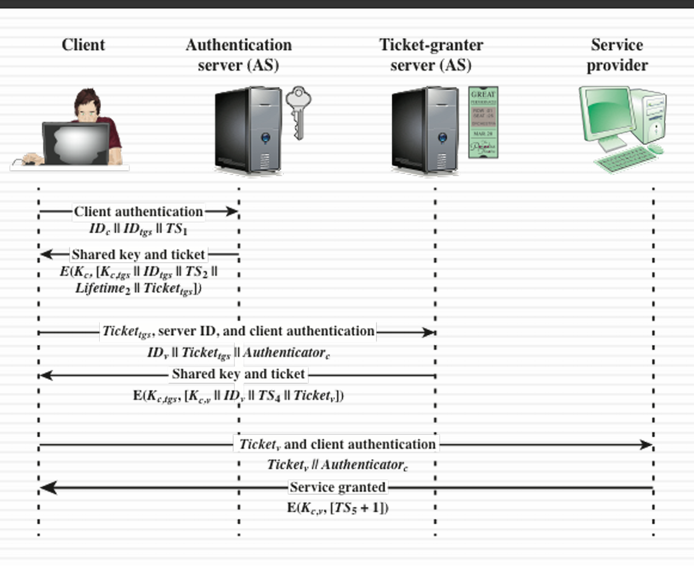
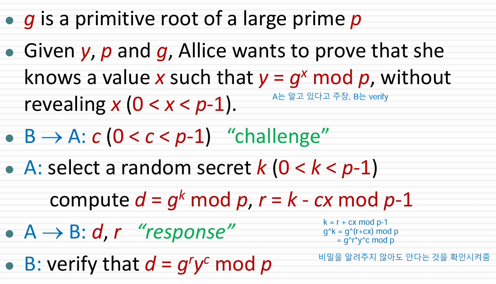
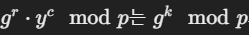

# User authentication
- 기본 보안 구성요소
- 접근성과 사용자 책임성
- 식별 및 검증
- 메시지 인증과는 다르며, 사용자 인증은 사용자의 신원을 확인하는 데 초점을 둠

# Means of User authentication
- Know : 사용자가 알고 있는 정보로 신원 증명
- Possesses : 사용자가 가지고 있는 물리적 또는 digital 자산을 이용해 인증
- Is : 생체 정보(지문)
- Does : 동적 생체 정보(목소리)

- 혼용해서 사용 가능
- 각자 문제점 존재

# Authentication Protocol
- 신원 확인, 세션 키 교환
- 단방향 인증 , 상호 인증
- 기밀성, 시간 정확성이 key issue
- 
- 대칭 키 방식

# Replay Attacks
- 유효한 서명이 포함된 메시지를 복사 및 재전송
- 방어 방법
- - Sequence Number : 번호 부여
- - Timestamps : 적절한 시간 내에서만 메시지 유효
- - Challenge/Response  : 고유한 난수를 사용하여 요청마다 응답

# One-way Authentication
- 송신자와 수신자가 동시에 통신할 수 없는 경우 단방향 인증
- 헤더는 평문

# Key Hierarhcy
- 대칭 암호화에서는 보안 강화를 위해 키 계층 구조
- Master key와 Session key를 계층적으로 관리
- 일반적으로 신뢰할 수 있는 KDC를 통해 키 관리

# KDC의 역할
- Master 키 공유
- Session 키 생성
- 주 키를 통해 Session key 분배

# Kerberos
- 중앙 집중식 비밀 키 기반 인증
- 

# Key Exchange & Key Agreement
- Key Exchange : 누군가 만들어서 다른 참여자에게 전달(Kerberos)
- Key Agreement : 모든 참여자가 키 생성에 기여하는 방식(Diffie-Hellman)

# Commitment Scheme
- 값을 미리 결정하지만, 나중에 공표할 때 까지 비밀로 하는 암호 기술

# Zero-Knowledge Proof
- 어떤 비밀을 알고 있는 사람이 다른 사람에게 그 비밀을 드러내지 않고, 자신이 알고 있음을 증명
- 
- B->A 에게 무작위 c 값을 보냄 (Challenge)
- A는 임의의 값 k를 선택하고, k를 통해 d와 r을 계산
- A는 d,r을 B에게 보냄
- B는 A에게서 온 답을 통해  같음을 검증
- 검증에 성공하면, A가 x를 알고 있다는 것을 증명