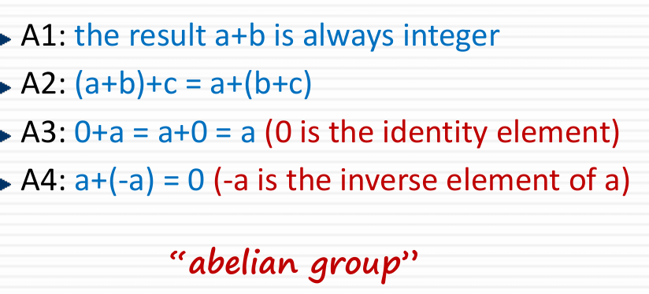
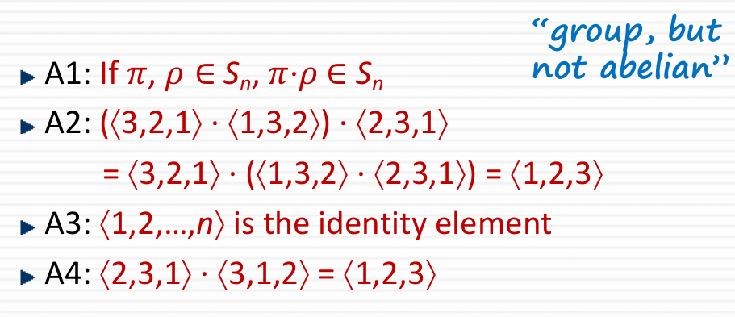
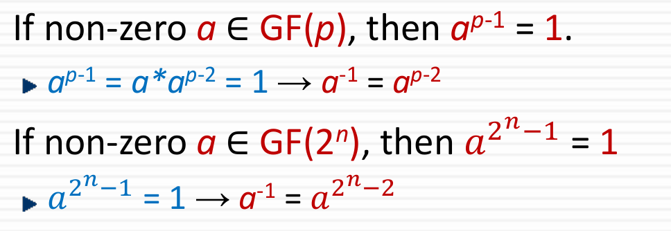

## Uclid Algorithm
- gcd 함수는 최대 공약수를 찾는 알고리즘
- A mod n 과 b mod n 이 같으면 합동
17^14 mod 8 =( 1 mod 8 )^14
사칙연산에서는 mod를 먼저 사용가능

## Group
- 이진 연산이 정의된 원소들의 집합
- Closure a,b ∈ G에 대해 a*b ∈ G
- 결합법칙 a,b,c ∈ G에 대해 (a*b)*c = a*(b*c)
- 항등원 e*a = a*e = a여야함. 
- 역원 역원을 가지고 있어야 함.
- **아벨 군**은 교환 법칙을 만족함

## a^-1 mod m
- 만약 a,b 값이 서로소이면 역원이 존재.
- 어떻게 아느냐? Extended Uclid Algorithm

## Extended Uclid Algorithm
- GCD 함수처럼 최대 공약수를 찾지만, 선형 다항식의 형태로 찾는다.
- 선형 다항식의 미지수 x,y 값을 찾는게 확장 유클리드의 핵심
- a,b가 서로소 관계이면 ax+by = 1에서 a와x, b와y는 역원관계

## Galois Field
- 갈로이스 필드의 특징은 유한 집합만을 가지고, 사칙 연산이 가능함
- modulo 연산을 해주기 때문에 결과 값이 항상 정수로 나옴
- 주로 GF(p) or GF(2^n)으로 사용
- GF(2^n)으로 하면 모듈러 연산은 2로함

- 다항식 gx가 자신 외에 1말고 다른 인수를 가지지 않으면 **기약다항식**
