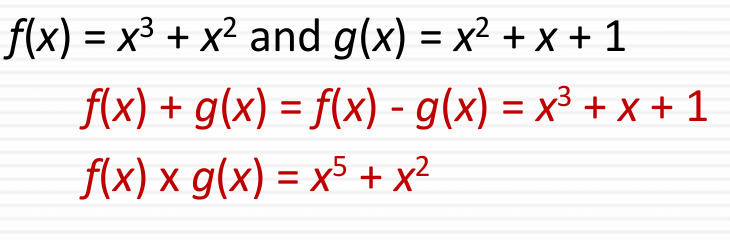

## Uclid Algorithm
- gcd 함수는 최대 공약수를 찾는 알고리즘
- A mod n 과 b mod n 이 같으면 합동
17^14 mod 8 =( 1 mod 8 )^14
사칙연산에서는 mod를 먼저 사용가능

## Extended Uclid Algorithm
- GCD 함수처럼 최대 공약수를 찾지만, 선형 다항식의 형태로 찾는다.
- 선형 다항식의 미지수 x,y 값을 찾는게 확장 유클리드의 핵심

## a^-1 mod m
- 확장 유클리드 알고리즘에서 만약 a,b 값이 서로소이면 최대 공약수는 1이다.
- 서로소이면 1 = ax+by 에서 양변에 mod b하면, 1 = ax mod b, 1 = ax는 역관계

## Galois Field
- 갈로이스 필드의 특징은 유한 집합만을 가지고, 사칙 연산이 가능함
- modulo 연산을 해주기 때문에 결과 값이 항상 정수로 나옴
- 주로 GF(p) or GF(2^n)으로 사용
- GF(2^n)으로 하면 모듈러 연산은 2로함
- 