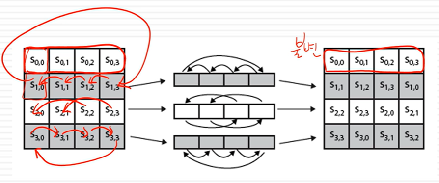

## AES
- 128, 192, 256 bits의 key로 구성되어 있음.
- iterative한 구조로 Round가 반복됨.
- 하나의 블록을 4개의 columns와 4개의 bytes로 설정 (총16bytes)
- 알려진 공격에 대해 저항성이 있음
- 속도와 코드가 간결해서 저사양의 CPU에서도 사용 가능하며, 디자인도 간단함

## AES 방식 

- Round 마다 key가 사용되는데, key schedule을 통해 각 라운드마다 다른 key를 사용하며, inital Xor연산
- Round 에서는 Substitute Bytes, Shift Rows, Mix columns 등의 함수 사용

# Add round key
- Xor 연산만으로 가능하며, 라운드 키와 state 배열의 열을 Xor
- 

# Substitute Bytes
- table look up 만으로 가능하며, S-box를 통해서 다른 byte로 변경
- 

# Shift Rows
- table look up 만으로 가능하며, 왼쪽으로 순환 이동
- 

# Mix columns 
- 갈로이스  필드 GF(2^8)을 사용하는데, table이 작으면 look up 만으로 가능하며 table이 크면 xor 연산도 필요
- 
결론적으로, 전체 구현을 Xor + table look up으로 가능

## 복호화 과정
- 거꾸로 올라가면서 진행하면 됨.
- Key가 반대로 적용 됨.
- 정석적으로 가능하지만, 순서를 바꿔 Encryption과 유사하게 만들 수 있음.
- 

## Key Expansion
- 초기의 키들은 state의 열로 구성되지만, 이후의 키들은 자체적으로 생성
- 
- 4번째 word마다 특별한 연산을 하는데, g(w3) = S-Box(LRotWord(w3)) XOR RCon
- **LRotWord** 는 왼쪽으로 순환 이동
- **S-Box** 는 S-Box 넣어서 Byte 변환
- 이후 변환된 결과와 RConstant를 Xor 하면 다음 키 생성
