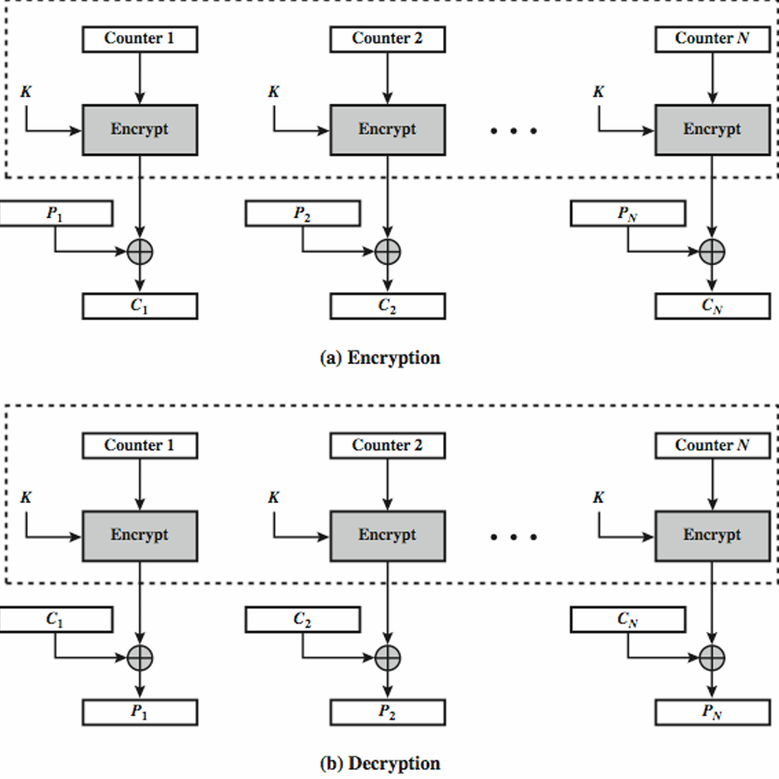

## DES
- DES는 옛날 보안 방식인데, 쉽게 파훼되었던 이뉴는 키의 길이가 짧기 때문
- Double DES는 키를 2개 사용해서, 2배 이상의 효율을 기대했지만 양쪽에서 공격했을 시 취약한 단점
- Triple DES는 키를 2~3개를 사용해서 양쪽에서 공격해도 만나지 못하게 하는 방식
- 
- Encryption과 Decryption의 순서는 상관없음. 결국에는 평문이 나옴

## Block vs Stream Cipher
- Block mode는 블록 단위(128bit)로 암호화
- Stream mode는 한 bit씩 처리하는데, 그래서 random bit를 정하는 방식이 매우 중요

## Block Mode
# ECB
- 동일한 데이터가 input 되면 암호화 된 데이터, 즉 출력이 같아서 유추 가능
- input의 길이가 128bit보다 작을 때 사용
- 
- input의 길이와 output의 길이가 같다는 단점이 있음

# Message Padding
- input이 128bit의 배수가 아닐 때, 빈 자리 수 만큼 0을 채워주고, bit에 0의 개수를 써주는 방식

# CBC
- input과 이전에 생성되었던 암호문을 Xor해서 새로운 암호문을만듦
- 평문 P1 P2가 같아도 다른 암호문이 나옴
- 복호화도 가능
- 128bit 이상은 주로 CBC방식을 사용하며, initial vector는 알려줘도 크게 문제 없음
- initial vector를 비밀스럽게 알려주고 싶다면 ECB로 암호화해서 줄 수 있음
- 

# Ciphertext Stealing
- Ouput의 길이를 input의 길이와 같게 만듦
- 

## Stream Mode
# CFB-s
- s bit씩 암호화
- Block 암호 알고리즘을 통해서 random bit을 생성
- C1을 initial vector의 뒤에 붙이고, 밀린 bit는 삭제
- Key와 initial vector의 같은 조합을 절대 사용하면 안됨(같은 결과가 나오니까)
- 

# OFB
- Nonce는 한번 쓰고 버리는 숫자로, 재사용하면 안됨
- C1이 없어도 C2를 계산 가능함 - 입력을 미리 계산 가능
- 순차적 방식으로, CFB와 다르게 암호화된 결과 값이 없어도 다음 계산이 가능
- 

# CTR
- Counter을 통해서 입력하는데, Counter1과 Counter2는 1의 차이가 존재
- OFB처럼 independent하면서, 병렬 처리까지 가능
- 독립적 방식으로, 이전 결과값이 필요가 없고, 원하는 값만 가능(Random Access)
- Counter와 key value의 조합을 재사용하면 안됨
- 

## Tweakable Block Cipher
- input이 같아도 출력이 다르며, 원하는 값을 암호화 및 복호화 가능하도록 함
- 평문 + Tweak 문을 더해서 같은 입력이 들어가도 출력이 다르도록 함
- Hash는 길이가 고정되어 있으며, 역으로 계산하기 힘듦
- Hash 함수는 공개되어 있음
- 

## XTS-AES
- Tweakable Block Cipher로, 같은 키를 사용하더라도 다른 암호화 가능
- 각 블록을 AES를 두번 사용해 암호화하는데, 첫 번째 tweak 값을 통해 Key1을 암호화하고, 두 번째는 평문과 Xor한 후 Key2를 통해 암호화
- Tj=EK2(i)⋅αj 는 (갈로이스 필드에서의 곱셈) 모듈러 곱셈으로, x128+x7+x2+x+1으로 나눔
- 
# XTS-AES의 특징
- 병렬로 암호화 가능
- 특정 블록만 선택하여 암호화하거나 복호화할 수 있음
- 마지막 두 개의 블록에서는 특별한 처리가 발생하는데, 블록의 크기가 맞지 않는 경우 패딩이나 교환방식으로 암호화(Ciphertext Stealing 방식)
