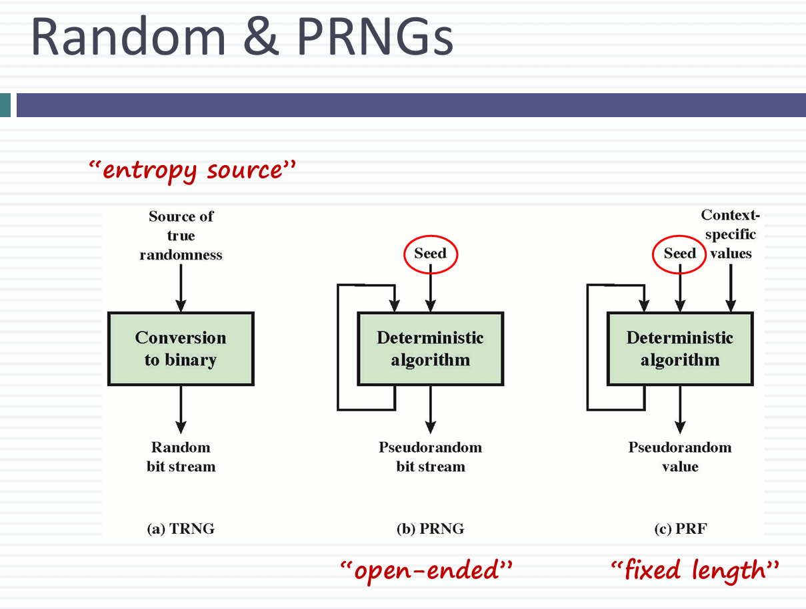
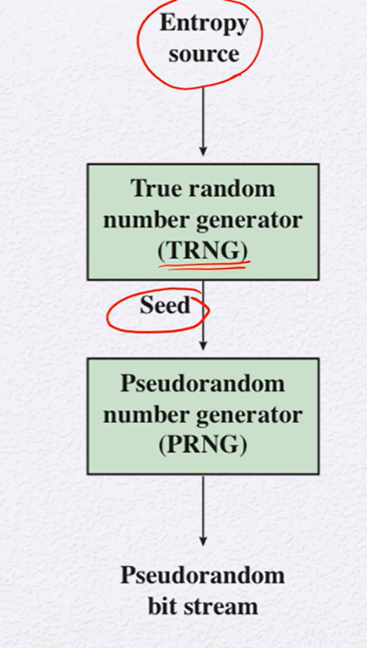
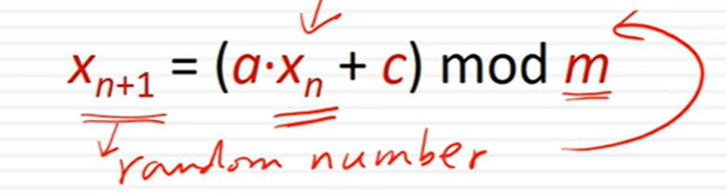
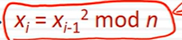
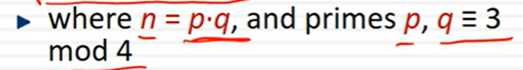

## Stream 암호와 난수 생성

# Random number Uses
- Nonce - 한번 사용하고 버리는 random한 숫자로, 인증 or reply 방지용
- Session key
- Public key generation
- Keystream for one time pad

# 난수
- 통계적으로 random
- uniform하게 분포
- 독립적이여야 함
- 어떤 난수가 다음에 나올지 예상하지 못해야 함

# PRNG
- Pseudo random Number Generator - 가상 난수 생성기
- Deterministic한 알고리즘에 기반하여 난수 생성
- - 알고리즘 기반이다보니, 진정한 의미에서의 난수가 아님
- - 난수의 주기가 존재
- - Randomness라는 test 통과해야 함

# TRNG
- True random Number Generator - 진짜 난수 생성
- Entropy source(input source)를 통해 새로운 난수 생성
- 굉장히 random하며, 현실에서 발생하는 랜덤한 현상을 기반으로 난수 생성
- TRNG는 아날로그 환경 신호를 이진 출력으로 변환하여 사용함으로써 난수 생성
- 시스템 외부의 엔트로피에 의존하기 때문에 예측 불가

## PRNG && TRNG

- TRNG는 디지털 값으로 변환
- PRNG는 open-ended방식으로, bit stream이 출력으로 나옴
- PRF는 fixed length방식으로, 고정된 값으로 나옴. 또한 User ID, App ID 같은 Context-specific value 사용

# PRNG Requirements
- Randomness
- - Uniformity, scalablity, consistency
- Unpredictability
- - seed 값 예측이 어려워야 함
- - **Forward unpredictability** - Seed를 모르면, sequence 예측 불가
- - **Backward unpredictability** - 이미 생성된 숫자로 seed 예측 불가
- Secure
- - PRNG의 sequence를 정하는 값이기 때문에 안전해야 함. Seed가 같으면 sequence가 같으므로 test 가능
- - Seed 값을 알면, output을 알 수 있음
- - Seed 자체가 random해야 하며, Pseudo random number을 seed로 사용

# Seed REquirements
- seed는 secure && unpredictable 해야 함
- 보통 Seed는 TRNG에 의해 생성 

## Random number Generator
# Linear Congruential Generator
- x0 = seed로 두고, 다음 x0을 구하는 방식
- 안전하지 않음
- 

# Blum Blum Shub Generator
- 공개 키 알고리즘 기반
- 
- 반복적인 계산
- xi의 bit중 가장 왼쪽 비트를 출력함으로써 매 계산마다 1bit 출력
- 
- Unpredictable 해서, next-bit test를 통과
- N을 인수분해 하는 것이 어려움
- - 인수분해가 어려운 것에 의존하기 때문에 느림
- - Key generation할 때 좋음