## 정수론

# 페르마 정리
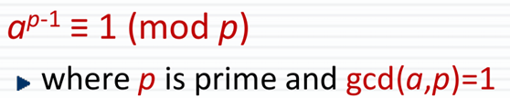
- p가 소수이고, a와 p가 서로소 관계이면 a^(p-1) 은 1과 합동
- a^p = a

# 오일러 정리
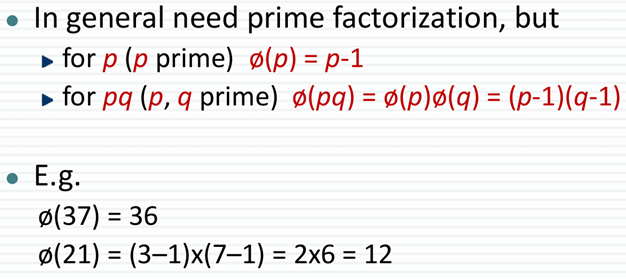
- 서로소 집합에 있는 요소들의 개수

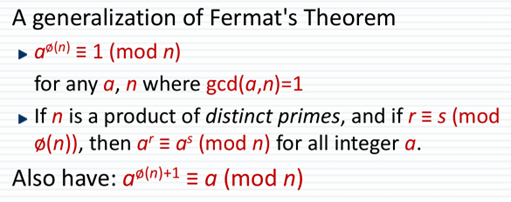
- a와 n이 서로소이면, a^파이(n)은 mod n에서 1과 합동
- 만약 n이 서로 다른 소수의 곱이라면, 그리고 r이 mod 파이(n)에서 s와 합동이라면 , a^r은 mod n에서 a^s와 합동 (r,s > 0)

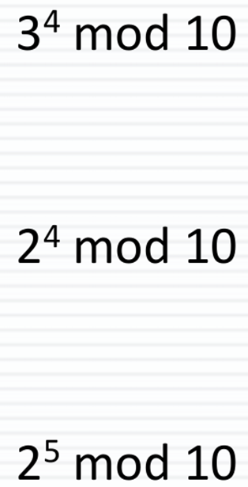
1. 3과 10은 서로소 관계이므로 pi(10) = 4, 3^pi(10) = 1 (방법1)
2. r은 지수 값. r이 4인 경우, mod 4를 하면 나머지 s가 0이기 때문에 불가
3. 10 = 2 * 5, pi(10) = 4 , 1 = 5 mod 4 -> a^1 = a^5 이므로 2^5 = 2^1 (방법2)

# Sieve - 에라토스테네스의 체
**False positive** - 답이 맞을 수 있지만, 틀릴 수 있음
**False negative** - 답이 틀릴 수 있는데, 맞을 수 있음
바이러스 탐지 프로그램을 생각해보면, 
**False negative** - no 라고 했는데, 바이러스가 존재 (Disaster)
**False positive** - Yes 라고 했는데, 바이러스가 존재하지 않음 

## Miller Rabin Algorithm
- 소수를 찾는 알고리즘으로 n은 무조건 홀수
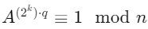
- (n-1)은 짝수 n-1 = 2^k*q인데, k랑 q 값을 알아야함
- (n-1)을 2로 계속 나누면서 k++, 나머지 값이 q
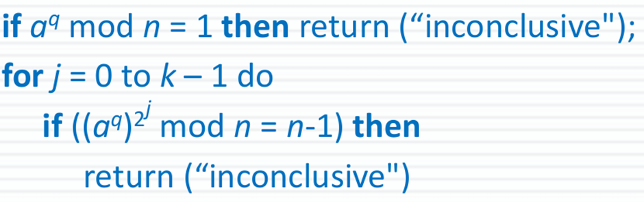

## 페르마 정리
- n이 소수이고 a와 n이 서로소이면 , a^(n-1) = 1 mod n

- a^q mod n = 1 에서, 페르마 정리에 의해 a^q mod n = 1 이면 n이 소수일지도 모름.
- n-1 = 2^k*q 이므로 a^(q*2^k) = n-1 mod n 은 소수일 지도 모름. 거듭제곱 및 소수의 특징 때문이라고 함.

## Deterministic Miller Rabin Algorithm
- 누군가 이미 계산해본 알고리즘
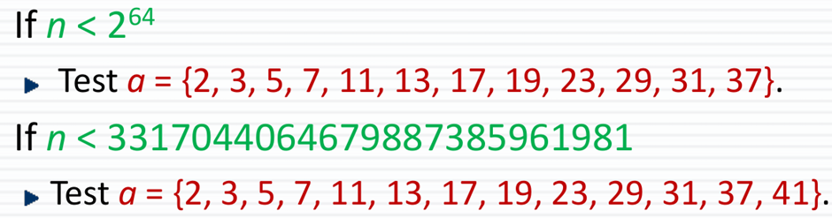
- n < 2^64 라면 a 값을 기본 소수 배열 값들만 검사해보면 됌.

# 소수의 분포
- 주로 log(n) 간격으로 소수가 존재하는데, 짝수를 제외하면 보통 0.5log(n) 간격으로 소수가 존재한다.
- 소수는 나중에 갈수록 없다고 생각할 수 있지만, 소수 또한 상당히 많음.
- 나오는 빈도수는 정말 조금씩 줄어들겠지만, 꾸준히 등장함

## 중국인의 나머지 정리(CRT)
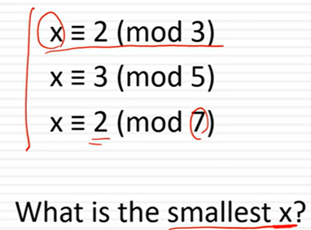
- Modulo 값들이 서로소 이면 하나의 해가 존재
- Modulo 3 * 5 * 7 내에서 unique한 해를 가짐

# 특징
- Modulo 연산을 빠르게 가능 
- 큰 M을 작은 m으로 쪼개서 계산
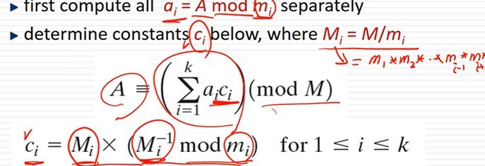
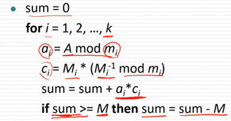
- 큰 수인 M으로 Modulo 연산하기 힘들어서 쪼갠만큼, 작은 수 m으로만 연산

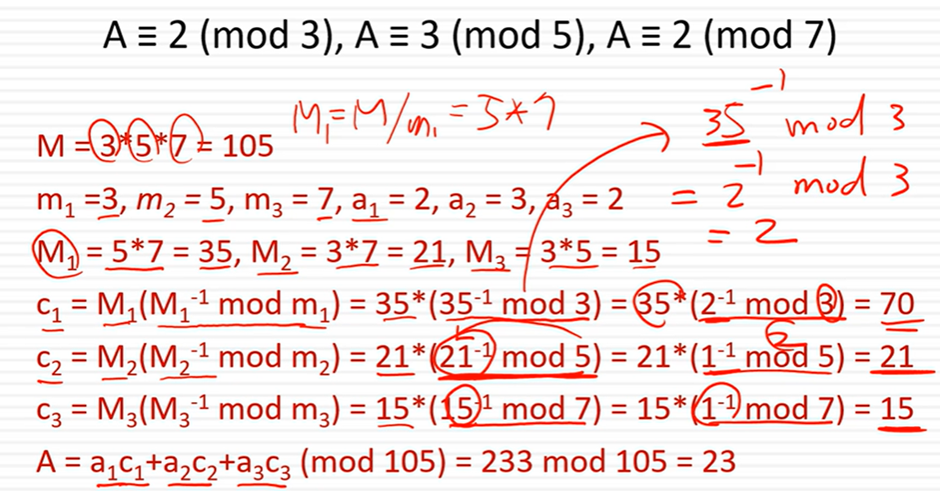
- 35^-1 mod 3 연산 과정
- mod 3을 먼저 연산 -> 2^-1 mod 3
- x = 2^-1 mod 3 이므로 양변에 2 곱함
- 2x = 1 mod 3 -> x = 2 

## Primitive Roots
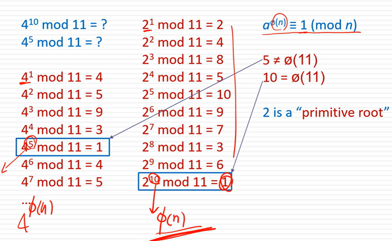

- a^pi(n) = 1 이라는 사실을 오일러 정리를 통해 알 수 있음.
- 가장 처음 1이 나오는 순간이 pi(n) 인 경우, a는 **primitive root**

# 특징
- **primitive root**는 모든 숫자를 생성함.

## Discrete Logarithms
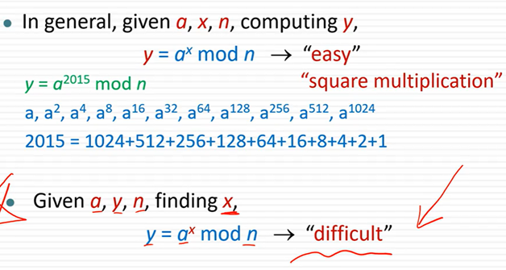
- y를 구하는 건 쉽지만, x를 구하는 건 어려움.

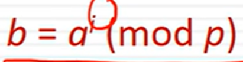
- 만약 a가 **primitive root** 라면 i 값이 존재.
- 만약 a가 **primitive root**가 아니라면 i 값이 존재할 수 도 있고, 없을 수 있음.