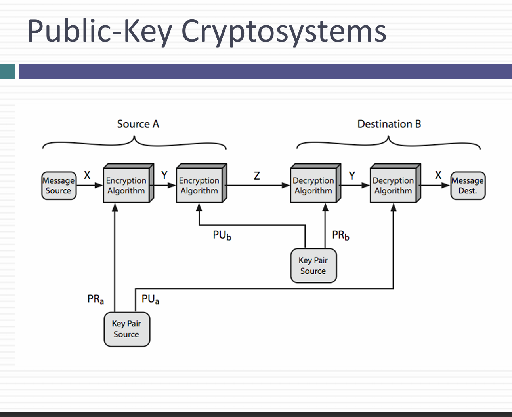
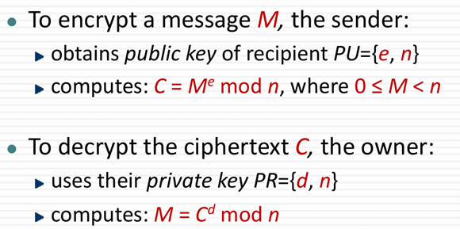
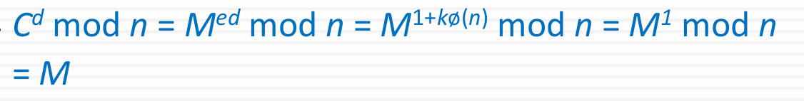
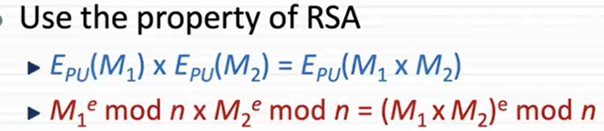
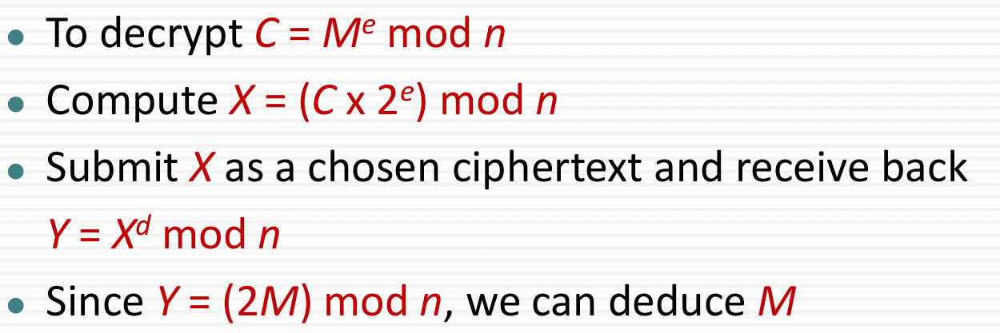

## RSA
- 공개 키 보안 방식
- 하나는 공개 키, 하나는 개인 키 사용
- 개인 키로 암호화하면 공개 키로 풀거나, 공개키로 암호화하면 개인 키로 푸는 게 가능

# 왜 공개 키 방식을 사용해?
- 키의 분배
- - 대칭 키를 사용하면 안전하게 키를 전달할 방법이 필요함
- 전자 서명
- - 개인 키로 암호화를 해놓으면, 다른 사람들은 공개 키로 서명을 확인할 수 있음
- - 공개 키로 암호화를 한 문서를 보면, 개인 키를 통해서 나만 확인할 수 있음

# Public Key
- Public key 는 암호화 하고 sign을 확인하는 방식
- Private key는 복호화 하고, sign을 작성하는 방식
- 비 대칭적
- - Public key가 private key의 역할을 동시에 할 수는 없음
- 공개 키 = PU = +K
- 개인 키 = PR = -K

1. 송신자는 대상의 공개 키를 사용하여 메시지 X를 암호화
2. 암호화된 메시지 Y는 목적지로 전달
3. 수신자는 자신의 개인 키를 사용해 원래 메시지 X로 복호화

양방향 통신 과정
1. Source A의 개인 키를 사용해 메시지를 암호화
2. 대상의 공개 키를 사용해 다시 암호화
3. 수신자는 자신의 개인 키를 사용해 복호화
4. 송신자의 공개 키를 통해 서명 검증

# Public Key의 Uses
- 암호화 및 복호화
- - 비밀성 제공
- 전자 서명
- - 내 개인 키로 암호화하면 다른 사람이 공개 키로 확인해봄
- 키 교환
- - 대칭 키로 암호화해서 키를 공개키로 암호화 해서 넘겨줌
- - 개인 키로 복호화 하고 대칭 키로 복호화 가능

# Requirements
- 암호화 키로 복호화 키를 찾는 것은 계산적으로 불가능
- 올바른 암호화 키나 복호화 키를 알고 있으면, 메시지를 암호화 및 복호화 하는 것은 어렵지 않음
- 어느 키로나 암호화 가능
- **Trapdoor One-way Function**으로 특별한 정보가 있으면 역계산이 가능한 단방향 함수
- - 공개 키를 알면 암호화가 쉽고, 개인 키를 알면 복호화가 쉬움

# RSA
- 공개 키 방식
- 갈로이스 필드 방식의 계산
- 2048bits를 사용하기 때문에 느림
- 두 개의 큰 소수의 곱으로 이루어진 인수분해 기반의 방식
- 
- e와 n은 공개함
- M은 n보다 무조건 작아야 함

# Key Setup
- random한 소수 p,q를 선택
- n = p*q
- 1 < e < pi(n), e와 pi(n)이 서로소인 e 선택
- d는 mod pi(n) 에서 e의 역원 
- - ed = 1 mod pi(n)
- 공개 키 = {e,n}
- 개인 키 = {d,n}
- ed = 1 + k * pi(n) 으로 정의할 수 있음

# Square and Multiply Algorithm
- repeatedly squaring 하면 exponent하게 커짐
- Only O(log n)

# Efficient Encryption
- 만약 e가 작으면 빨라질 것으로, 주로 e는 2^16+1인 65537을 사용
- e가 너무 작으면 공격 받을 수 있으므로 주의
- e는 pi(n)과 서로소여야 함 

## Efficient Decryption
- 중국인의 나머지 정리를 사용함
- - 모듈러 연산을 빠르게 하기 위해 사용
- - 큰 M을 p , q로 나눠서 계산시 4배정도 빨라짐
- - 개인 키 소유자만이 p,q를 사용할 수 있어야 함

# Using CRT
- M = C^d mod n 
- dP = d mod p-1 , dQ = d mod q-1
- m1 = C^dP mod p, m2 = C^dQ mod q
- q^inv = q^-1 mod p
- h = (m1-m2)*q^inv mod p
- Output **M = m2 + q*h** (Gardner's formula)

# RSA Security
- 기본적으로 인수분해로 보안
- Timing attacks - 시간을 보고 d의 범위를 추측하는 방법
- Chosen ciphertext attacks - RSA 절차의 허점을 파고드는 방법

- p,q를 고를 때 크기가 비슷하고,p-1과 q-1은 큰 소수여야 함
- gcd는 작아야 좋음
- Carmichael's totient로 lambda 값을 사용
- lambda(n) = ((p-1)*(q-1)) / gcd(p-1,q-1)

- Timing Attacks 방지
- - 2^100승을 구하고 싶으면 7번만 계산하면 알 수 있지만, 100번 계산한 것 처럼 헛 계산을 해서 시간을 일정하게 만들어줌
- - 계산마다 random한 delay를 줌
- - 10승의 값을 원하면, 25승까지 계산하고 15승을 나눠버림

- Chosen Ciphertext Attacks 방지

- **동형 특성**으로 암호문 끼리 곱했을 때, 원문끼리 곱한 것을 암호화 한 것과 같음
- 암호화한 데이터를 전체 저장하면, 개인 키를 가진 나만 확인 가능\
- 랜덤한 padding 추가

- C = M^e mod n 을 복호화 하려고 하는데, 복호화 오라클이 M의 복호화를 거부하면 다른 방식으로 알아낼 수 있음.

# OAEP
- 메시지에 random string을 붙여서 해시를 통과시키고, 두개의 x,y를 만듦
- 복호화 했을 때, random bit이랑 padding 때문에 어려울 것
- 동형 암호의 성질을 이용할 수 없게 됨

# RSA-OAEP
- Message에 대한 label을 붙임
- seed값이 random으로 생성되고, MGF를 통해 생성
- 전체 길이는 RSA modulo의 길이와 같음
- **PS**에 0000...을 넣는 이유는 M이 작을 때를 대비한 padding
- 01은 00000..의 끝을 나타냄
- 00으로 시작하는 이유는, n보다 작아야하기 때문