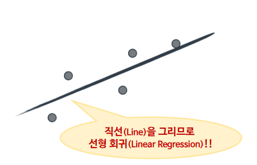
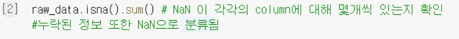

물론입니다! 아래는 보내주신 내용을 **Markdown 형식**으로 정리한 것입니다. 내용은 항목별로 구분해 가독성 좋게 구성했습니다.

---

# 🧠 머신러닝 기초 정리

## 🗂️ 지도학습 (Supervised Learning)

* **정의**: 학습할 데이터에 예측하고자 하는 **정답(Label)** 이 주어져 있음

### 📈 회귀 (Regression)

* 연속된 값 예측
* 데이터셋에 가장 **가까운 선**을 그리는 것이 목표
  

### 🧮 분류 (Classification)

* 불연속적인 값 예측
* 데이터를 **둘로 나누는 선**을 찾는 것
  

### 🌳 결정나무 (Decision Tree)

* 계속 질문해가며 데이터를 분류하는 모델
* 과적합 위험 있음 → `max_depth`, `min_samples_split` 조정 필요

---

## 📊 데이터 분할

* 훈련용 / 검증용 / 테스트용 데이터로 나누는 것이 중요
* **이유**: 과적합 방지, 모델의 일반화 능력 평가 가능

---

## 💸 회귀에서의 거리 측정 - Cost Function

* **평가 방법**: 수직 거리의 **제곱합** 사용
  → 단순 합보다 오차에 더 민감함

---

## ⛰️ 경사하강법 (Gradient Descent)

* **비유**: 산꼭대기에서 안개 낀 채 내려가는 것

### 학습률(learning rate)의 영향

| 크기    | 설명               |
| ----- | ---------------- |
| 너무 작음 | 느리게 수렴, 반복 많이 필요 |
| 너무 큼  | 최소값 지나치거나 진동/발산  |
| 적당함   | 빠르고 안정적인 수렴      |


---

## 🔀 커널 기법 (Kernel Trick)

* **고차원으로 올려서 비선형 문제 해결**

  * 2D에서 원 모양 → 3D로 확장 → 평면으로 분리
    → 다시 보면 **원 형태 경계**가 생김
* 비선형 데이터도 분리 가능
* 계산 효율성 향상


---

## 📌 확증적 데이터 분석

* **정의**: 목적을 가지고 데이터를 수집하고 분석하는 방식

---

## 📈 데이터 분석 절차

1. 데이터 수집
2. 데이터 정제 (NaN 처리, 이상치 처리 등)
3. 데이터 탐색
4. 예측 모델 생성


---

## 📉 과적합 방지

* 검증 데이터셋 필요
* K-겹 교차 검증으로 모든 데이터 활용


* **클래스 불균형** 있을 경우, 폴드별로 비율 유지 필요
  

* 귀찮다면 `cross_val_score` 사용
  

---

## 🎯 평가 지표

| 용어        | 정의                                       |
| --------- | ---------------------------------------- |
| Accuracy  | 전체 중 맞춘 비율           |
| Precision | 생존이라고 예측한 것 중 실제 생존  |
| Recall    | 실제 생존 중 모델이 맞춘 비율    |
| Fall-out  | 실제 사망인데 생존이라 예측   |

### 🎚️ Threshold 조정 효과

* **Recall 중시** (암 진단 등): Threshold 낮춤 (ex: 0.3\~0.4)
* **Precision 중시** (스팸 필터 등): Threshold 높임 (ex: 0.8\~0.9)

---

## 📉 ROC & AUC

### ROC Curve

* x축: Fall-out, y축: Recall
* **좌상단으로 갈수록 성능 우수**
  

### AUC

* ROC 아래 면적
* 1에 가까울수록 좋음
  

---

## ⚙️ 하이퍼 파라미터 & 튜닝

* 학습 전에 설정하는 값
* 성능 크게 좌우 → 튜닝 중요
  

---

## 🧪 인디언 당뇨병 예측 실습

* **로지스틱 회귀** 사용
* 의료 데이터이므로 **Recall 중요**
* 의미 없는 0값은 평균으로 대체

---

## 🎲 앙상블 학습

### 📦 Bagging

* 여러 샘플로 모델 여러 개 → 투표
* 대표 모델: **랜덤 포레스트**
  

### 🔁 Boosting

* 틀린 것에 집중해 학습
* 대표 모델: **Adaboost**
    

---

## 📊 countplot

* 카테고리 변수 빈도 시각화
  

---

## 🌐 클러스터링 (Clustering)

* **비지도 학습**
* 라벨 없이 유사한 데이터끼리 그룹화

### K-means 알고리즘

1. 초기 중심점 k개 설정
2. 가장 가까운 중심점에 할당
3. 중심점 재계산
4. 반복
5. 수렴 시 종료
   

* `init='kmeans++'`: 중심점 초기 위치 잘 설정
  

---

## 📊 데이터 시각화

```python
sns.scatterplot(data=irisDF, x='petal_length', y='petal_width', hue='species', style='species', s=100)
```

* `plt.figure()` → 그래프 크기 설정
* `hue`, `style` → 그룹별 색상/마커 차별
* `scatter()` → 중심점 표시
* `plt.show()` → 그래프 출력
  

---

## ⚙️ 데이터 전처리

### NaN 처리

```python
df.isna().sum()
df.dropna()
df.fillna(df.mean())
```

  

### 상관관계

```python
sns.heatmap(corr_matrix)
```

### 이상치 탐지

```python
df.boxplot(column='col')
```


### 이상치 기준

```python
IQR = Q3 - Q1
lowest = Q1 - 1.5*IQR
highest = Q3 + 1.5*IQR
```

---

## ⚠️ 클래스 불균형

* 전체의 90%가 정상이라도, 불량 예측 실패 → Recall = 0 → 의미 없음
* **OverSampling 필요**

  * `SMOTE`: 가상 데이터 생성
  * `RandomOverSampler`: 단순 복제
    

---

## 🧠 인공 신경망

* **입력층 - 은닉층 - 출력층** 구성

* 복잡한 비선형 문제 해결 가능
  

* **딥러닝**: 은닉층이 많은 심층 신경망
  

### 장점

* 오픈소스로 빠른 개발 가능

### 단점

* 데이터 확보 어려움
* 과적합 위험
* 해석 어려움

   

---

## 🤖 퍼셉트론 (Perceptron)

* 단층 퍼셉트론: 신호를 더해 activation function 통과
* 활성화 함수 예시:

  * `sigmoid`: 0\~1로 매핑, 하지만 층이 깊으면 0으로 수렴
  * `ReLU`: 0 이상은 그대로 통과

 

### 행렬 연산


### AND-OR 회로


---

## 🔁 퍼셉트론 학습

* 다음 가중치 = 현재 가중치 + 신호의 곱
* 학습률 기반 가중치 갱신
* 목표값 기준 방향 결정

  

```math
Δw = learning\_rate × error × input
```

---

## ❌ XOR 문제와 다층 퍼셉트론

* XOR은 **선형 분리 불가**
* 은닉 노드 추가 → 비선형 문제 해결
* **오차 역전파(Backpropagation)** 알고리즘으로 학습
* 이게 바로 딥러닝!
  
  

---

## 🧮 Loss Function

* 예측값과 실제값의 차이
* 학습 성능 판단 지표

---

필요한 부분을 따로 추출하거나 PPT/보고서용으로 정리해드릴 수도 있어요. 원하시면 말씀 주세요!
